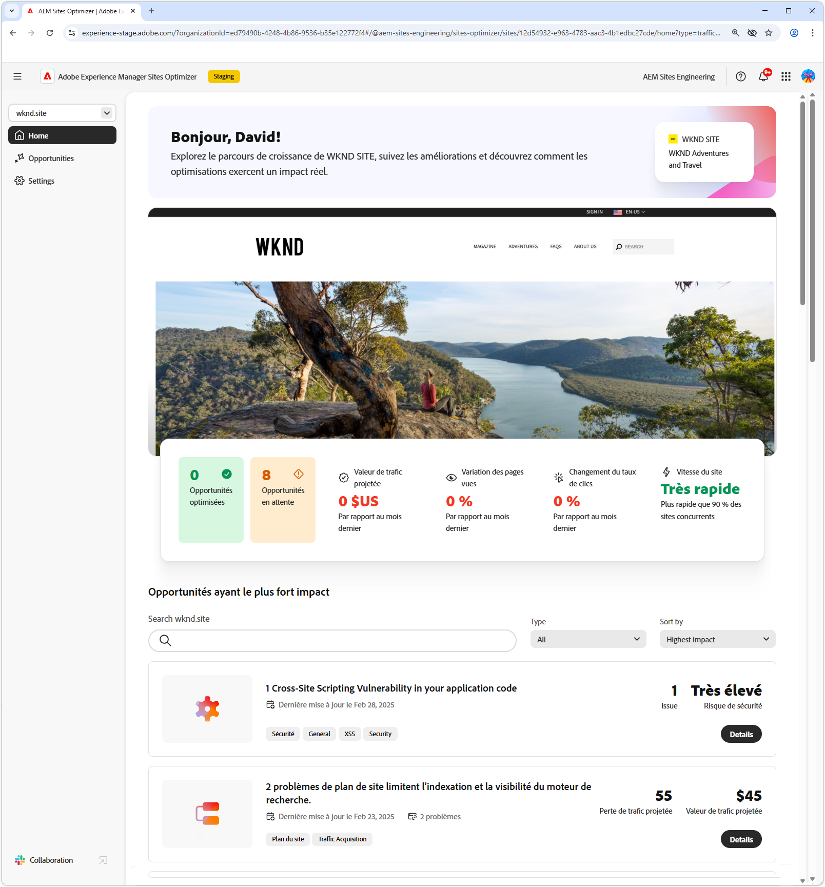
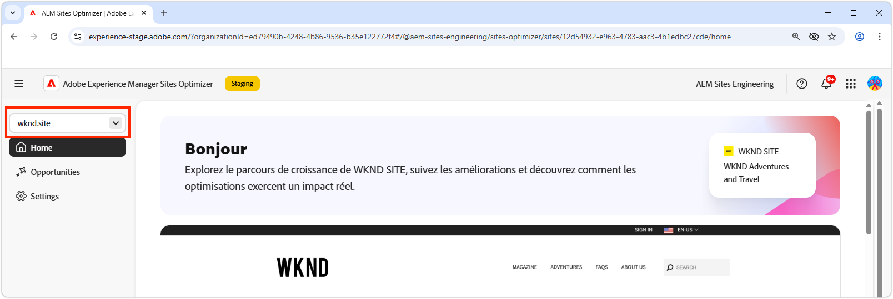
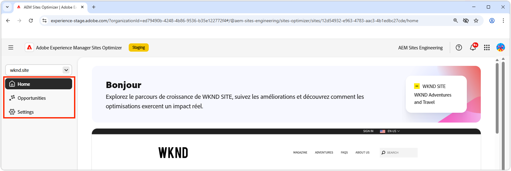
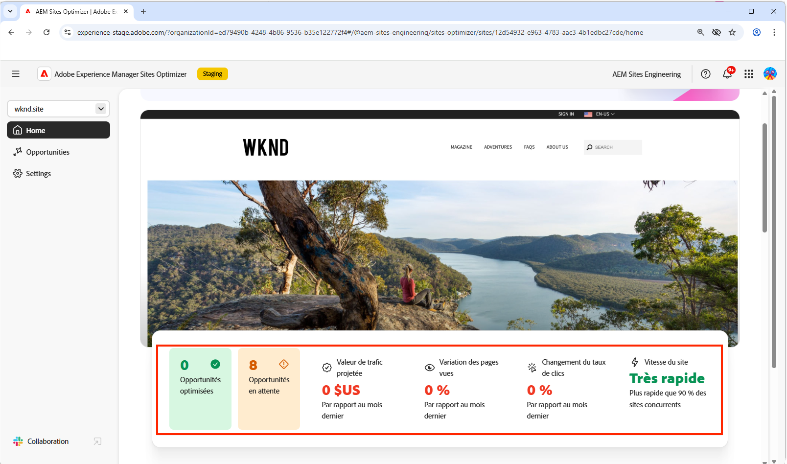
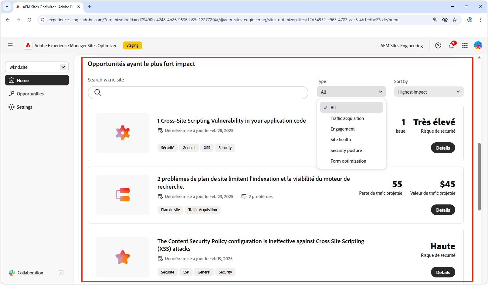
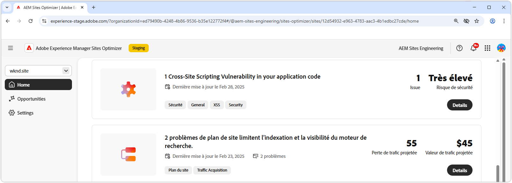

# Concepts de base de Sites Optimizer

{align="center"}

Le tableau de bord de Sites Optimizer offre une vue d’ensemble des performances de votre site et des opportunités d’amélioration.

## Gestionnaire de domaines

{align="center"}

Le menu contextuel du gestionnaire de domaines vous permet de choisir le site AEM, par domaine, que vous souhaitez évaluer et optimiser. Sites Optimizer fournit une liste de tous les sites AEM de production enregistrés dans [Cloud Manager](https://experienceleague.adobe.com/fr/docs/experience-manager-cloud-service/content/implementing/using-cloud-manager/edge-delivery-sites/add-edge-delivery-site).

## Navigation

{align="center"}

La section Navigation permet d’accéder rapidement et de manière persistante à des zones essentielles de Sites Optimizer, où que vous soyez dans Sites Optimizer, notamment :

* **Accueil** : tableau de bord principal offrant une vue d’ensemble sur les performances de votre site et les opportunités d’amélioration.
* **Opportunités** - Affichez et gérez les opportunités identifiées par Sites Optimizer, y compris celles qui ont été optimisées ou qui ne le sont toujours pas.
* **Paramètres** : configurez vos paramètres Sites Optimizer, y compris les sites que vous surveillez et les notifications que vous recevez.

## Résumé du site

{align="center"}

La section Résumé du site fournit un instantané des performances de votre site, de la manière dont Sites Optimizer a amélioré votre site au fil du temps et des opportunités d’amélioration. Les mesures clés sont les suivantes :

* **Opportunités optimisées** : nombre d’opportunités identifiées qui ont été améliorées pour accroître les performances commerciales.
* **Opportunités en attente** : nombre d’améliorations potentielles qui ne sont toujours pas optimisées, représentant des domaines de gains commerciaux.
* **Valeur de trafic projetée** : modification de la valeur estimée du trafic de votre site web par rapport au mois précédent, ce qui permet d’évaluer la contribution de Sites Optimizer aux objectifs commerciaux.
* **Modification des pages vues** : pourcentage de modification dans la fréquence d’affichage de votre site, reflétant l’intérêt des utilisateurs et utilisatrices ainsi que l’efficacité du contenu.
* **Modification du taux de clics** : pourcentage de modification de la fréquence de clic des utilisateurs et utilisatrices, indiquant des changements dans l’engagement et le potentiel de conversion.
* **Vitesse du site** : indicateur clé de la vitesse et de la convivialité de votre site web, qui a un impact sur l’expérience client et les classements dans les recherches.

## Opportunités à fort impact

{align="center"}

La section Opportunités à fort impact met en évidence les opportunités d’amélioration en attente les plus importantes, en fonction de leur impact potentiel sur les performances de votre site. Ces opportunités sont organisées par type, ce qui facilite la hiérarchisation des efforts d’optimisation.

Filtrez les opportunités par mots-clés, balises, URL ou [type d’opportunité](../opportunity-types/overview.md) pour vous concentrer sur les améliorations les plus importantes.

### Détails de l’opportunité

{align="center"}

Chaque opportunité fournit une brève description du problème, son impact potentiel sur votre site et un lien vers des détails complets. Vous pouvez également consulter son statut, qui indique si elle a été optimisée ou si elle est toujours en attente.

* **Titre de l’opportunité** : brève description du problème et de son impact potentiel sur les performances de votre site.
* **Dernière mise à jour** - Sites Optimizer a mis à jour l’opportunité pour la dernière fois avec de nouvelles données à cette date.
* **Nombre de problèmes** : nombre d’occurrences du problème identifié sur votre site.
* **Types d’opportunité** - Les [types d’opportunité](../opportunity-types/overview.md) dont cette opportunité fait partie, tels que l’acquisition du trafic, l’engagement, la conversion ou l’intégrité du site.

Les informations récapitulatives de chaque opportunité varient selon le type et peuvent inclure des détails sur l’impact sur le chiffre d’affaires, le trafic, l’interaction client ou les menaces pour la sécurité.

Pour afficher les détails d’une opportunité, cliquez sur le bouton **Détails**.

Pour exclure une opportunité du tableau de bord et des rapports de Sites Optimizer, cliquez sur le bouton **Ignorer**.
