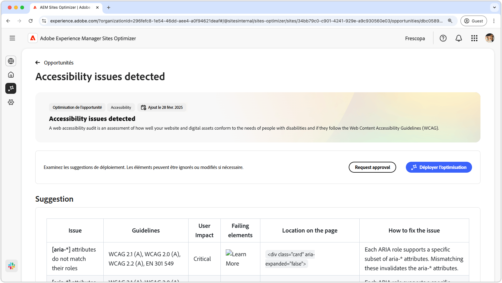
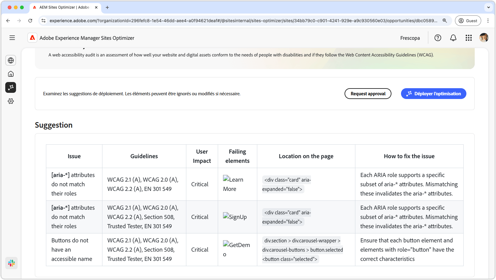
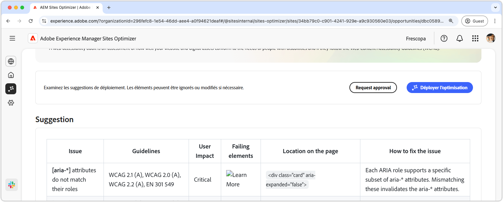

# Opportunité des problèmes d’accessibilité

{align="center"}

L’opportunité des problèmes d’accessibilité identifie dans quelle mesure votre site web est conforme aux besoins des personnes en situation de handicap et si elles suivent les [Directives d’accessibilité du contenu web (WCAG)](https://www.w3.org/TR/WCAG21/). En évaluant la conformité de votre site au WCAG, vous contribuez à créer une expérience en ligne inclusive. En retour, il permet aux personnes ayant des déficiences visuelles, auditives, cognitives et motrices de naviguer dans votre contenu, d’interagir avec celui-ci et d’en bénéficier. Non seulement cette fonctionnalité est essentielle pour des raisons éthiques, mais elle favorise également la conformité aux exigences légales, améliore le référencement et peut augmenter la portée de votre audience, améliorant à la fois l’expérience utilisateur et les performances commerciales.

## Identification automatique

{align="center"}

L’**opportunité des problèmes d’accessibilité** identifie les problèmes d’accessibilité sur votre site web et inclut les éléments suivants :

* **Problèmes** : problèmes d’accessibilité spécifiques détectés.
* **Directives** : [identifiant des directives WCAG](https://www.w3.org/TR/WCAG21/) en cause dans le problème.
* **Impact sur les utilisateurs et utilisatrices** : évaluation de l’impact sur les personnes en situation de handicap.
* **Éléments en échec** ; éléments HTML de la page web concernés par le problème.
* **Emplacement sur la page** : fragment de code HTML de l’élément de page affecté par le problème.

## Suggestion automatique

{align="center"}

La suggestion automatique fournit des recommandations générées par l’IA dans le champ **Comment résoudre le problème**, qui fournit des conseils prescriptifs sur la marche à suivre pour résoudre le problème.

## Optimiser automatiquement

[!BADGE Ultimate]{type=Positive tooltip="Ultimate"}

{align="center"}

Sites Optimizer Ultimate permet de déployer une optimisation automatique pour les vulnérabilités détectées.

>[!BEGINTABS]

>[!TAB Déployer l’optimisation]

{{auto-optimize-deploy-optimization-slack}}

>[!TAB Demande d’approbation]

{{auto-optimize-request-approval}}

>[!ENDTABS]
