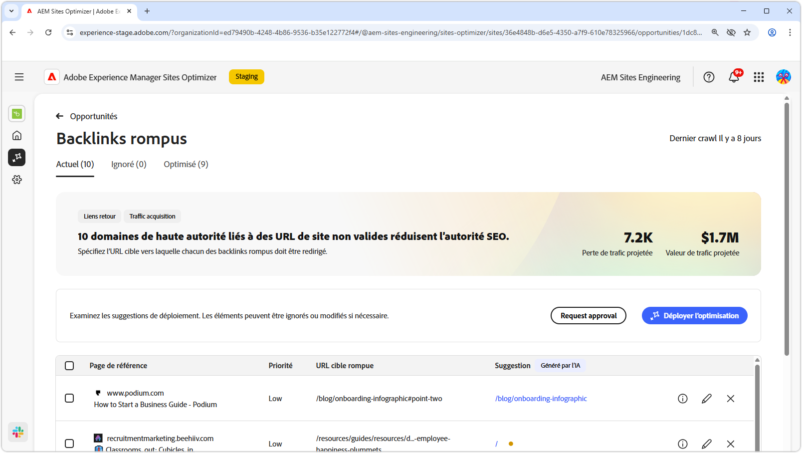
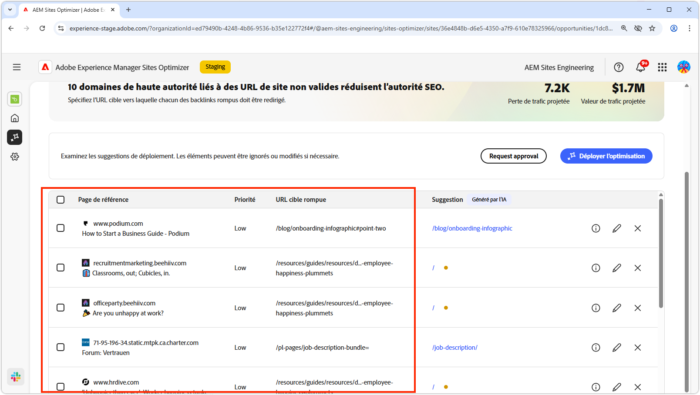
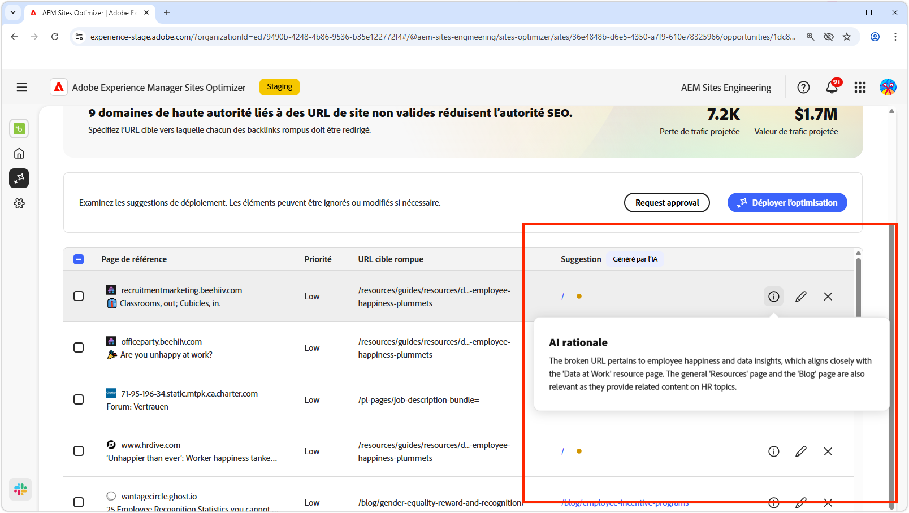
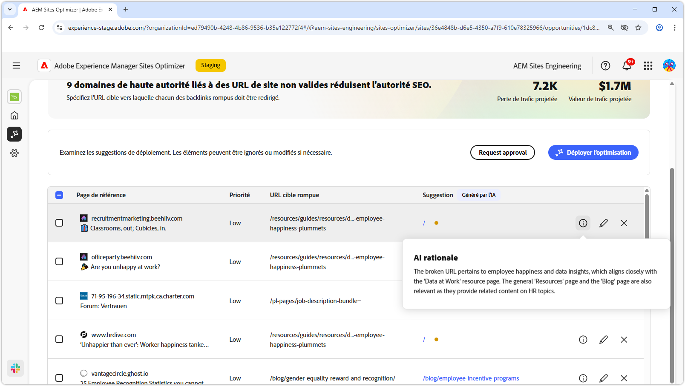
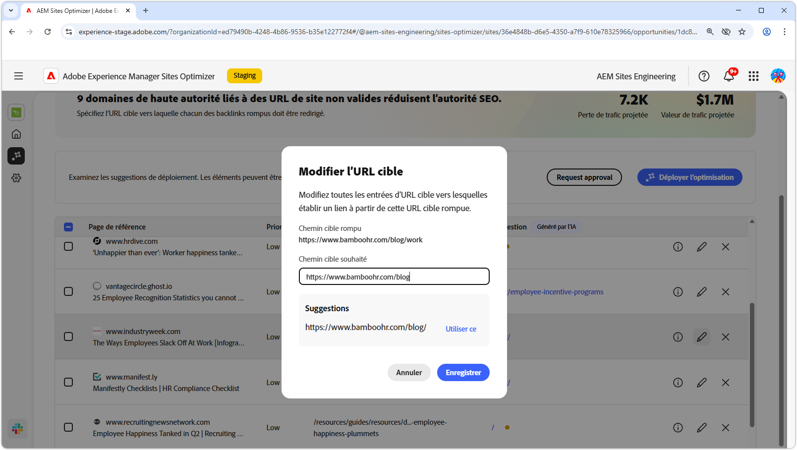
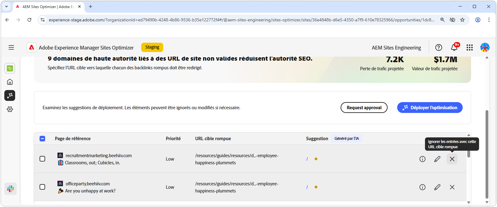
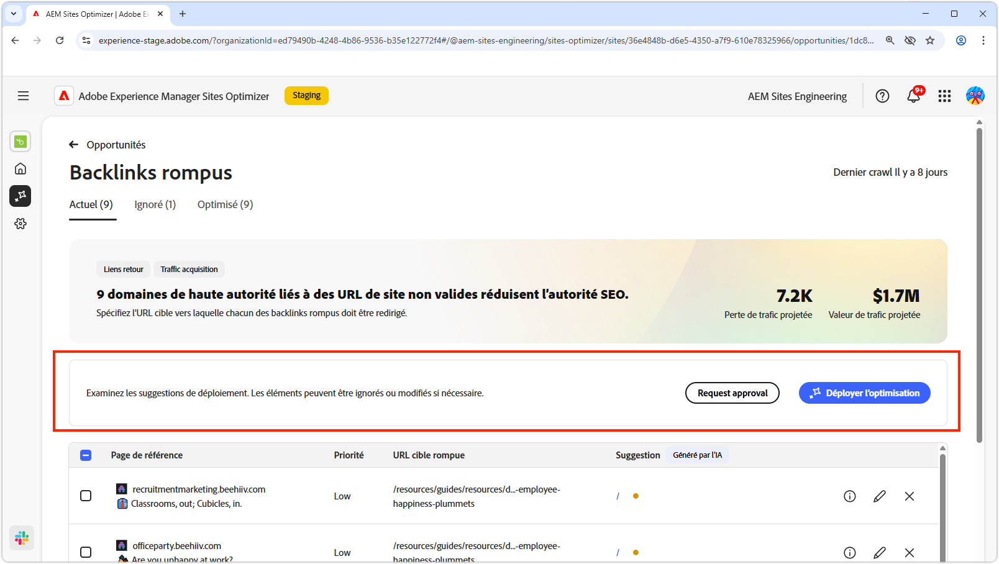
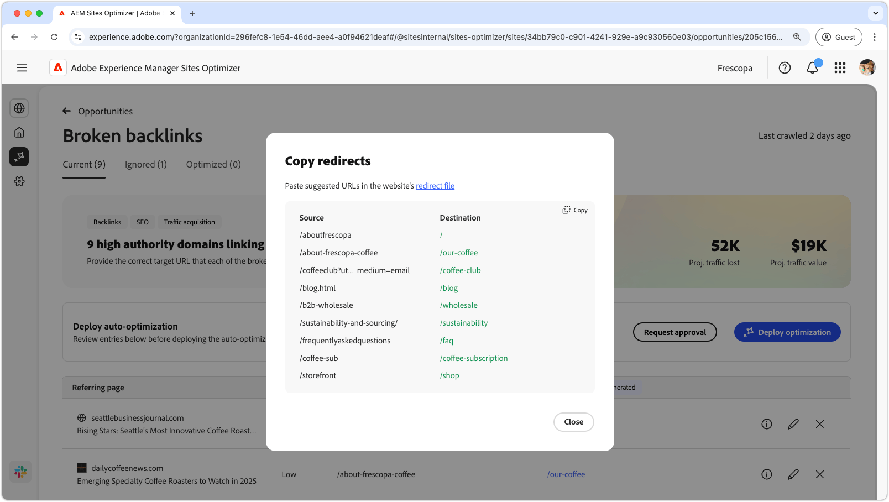
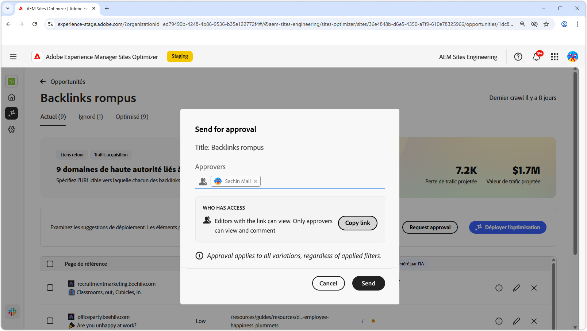

# Opportunité de backlinks rompue

{align="center"}

L’opportunité de lien retour rompu identifie les liens d’autres sites web vers votre site qui entraînent une erreur 404. Comme les moteurs de recherche utilisent des liens retour pour déterminer la pertinence de la recherche, les liens rompus peuvent avoir un impact négatif sur l’optimisation du moteur de recherche et la découvrabilité de votre site. Ces problèmes peuvent être dus à des facteurs tels que les modifications d’URL ou la suppression de la page liée.

L’opportunité de liens retour rompus affiche un résumé en haut de la page, y compris un résumé du problème et de son impact sur votre site et votre entreprise.

* **Perte de trafic prévue** - Estimation de la perte de trafic due à des liaisons retour rompues.
* **Valeur prévue du trafic** - Valeur estimée du trafic perdu.

## Auto-identification

{align="center"}

L’opportunité Liens récurrents rompus répertorie tous les liens récurrents rompus de votre site, y compris les éléments suivants :

* **Page de référence** - Domaine du site web contenant le lien rompu.
* **Priorité** - Élevée, moyenne ou faible, indiquant l’impact du lien rompu sur l’optimisation du moteur de recherche (SEO) en fonction de la commande TODO.
* **URL cible endommagée** - URL non existante sur votre site à laquelle est associé le lien.

## Suggestion automatique

{align="center"}

L’opportunité de liens retour rompus fournit également des suggestions générées par l’IA sur la page de votre site web vers laquelle l’URL rompue doit être redirigée. Les suggestions sont basées sur le texte qui comprend l’URL rompue et le contenu de la page suggérée.

>[!BEGINTABS]

>[!TAB Justification de l’IA]

{align="center"}

Sélectionnez l’icône **informations** pour afficher la justification par l’IA de l’URL suggérée. La raison explique pourquoi l’IA estime que l’URL suggérée est la mieux adaptée au lien rompu. Cela peut vous aider à comprendre le processus de prise de décision de l’IA et à prendre une décision éclairée sur l’acceptation ou le rejet de la suggestion.

>[!TAB Modifier l’URL cible]

{align="center"}

Si vous n’êtes pas d’accord avec la suggestion générée par l’IA, vous pouvez modifier l’URL suggérée en sélectionnant l’icône **Modifier**. Cela vous permet de saisir manuellement l’URL qui, selon vous, convient le mieux au lien rompu. Sites Optimizer répertorie également toutes les autres URL de votre site qui, selon lui, pourraient convenir au lien rompu.

>[!TAB Ignorer les entrées]

{align="center"}

Vous pouvez choisir d’ignorer les entrées avec l’URL cible rompue. Sélectionner l’icône **ignorer** supprime le lien retour rompu de la liste des opportunités. Les backlinks rompus ignorés peuvent être réengagés à partir de l’onglet **Ignorés** en haut de la page de l’opportunité.

>[!ENDTABS]

## Optimisation automatique d’[!BADGE Ultimate]{type=Positive tooltip="Ultimate"}

{align="center"}

Sites Optimizer Ultimate offre la possibilité de déployer l’optimisation automatique pour les liens retour rompus. Cliquer sur le bouton **Optimisation automatique** met automatiquement à jour les règles de redirection du site AEM pour mapper l’**URL cible rompue** à l’**URL suggérée**. Cela permet de s’assurer que les visiteurs et visiteuses du site Web et les robots de recherche qui suivent les liens rompus sur les **pages de référence** sont redirigés vers la bonne page de votre site, améliorant ainsi l’optimisation du moteur de recherche et l’expérience utilisateur.

>[!BEGINTABS]

>[!TAB Déployer l’optimisation]

{align="center"}

Sélectionner **Déployer l’optimisation** mettra à jour les règles de redirection du site AEM pour mapper l’**URL cible rompue** à l’**URL suggérée**. Cela permet de s’assurer que les visiteurs et visiteuses du site Web et les robots de recherche qui suivent les liens rompus sur les **pages de référence** sont redirigés vers la bonne page de votre site, améliorant ainsi l’optimisation du moteur de recherche et l’expérience utilisateur.

>[!TAB Demande d’approbation]

{align="center"}

{{auto-optimize-request-approval}}

>[!ENDTABS]
