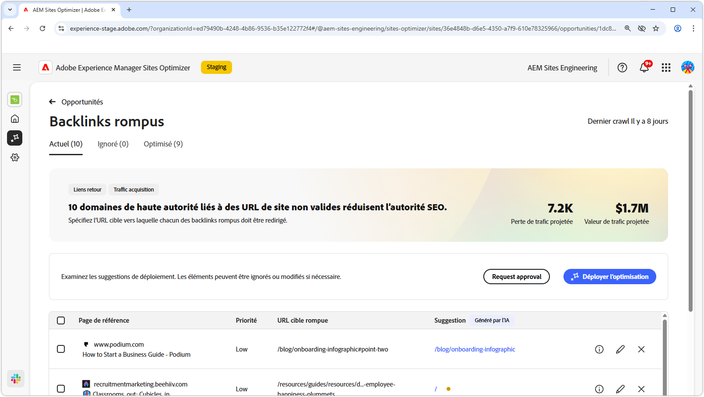
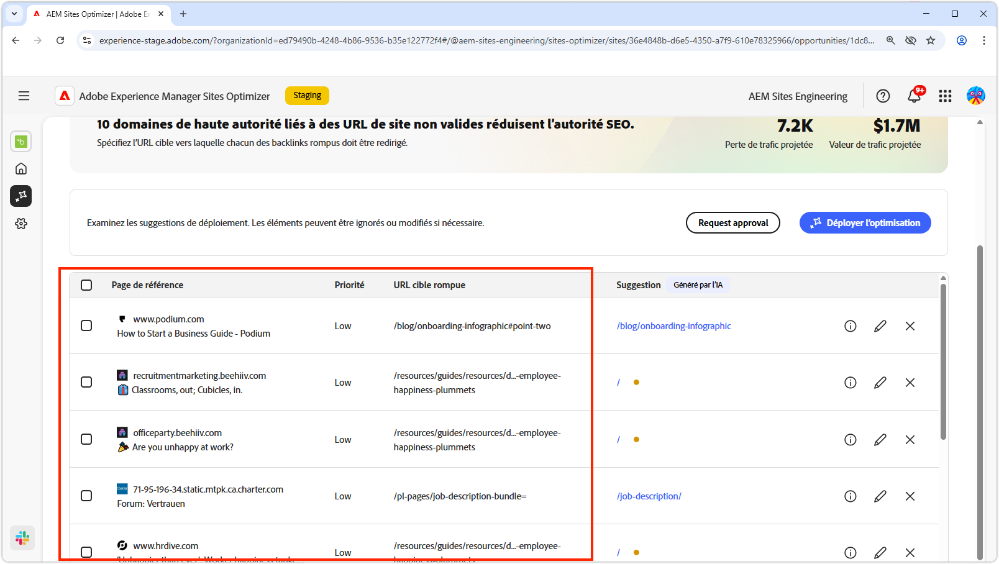
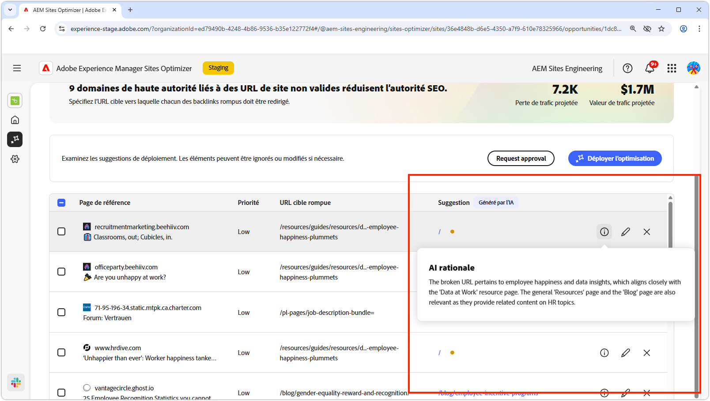
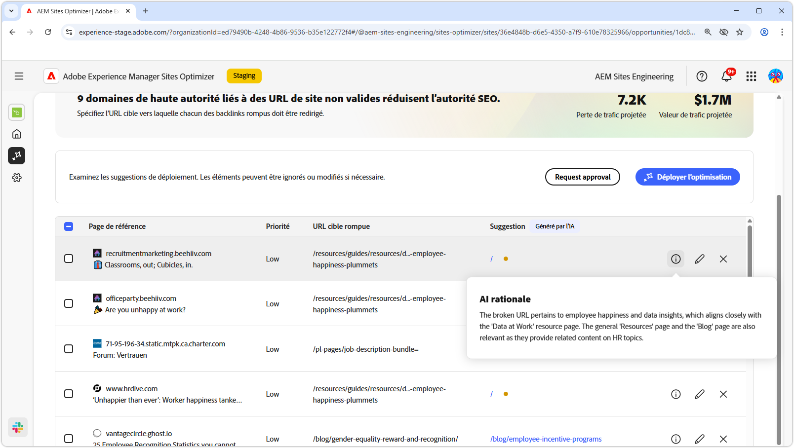
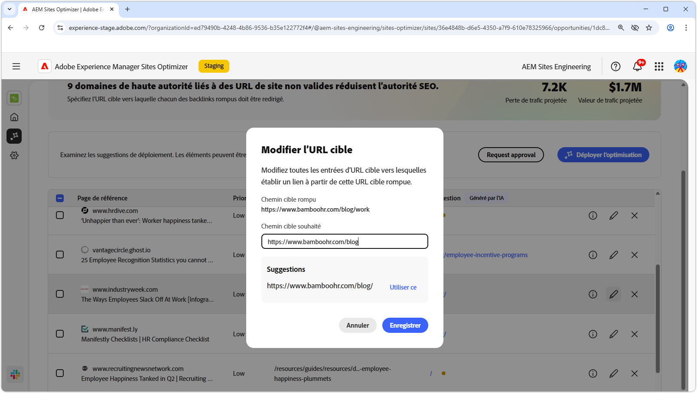
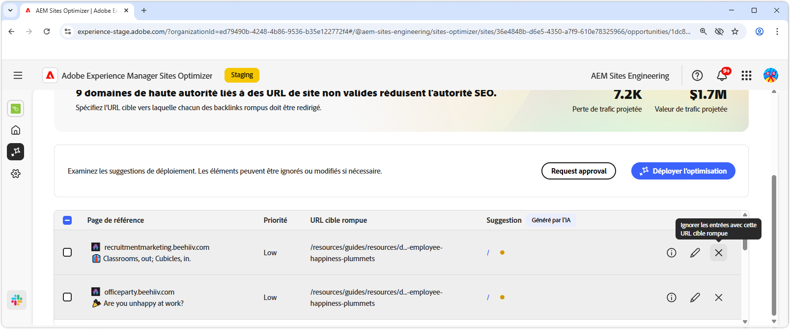

# Opportunité de backlinks rompus

<!--{align="center"}-->

>[!VIDEO](https://video.tv.adobe.com/v/3483250/?learn=on&enablevpops)

L’opportunité de backlinks rompus identifie les liens externes renvoyant vers des pages inexistantes (404) sur votre site. Ces liens entraînent une perte de trafic de recommandation et une valeur SEO réduite, car les moteurs de recherche s’appuient sur les backlinks pour évaluer la pertinence et l’autorité. Ces problèmes se produisent lorsque les URL sont modifiées, que le contenu est supprimé ou que les pages ne sont plus disponibles sans redirections appropriées. AEM Sites Optimizer identifie tous les backlinks rompus, fournit des recommandations d’IA spécifiques et permet un déploiement en un clic pour les corriger, le tout dans une vue centralisée unique.

## Identification automatique

<!--{align="center"}-->

AEM Sites Optimizer analyse en permanence les sources de données externes pour détecter les backlinks renvoyant à des pages 404 inexistantes sur votre site. Les données sont agrégées à partir de plusieurs sources, notamment Google Search Console, la [télémétrie opérationnelle](https://experienceleague.adobe.com/fr/docs/experience-manager-cloud-service/content/sites/operational-telemetry-for-aem-as-a-cloud-service) et des plateformes SEO. L’opportunité d’identification automatique identifie les domaines externes renvoyant vers des URL rompues et les classe par priorité en fonction de l’impact, y compris l’autorité du domaine, le trafic attendu, et la perte de valeur des liens.

Cette opportunité répertorie tous les problèmes identifiés, y compris les détails suivants :

* **Page ou domaine référent** : page ou domaine externe contenant le lien rompu.
* **Priorité** : élevée, moyenne ou faible, indiquant l’impact du lien rompu sur le processus SEO.
* **URL cible rompue** : URL non existante sur votre site à laquelle est associé un lien.

## Suggestion automatique

<!--{align="center"}-->

Pour chaque backlink rompu identifié, AEM Sites Optimizer recommande la destination la plus appropriée pour restaurer le trafic et la valeur SEO. Il détermine l’intention du backlink en analysant les éléments suivants :

* Structure de l’URL et jetons
* Texte d’ancrage
* Titre et contexte de la page de référence

Cette intention est mise en correspondance avec le contenu du site existant pour identifier la page de destination la plus pertinente. Chaque URL rompue est mappée à une page de remplacement exacte ou à la page la plus pertinente. Si aucune destination appropriée ne peut être déterminée, le problème est soumis à une révision manuelle.

>[!BEGINTABS]

>[!TAB Justification de l’IA]

<!--{align="center"}-->

Sélectionnez l’icône **Informations** pour afficher la justification de l’IA pour l’URL suggérée. La justification précise pourquoi l’IA considère que l’URL suggérée est la mieux adaptée au lien rompu. Cela peut vous aider à comprendre le processus de prise de décision de l’IA et à prendre une décision éclairée quant à la suggestion.

>[!TAB Modifier l’URL cible]

<!--{align="center"}-->

Si vous n’êtes pas d’accord avec la suggestion générée par l’IA, vous pouvez modifier l’URL suggérée en sélectionnant l’**icône Modifier**. Cela vous permet de saisir manuellement l’URL qui, selon vous, convient le mieux au lien rompu. Sites Optimizer répertorie également toutes les autres URL de votre site qui, selon lui, pourraient convenir au lien rompu.

>[!TAB Ignorer les entrées]

<!--{align="center"}-->

Vous pouvez choisir d’ignorer les entrées avec les URL rompues ciblées. Sélectionner l’ supprime le lien retour rompu de la liste des opportunités. Les backlinks rompus ignorés peuvent être à nouveau traités à partir de l’onglet **Ignoré** en haut de la page des opportunités.

>[!ENDTABS]

## Optimiser automatiquement

<!--[!BADGE Ultimate]{type=Positive tooltip="Ultimate"}-->

Une fois les suggestions vérifiées et approuvées, vous pouvez cliquer sur **Déployer l’optimisation**. AEM Sites Optimizer applique ensuite les correctifs dans l’environnement de création, en fonction de la manière dont les redirections sont gérées dans votre mise en œuvre. L’auteur ou l’autrice AEM peut ensuite publier les modifications à partir du système de gestion de contenu (CMS).

Selon la configuration, des correctifs sont appliqués sous forme de modifications de contenu ou de code dans les workflows de déploiement existants. Le processus d’optimisation comprend les étapes suivantes :

* **Validation** : permet de s’assurer que les modifications fonctionnent comme prévu et n’introduisent pas de régressions avant le déploiement.
* **Déploiement** : permet d’appliquer les modifications par le biais de processus existants, tels que les mises à jour de contenu dans AEM ou le déploiement de code via des pipelines CI/CD.
* **Vérification des autorisations** : permet de vérifier que l’utilisateur ou l’utilisatrice dispose des autorisations appropriées pour déployer les modifications. Dans le cas contraire, d’autres sorties, telles que des listes de redirection téléchargeables ou des correctifs de code, sont fournies.

Ce processus permet de s’assurer que les redirections sont mises en œuvre avec précision, validées avant la publication et alignées sur les configurations et les processus de gouvernance existants.
