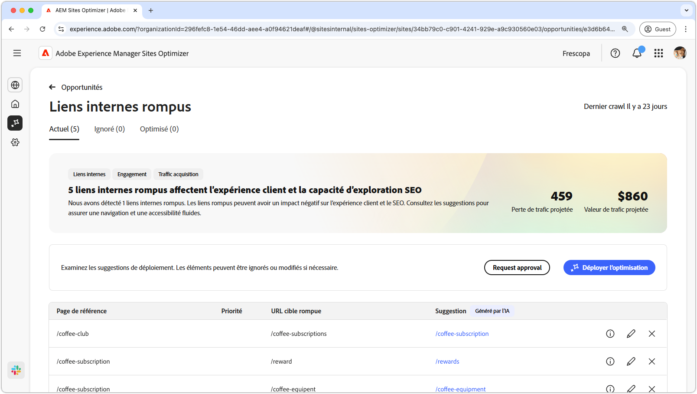
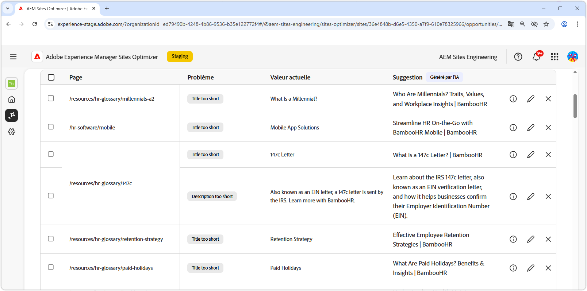

# Opportunité de liens internes rompus

{align="center"}

Les liens internes rompus affectent la capacité du moteur de recherche à indexer votre site. Ils ont une incidence négative sur l’expérience client et l’optimisation du moteur de recherche. Pour résoudre ce problème, l’opportunité de liens internes rompus signale les URL rompues et fournit des suggestions pour des mises à jour de liens valides. La résolution de ces problèmes améliorera l’interaction des clientes et clients et garantira une navigation et une accessibilité fluides.

L’opportunité des liens internes rompus affiche un résumé en haut de la page, y compris une synthèse du problème et de son impact sur votre site et votre entreprise.

* **Trafic projeté perdu** : estimation de la perte de trafic due aux liens internes rompus.
* **Valeur prévue du trafic** : valeur estimée du trafic perdu.

## Identification automatique

<!---{align="center"}-->

L’opportunité des liens internes rompus identifie et répertorie automatiquement tous les liens concernés sur vos pages et inclut les éléments suivants :

* **Page de référence** : page contenant le lien rompu.
* **URL cible rompue** : lien interne rompu.
* **Suggestion** : suggestion générée par l’IA sur la façon de mettre à jour le lien rompu. Pour plus d’informations, consultez la section de suggestion automatique.

## Suggestion automatique

<!--{align="center"}-->

L’opportunité de liens internes rompus fournit des suggestions générées par l’IA sur la mise à jour les liens rompus. Ces suggestions sont basées sur l’URL rompue ciblée et fournissent un remplacement approprié. Sélectionner l’ fournit une justification générée par l’IA pour la mise à jour suggérée.

>[!BEGINTABS]

>[!TAB Justification de l’IA]

<!--[AI rationale of broken internal links](./assets/broken-internal-links/auto-suggest-ai-rationale.png) -->

Sélectionnez l’icône  pour afficher la justification de l’IA pour l’URL suggérée. La justification précise pourquoi l’IA considère que l’URL suggérée est la mieux adaptée au lien rompu. Cela peut vous aider à comprendre le processus de prise de décision de l’IA et à prendre une décision éclairée quant à la suggestion.

>[!TAB Modifier l’URL cible]

<!--{align="center"}-->

Si vous n’êtes pas d’accord avec la suggestion générée par l’IA, vous pouvez modifier la valeur du lien suggéré en sélectionnant l’**icône Modifier**. Cette fonctionnalité vous permet de saisir manuellement le lien souhaité. La fenêtre de modification contient le **chemin cible rompu** du lien, le **chemin cible souhaité** où vous pouvez modifier manuellement le lien et un champ contenant la suggestion générée par l’IA. Une fois la modification terminée, cliquez sur **Enregistrer** pour mettre à jour l’entrée du lien rompu. Un point jaune apparaît dans le champ de saisie pour indiquer que le lien a été modifié.

>[!TAB Ignorer les entrées]

<!--{align="center"}-->

Vous pouvez choisir d’ignorer les entrées avec les URL rompues ciblées. Sélectionner l’ efface l’entrée de la liste des opportunités. Les entrées ignorées peuvent être à nouveau traitées à partir de l’onglet **Ignoré** en haut de la page des opportunités.

>[!ENDTABS]

## Optimiser automatiquement

[!BADGE Ultimate]{type=Positive tooltip="Ultimate"}

<!---{align="center"}-->

Sites Optimizer Ultimate permet de déployer l’optimisation automatique pour les liens rompus détectés par l’opportunité. <!--- TBD-need more in-depth and opportunity specific information here. What does the auto-optimization do?-->

>[!BEGINTABS]

>[!TAB Déployer l’optimisation]

{{auto-optimize-deploy-optimization-slack}}

>[!TAB Demande d’approbation]

{{auto-optimize-request-approval}}

>[!ENDTABS]

