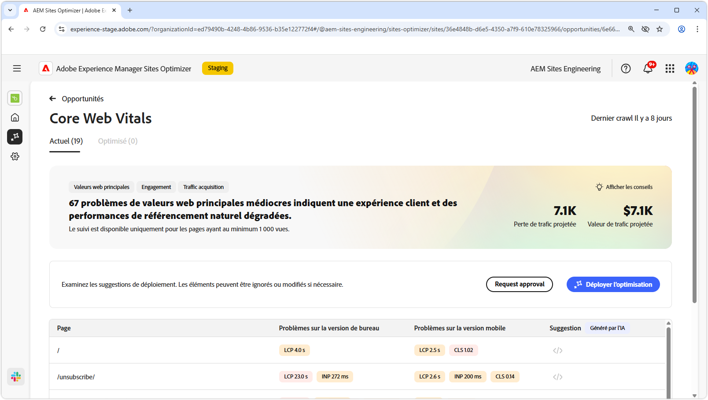
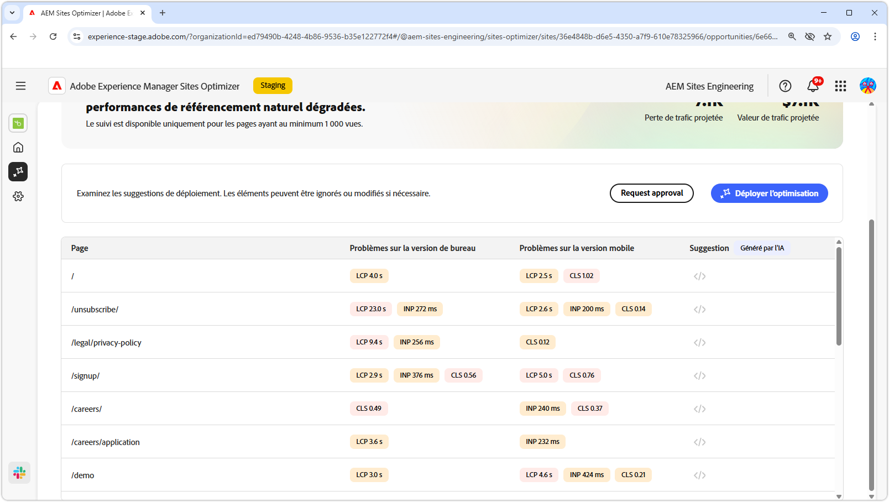
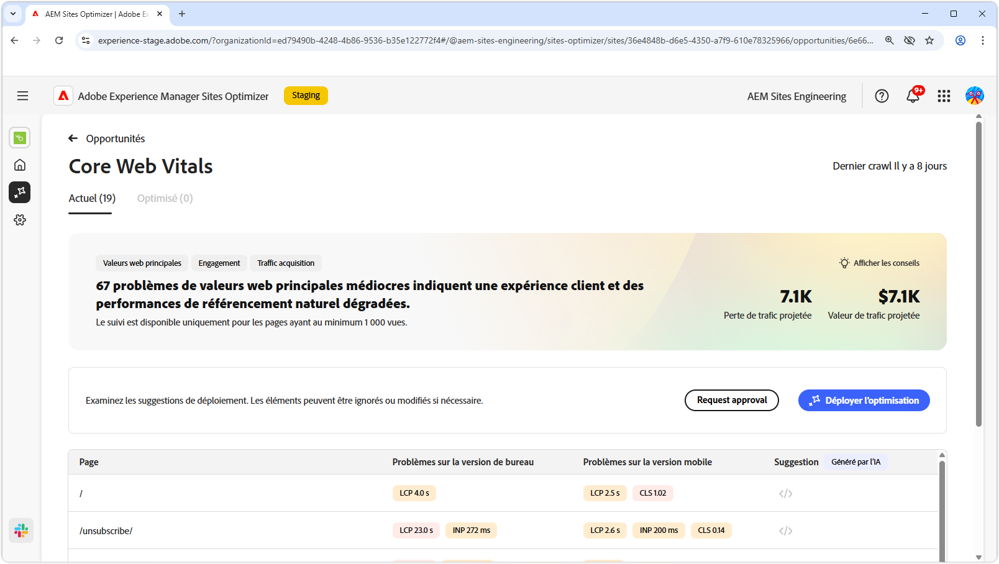

# Opportunité des éléments vitaux du web principal

{align="center"}

L’opportunité Web vitaux principale identifie les problèmes qui peuvent dégrader l’expérience utilisateur et les performances de recherche organiques de vos pages web. Ces problèmes proviennent de nombreux facteurs, tels que : les polices personnalisées, les dépendances JavaScript non optimisées, les scripts tiers, etc. L’opportunité des éléments web vitaux de base pointe ces éléments défectueux et suggère des correctifs qui peuvent améliorer les performances de votre page web. Notez que seules les pages qui ont au moins 1 000 pages vues peuvent être analysées.

Pour commencer, l’opportunité des éléments vitaux du web principal affiche un résumé en haut de la page, y compris un résumé du problème et de son impact sur votre site et votre entreprise.

* **Perte de trafic prévue** - Estimation de la perte de trafic due aux éléments vitaux du web principal qui sont inférieurs aux seuils de performance.
* **Valeur prévue du trafic** - Valeur estimée du trafic perdu.

## Auto-identification

{align="center"}

Dans la partie inférieure de la page, vous trouverez la liste de tous les événements actuels, regroupés comme suit :

* **Problèmes mobiles** - Liste des problèmes affectant la version mobile de la page.
* **Problèmes liés au bureau** - Liste des problèmes affectant la version bureau de la page.

Chaque événement est présenté dans un tableau, avec la colonne **Page** identifiant l’entrée de page concernée.

En outre, ces problèmes sont également regroupés selon les mesures de performances standard du rapport des éléments vitaux du web principal : la plus grande peinture contentée **LCP**, l’interaction avec la peinture suivante **INP** et le changement de disposition cumulé **CLS**.

## Suggestion automatique

{align="center"}

L’opportunité Web vitaux principale fournit des suggestions de correctifs générés par l’IA. Lorsque vous cliquez sur le bouton de suggestions, une nouvelle fenêtre s’affiche. Elle contient les mesures de performances **LCP**, **INP** et **CLS** sous forme de catégories. Vous pouvez basculer entre ces catégories pour afficher une liste de problèmes spécifiques.

Chaque catégorie peut contenir plusieurs problèmes. Veillez donc à faire défiler l’écran vers le bas pour afficher la liste complète des problèmes et des recommandations.  En outre, il existe deux jauges de performances pour les appareils mobiles et les ordinateurs de bureau pour chaque mesure.

## Optimisation automatique d’[!BADGE Ultimate]{type=Positive tooltip="Ultimate"}

{align="center"}

Sites Optimizer Ultimate offre la possibilité de déployer l’optimisation automatique pour les problèmes détectés par l’opportunité web vitale principale. <!--- TBD-need more in-depth and opportunity specific information here. What does the auto-optimization do?-->

>[!BEGINTABS]

>[!TAB Déployer l’optimisation]

{{auto-optimize-deploy-optimization-slack}}

>[!TAB Demande d’approbation]

{{auto-optimize-request-approval}}

>[!ENDTABS]

