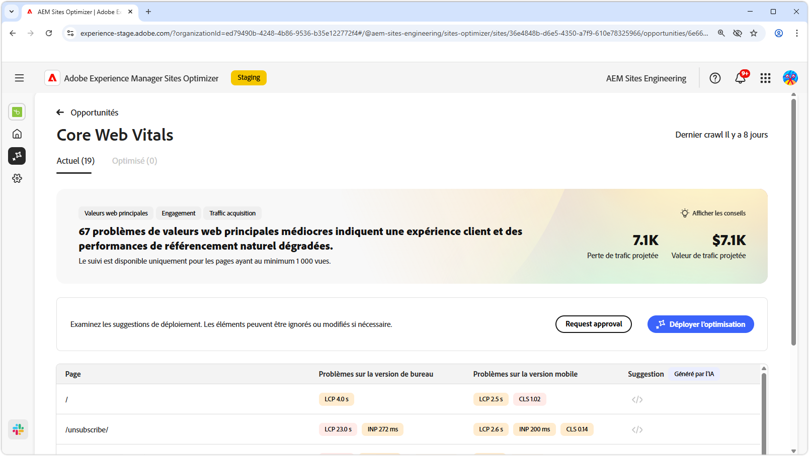
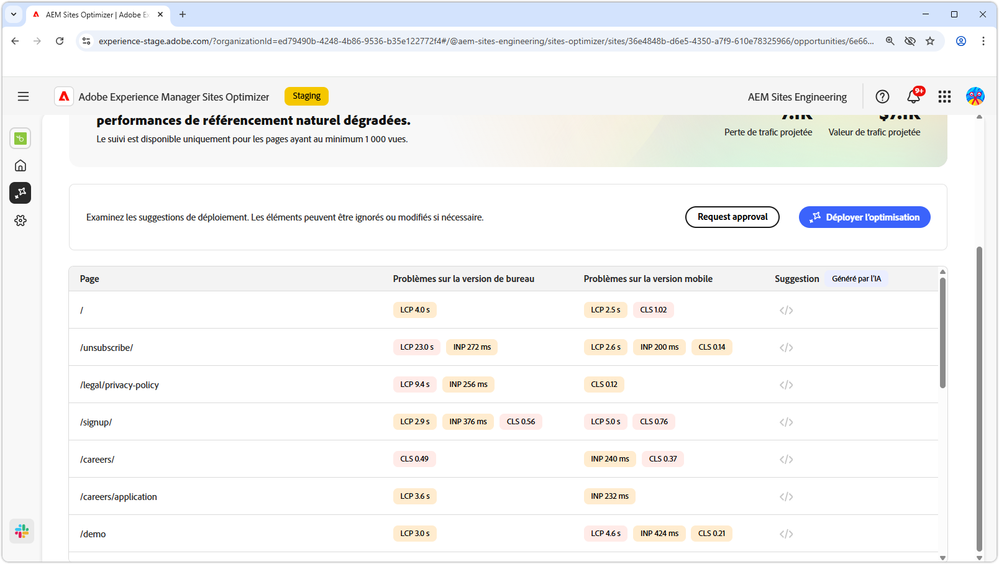

# Opportunité des valeurs web principales

<!--{align="center"}-->

>[!VIDEO](https://video.tv.adobe.com/v/3483371/?learn=on&enablevpops)

L’opportunité Core Web Vitals identifie les pages de votre site web qui ne sont pas performantes, ce qui a un impact sur l’expérience clientèle et les performances de référencement naturel. Ces problèmes peuvent provenir de facteurs tels que les polices personnalisées, les dépendances JavaScript non optimisées et les scripts tiers. Core Web Vitals mesure la vitesse de chargement du contenu, la stabilité de la mise en page et la réactivité de la page aux interactions des utilisateurs et utilisatrices.

AEM Sites Optimizer détecte les pages affectées par ces problèmes, fournit des recommandations d’IA spécifiques au niveau du code et applique des correctifs par le biais de vos workflows de développement existants. Notez que seules les pages avec au moins 1 000 vues peuvent être analysées.

## Identification automatique

<!--{align="center"}-->

AEM Sites Optimizer surveille en permanence les performances du site à l’aide de la [télémétrie opérationnelle](https://experienceleague.adobe.com/fr/docs/experience-manager-cloud-service/content/sites/operational-telemetry-for-aem-as-a-cloud-service) pour détecter les régressions dans les mesures Core Web Vitals telles que Largest Contentful Paint (LCP), Cumulative Layout Shift (CLS) et Interaction to Next Paint (INP). Il utilise des données réelles des utilisateurs et utilisatrices pour identifier les régressions de performances et classe les problèmes en fonction de leur impact sur l’expérience cliente.

AEM Sites Optimizer affiche la liste de tous les problèmes courants, détaillée par appareil mobile et poste de travail. La colonne **Page** indique l’entrée de page concernée et les problèmes sont classés par LCP, INP et CLS.

## Suggestion automatique

<!--{align="center"}-->

Pour chaque problème identifié, AEM Sites Optimizer génère des recommandations personnalisées au niveau du code afin d’améliorer les performances de Core Web Vitals. Il évalue la mise en œuvre sous-jacente en accédant à votre référentiel de code. Cela permet au système d’analyser la manière dont les composants, les scripts et les styles sont mis en œuvre et d’identifier la cause première des problèmes de performances. Sur la base de cette analyse, le système fournit des recommandations ciblées et génère des correctifs de code qui spécifient les modifications nécessaires pour améliorer les performances. Chaque recommandation peut être vérifiée avant d’être appliquée.

Lorsque vous cliquez sur le bouton des suggestions, une fenêtre contenant les mesures de performances LCP, INP et CLS sous forme de catégories s’affiche. Vous pouvez basculer entre ces catégories pour afficher une liste de problèmes spécifiques. Chaque catégorie peut contenir plusieurs problèmes. Veillez donc à faire défiler l’écran vers le bas pour afficher la liste complète des problèmes et des recommandations. En outre, il existe deux jauges de performances pour les appareils mobiles et les ordinateurs de bureau pour chaque mesure.

## Optimiser automatiquement

<!--[!BADGE Ultimate]{type=Positive tooltip="Ultimate"}-->

Une fois les recommandations vérifiées et approuvées, vous pouvez cliquer sur **Déployer l’optimisation**. AEM Sites Optimizer génère des correctifs de code en fonction des problèmes identifiés et les met à disposition par le biais de processus de contrôle de version. Le processus d’optimisation comprend les étapes suivantes :

* **Création de problèmes** : permet de créer un problème GitHub étiqueté pour chaque correctif, y compris une description claire et l’URL affectée pour la visibilité.
* **Diffusion de demande d’extraction** : permet d’ouvrir automatiquement une demande d’extraction associée avec le correctif de code exact, prête à être examinée, testée et fusionnée.
* **Suivi du statut** : permet d’effectuer le suivi de chaque correctif jusqu’à la fin, en signalant les tentatives partielles ou ayant échoué pour assurer un suivi.

Avant de rendre ces mises à jour disponibles, AEM Sites Optimizer effectue une validation pour s’assurer que les correctifs résolvent le problème sous-jacent et n’introduisent pas de régressions. Toutes les mises à jour suivent les pratiques de développement standard, qui nécessitent une révision et une approbation avant d’être intégrées en production.

Cela permet de s’assurer que les optimisations de performances sont exactes, validées et intégrées aux processus de développement et de gouvernance existants.
