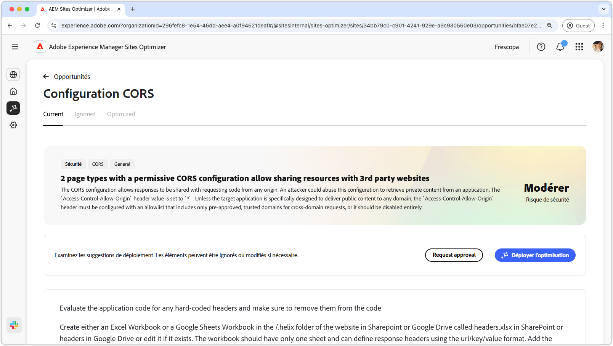
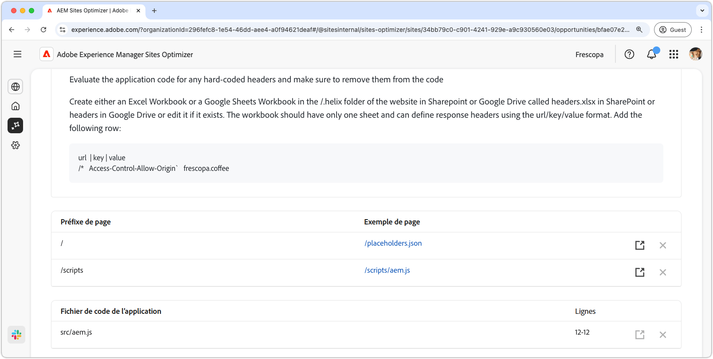

# Opportunité de configuration CORS

{align="center"}

La configuration correcte du partage des ressources cross-origin (CORS) est essentielle pour sécuriser les applications web contre tout accès non autorisé aux données. Lorsque l’en-tête `Access-Control-Allow-Origin` est défini sur `*`, tout domaine peut demander et recevoir des réponses, exposant potentiellement les informations sensibles aux attaquant(e)s. Cela offre l’occasion de renforcer la sécurité en mettant en œuvre une liste autorisée contrôlée de domaines approuvés ou en désactivant CORS lorsque cela n’est pas nécessaire. Une configuration CORS sécurisée contribue à protéger le contenu privé tout en maintenant un accès transparent pour les utilisateurs autorisés.

## Auto-identification

{align="center"}

L’auto-identification analyse votre site web à la recherche d’erreurs de configuration CORS et détecte les URL susceptibles d’être consultées sans autorisation. Ces URL sont répertoriées dans le tableau supérieur, avec les détails suivants :

* **Préfixe de page** - Préfixe du chemin d’URL qui est vulnérable à une mauvaise configuration CORS.
* **Exemple de page** - Exemple d’URL sensible aux accès non autorisés.

## Suggestion automatique

{align="center"}

Suggérez automatiquement des fournisseurs de **fichiers de code d’application** et de leurs **lignes** à réviser qui peuvent définir des politiques CORS laxistes.

## Optimisation automatique d’[!BADGE Ultimate]{type=Positive tooltip="Ultimate"}

>[!BEGINTABS]

>[!TAB Déployer l’optimisation]

{{auto-optimize-deploy-optimization-slack}}

>[!TAB Demande d’approbation]

{{auto-optimize-request-approval}}

>[!ENDTABS]
