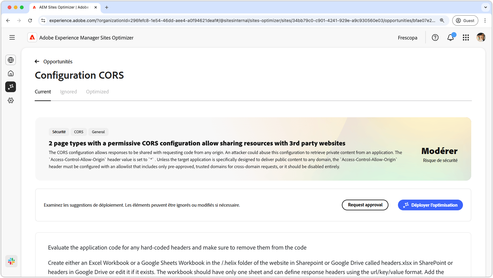
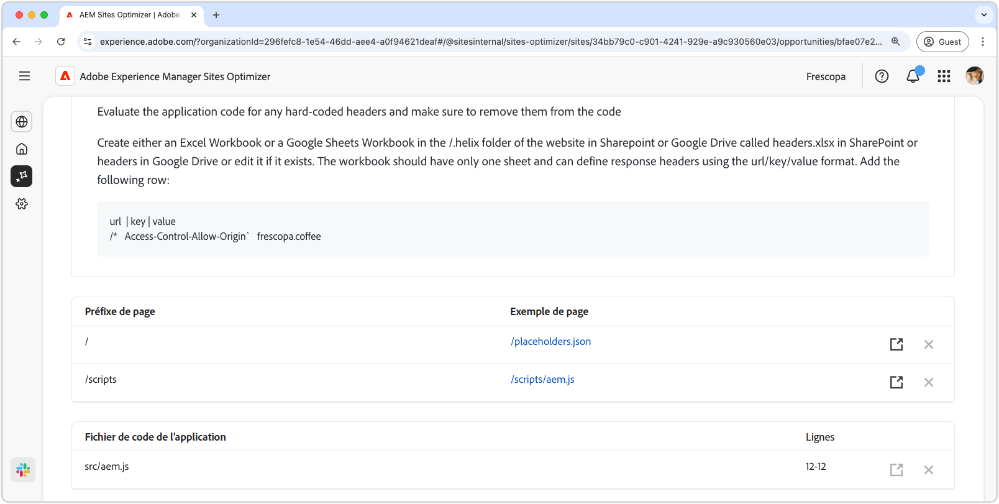

# Opportunité de configuration CORS

{align="center"}

La configuration correcte du partage des ressources entre origines multiples (CORS) est essentielle pour sécuriser les applications web contre tout accès non autorisé aux données. Lorsque l’en-tête `Access-Control-Allow-Origin` est défini sur `*`, tout domaine peut demander et recevoir des réponses, exposant potentiellement les informations sensibles aux personnes malveillantes. Cette fonctionnalité permet de renforcer la sécurité en implémentant une liste autorisée contrôlée de domaines approuvés ou en désactivant CORS lorsque cela n’est pas nécessaire. Une configuration CORS sécurisée contribue à protéger le contenu privé tout en maintenant un accès transparent pour les personnes autorisées.

## Identification automatique

{align="center"}

L’identification automatique analyse votre site web à la recherche d’erreurs de configuration CORS et détecte les URL susceptibles d’être consultées sans autorisation. Ces URL sont répertoriées dans le tableau supérieur, avec les détails suivants :

* **Préfixe de page** : préfixe du chemin d’URL qui est vulnérable à une mauvaise configuration CORS.
* **Exemple de page** : exemple d’URL sensible aux accès non autorisés.

## Suggestion automatique

{align="center"}

La suggestion automatique fournit des **fichiers de code d’application** et des **lignes** à vérifier qui peuvent définir des politiques CORS laxistes.

## Optimiser automatiquement

[!BADGE Ultimate]{type=Positive tooltip="Ultimate"}

>[!BEGINTABS]

>[!TAB Déployer l’optimisation]

{{auto-optimize-deploy-optimization-slack}}

>[!TAB Demande d’approbation]

{{auto-optimize-request-approval}}

>[!ENDTABS]
