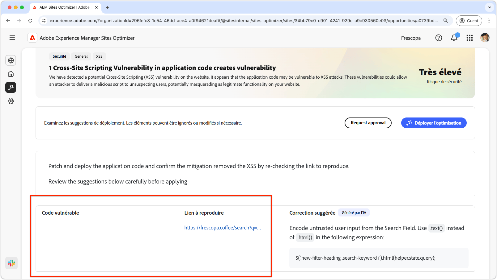
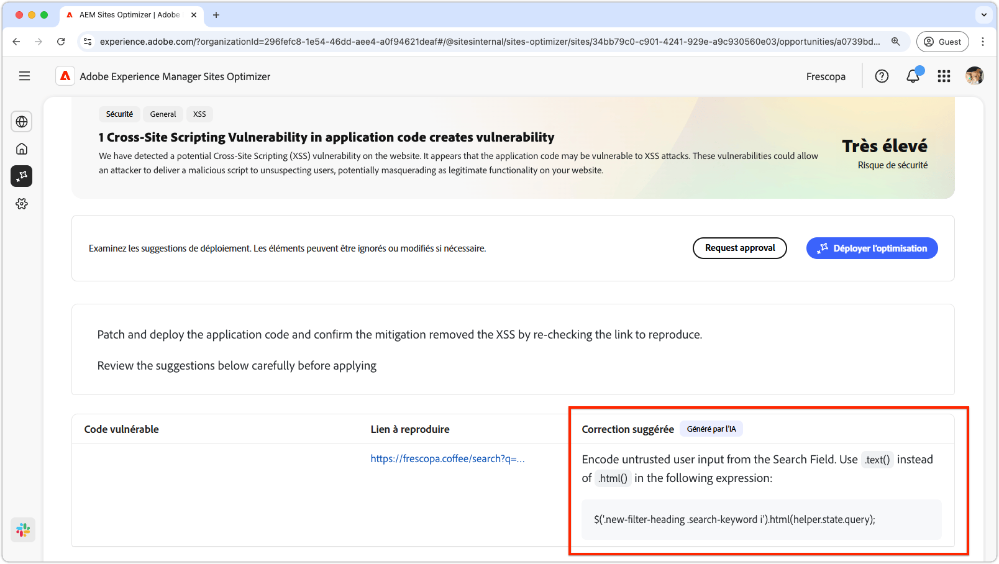

# Opportunité de cross-site scripting

{align="center"}

L’opportunité de cross-site scripting identifie et corrige les vulnérabilités du code de votre site qui peuvent être exploitées par des attaquant(e)s afin d’injecter des scripts malveillants dans des pages web consultées par d’autres utilisateurs et utilisatrices. Ces scripts peuvent voler des informations sensibles, telles que des cookies de session, ou effectuer des actions pour le compte de l’utilisateur, comme modifier son mot de passe.

## Auto-identification

{align="center"}

* **Code vulnérable** - Tout code vulnérable aux attaques de script entre sites.
* **Lien à reproduire** - Lien vers la page où la vulnérabilité a été trouvée.

## Suggestion automatique

{align="center"}

* **Correctif suggéré** - Une suggestion générée par l’IA sur la façon de corriger la vulnérabilité.

## Optimisation automatique d’[!BADGE Ultimate]{type=Positive tooltip="Ultimate"}

>[!BEGINTABS]

>[!TAB Déployer l’optimisation]

{{auto-optimize-deploy-optimization-slack}}

>[!TAB Demande d’approbation]

{{auto-optimize-request-approval}}

>[!ENDTABS]
