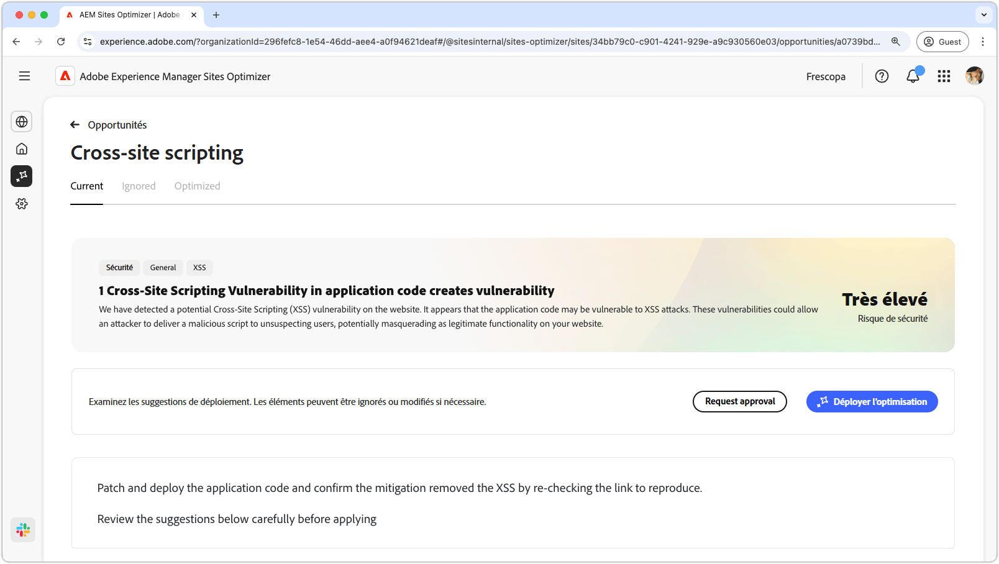

# Opportunité de cross-site scripting

{align="center"}

L’opportunité de cross-site scripting identifie les vulnérabilités du code de votre site. Il corrige ensuite les problèmes que les attaquant peuvent exploiter pour injecter des scripts malveillants dans des pages web consultées par d’autres utilisateurs. Ces scripts peuvent voler des informations sensibles, telles que des cookies de session, ou effectuer des actions pour le compte de l’utilisateur ou utilisatrice, comme modifier son mot de passe.

## Identification automatique

{align="center"}

* **Code vulnérable** : tout code vulnérable aux attaques de cross-site scripting.
* **Lien à reproduire** : lien vers la page où la vulnérabilité a été trouvée.

## Suggestion automatique

{align="center"}

* **Correctif suggéré** : suggestion générée par l’IA sur la façon de corriger la vulnérabilité.

## Optimiser automatiquement

[!BADGE Ultimate]{type=Positive tooltip="Ultimate"}

>[!BEGINTABS]

>[!TAB Déployer l’optimisation]

{{auto-optimize-deploy-optimization-slack}}

>[!TAB Demande d’approbation]

{{auto-optimize-request-approval}}

>[!ENDTABS]
