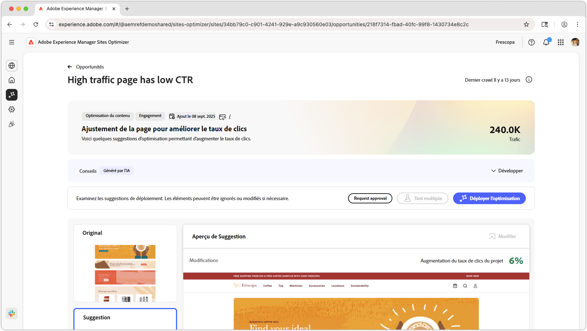
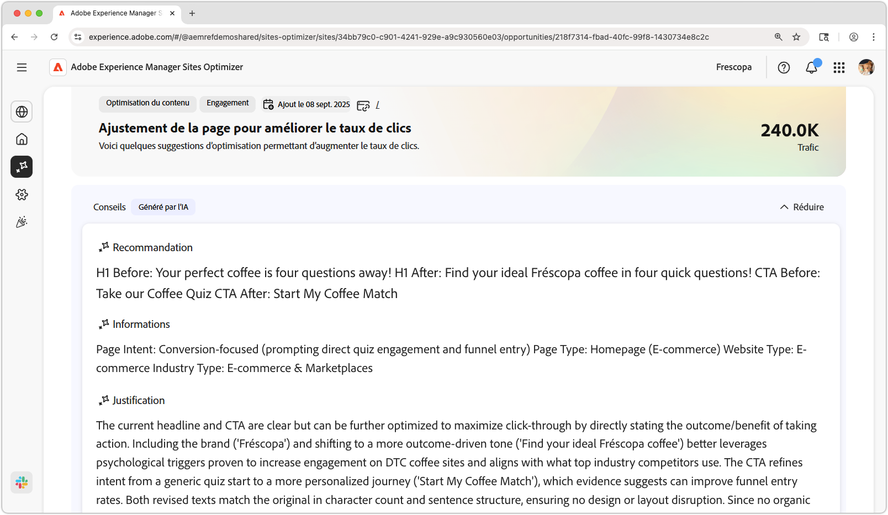
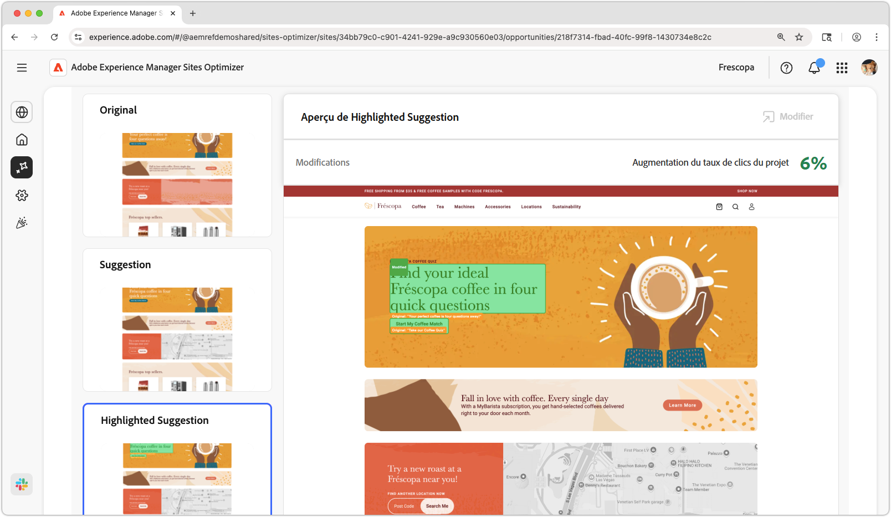
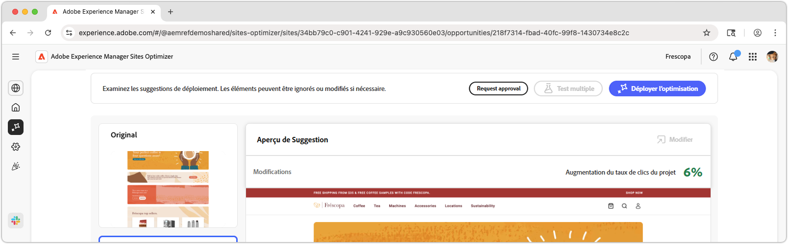

# Opportunité Page à trafic élevé avec faible CTR

{align="center"}

L’opportunité Page à trafic élevé avec faible CTR identifie les pages de votre site web qui reçoivent un trafic important, mais qui ont un faible taux de clic (CTR). En analysant ces pages, vous pouvez identifier les problèmes potentiels qui peuvent entraver l’interaction client et prendre des mesures pour améliorer ses performances. Cette opportunité est essentielle pour optimiser le contenu et la mise en page de votre site web, afin d’augmenter vos taux de conversion et d’améliorer les expériences d’utilisation.

## Identification automatique

{align="center"}

L’**opportunité Page à trafic élevé avec faible CTR** identifie les pages à trafic élevé avec un CTR faible sur votre site web et inclut les éléments suivants :

* **Recommandation** : action suggérée pour améliorer le CTR de la page.
* **Informations** : explication de la raison pour laquelle le CTR de la page est faible.
* **Justification** : raisonnement derrière la recommandation.

## Suggestion automatique

{align="center"}

La suggestion automatique fournit des suggestions générées par l’IA sur ce à quoi une expérience web optimisée pourrait ressembler. Les suggestions incluent une vue **mise en surbrillance** qui facilite la consultation des modifications suggérées.

Vous pouvez sélectionner les suggestions pour les afficher en plein écran, visualiser leur impact prévisionnel sur le CTR et les modifier avant de les appliquer à la page.

## Optimiser automatiquement

[!BADGE Ultimate]{type=Positive tooltip="Ultimate"}

{align="center"}

Sites Optimizer Ultimate permet de déployer une optimisation automatique pour l’optimisation détectée.

>[!BEGINTABS]

>[!TAB Déployer l’optimisation]

{{auto-optimize-deploy-optimization-slack}}

>[!TAB Demande d’approbation]

{{auto-optimize-request-approval}}

>[!ENDTABS]
