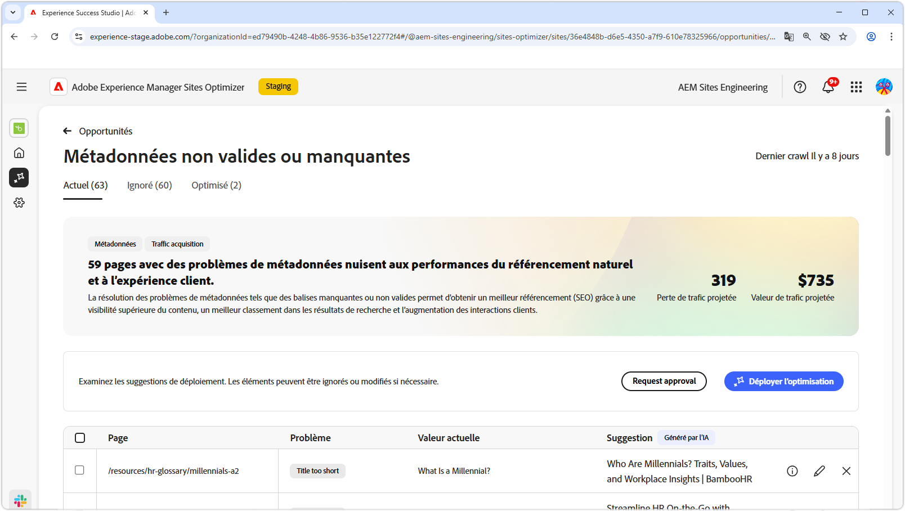
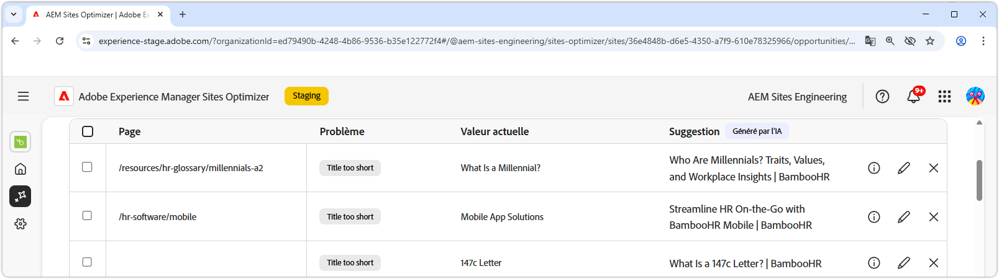
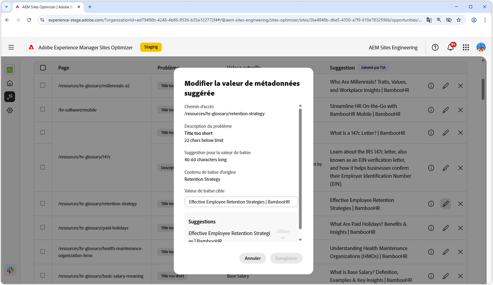
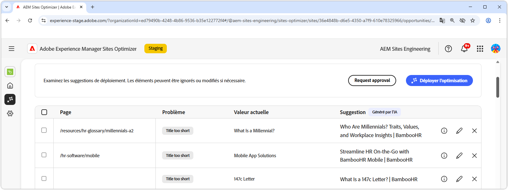

# Opportunité de métadonnées non valide ou manquante

{align="center"}

L’opportunité de métadonnées non valide ou manquante identifie les métadonnées manquantes ou défectueuses sur vos pages web. La résolution des problèmes de métadonnées améliore l’optimisation du moteur de recherche en améliorant la visibilité du contenu, le classement des recherches et l’interaction client. Ces problèmes peuvent provenir de facteurs tels que des balises manquantes ou non valides, des descriptions trop longues ou trop courtes, etc.

L’opportunité de métadonnées non valide ou manquante affiche un résumé en haut de la page, y compris un résumé du problème et de son impact sur votre site et votre entreprise.

* **Perte de trafic prévue** - Estimation de la perte de trafic due à des métadonnées défectueuses.
* **Valeur prévue du trafic** - Valeur estimée du trafic perdu.

## Auto-identification

{align="center"}

L’opportunité de métadonnées non valide ou manquante répertorie toutes les métadonnées défectueuses sur vos pages et inclut les éléments suivants :

* **Page** - Page contenant les métadonnées non valides ou manquantes.
* **Problème** - Indique le type de problème ayant un impact sur la balise de métadonnées. Il peut s’agir de titres manquants, de doublons de H1, etc.
* **Value** - Valeur actuelle de balise de métadonnées qui doit être modifiée.
* **Suggestion** - Suggestion générée par l’IA pour les mises à jour de balises appropriées. Consultez la section ci-dessous pour plus de détails.

## Suggestion automatique

{align="center"}

L’opportunité de métadonnées non valide ou manquante fournit également des suggestions générées par l’IA sur la modification ou la mise à jour des balises de métadonnées. Ces suggestions sont basées sur la balise initiale qui contenait les métadonnées défectueuses, ainsi que sur le contenu de la mise à jour suggérée.

>[!BEGINTABS]

>[!TAB Justification de l’IA]

La sélection de l’icône **informations** fournit la justification par l’IA de la mise à jour suggérée.

>[!TAB  Modifier la valeur de métadonnées suggérée]

{align="center"}

Si vous n’êtes pas d’accord avec la suggestion générée par l’IA, vous pouvez modifier la valeur de métadonnées suggérée en sélectionnant l’icône **Modifier**. Vous pouvez ainsi saisir manuellement la valeur qui, selon vous, convient le mieux aux métadonnées. La fenêtre de modification contient les éléments suivants :

* **Path** - Chemin d’accès à la page contenant les métadonnées (ou le manque de métadonnées).
* **Description du problème** - Indique le type de problème ayant un impact sur la balise de métadonnées et fournit une brève description.
* **Suggestion pour la valeur de balise** - Suggestion générée par l’IA sur la modification ou la mise à jour de la balise de métadonnées. Par exemple, le nombre de caractères que la mise à jour de balise doit contenir, etc.
* **Contenu original de la balise** - Valeur de balise d’origine.
* **Valeur de balise cible** - Modifiez ce champ et ajoutez manuellement la valeur de balise souhaitée. Lorsque vous sélectionnez **Enregistrer**, il s’agit de la valeur qui sera appliquée à la mise à jour proposée.
* **Suggestion** - Suggestion générée par l’IA sur la manière de modifier la valeur.
* **Enregistrer** - Enregistre et applique la valeur du champ **Valeur de balise cible**.

>[!TAB Ignorer les entrées]

Vous pouvez choisir d’ignorer les entrées avec les métadonnées ciblées rompues ou non valides. Sélectionner l’icône **ignorer** supprime l’entrée de la liste des opportunités. Les entrées ignorées peuvent être réengagées à partir de l’onglet **Ignorées** en haut de la page de l’opportunité.

>[!ENDTABS]

## Optimisation automatique d’[!BADGE Ultimate]{type=Positive tooltip="Ultimate"}

{align="center"}

Sites Optimizer Ultimate permet de déployer l’optimisation automatique pour les problèmes détectés par l’opportunité de métadonnées non valide ou manquante. <!--- TBD-need more in-depth and opportunity specific information here. What does the auto-optimization do?-->

>[!BEGINTABS]

>[!TAB Déployer l’optimisation]

{{auto-optimize-deploy-optimization-slack}}

>[!TAB Demande d’approbation]

{{auto-optimize-request-approval}}

>[!ENDTABS]
