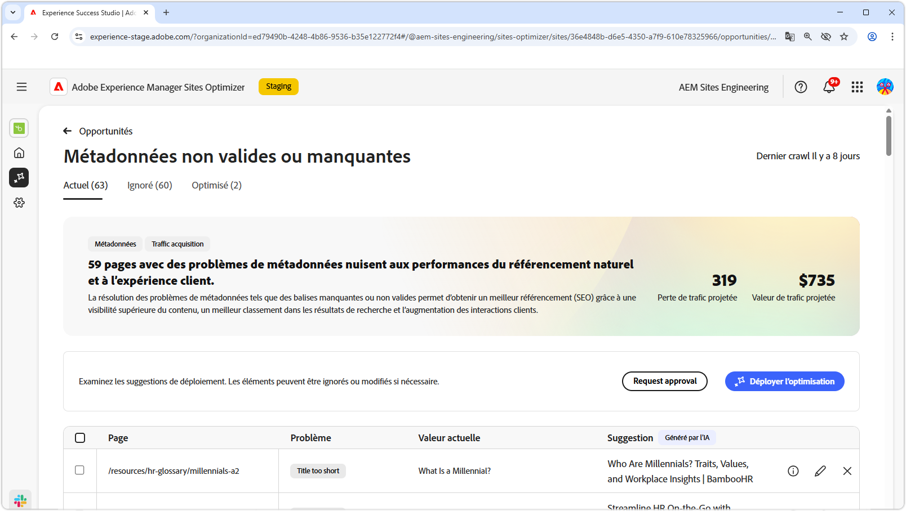
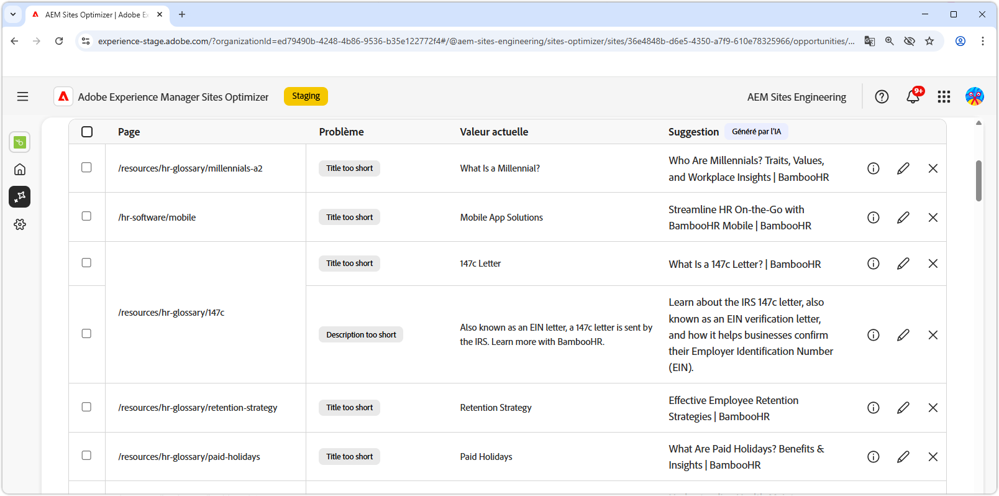
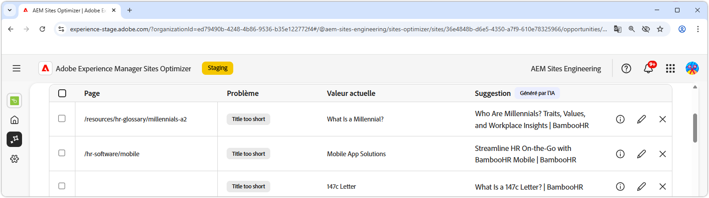
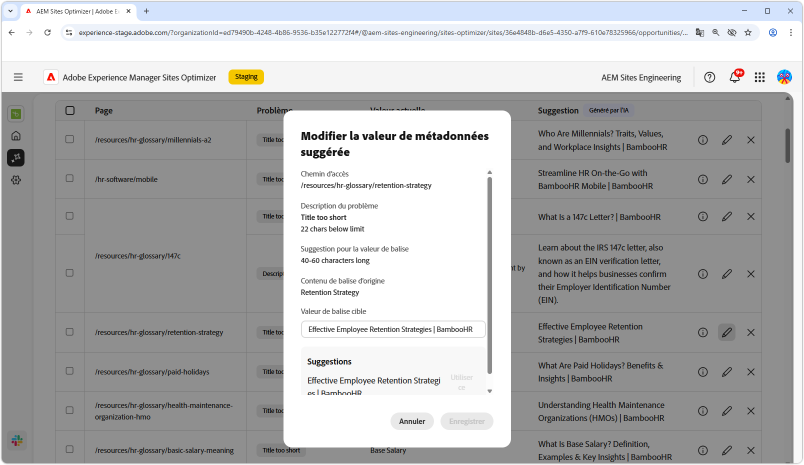
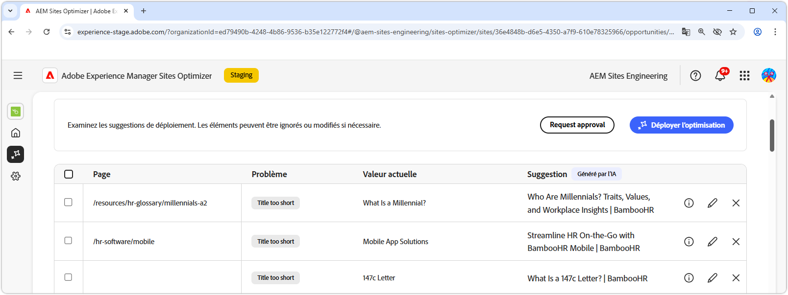

# Opportunité de métadonnées non valides ou manquantes

{align="center"}

L’opportunité de métadonnées non valides ou manquantes identifie les métadonnées manquantes ou défectueuses sur vos pages web. La résolution des problèmes de métadonnées permet d’obtenir un meilleur référencement grâce à une visibilité supérieure du contenu, un meilleur classement dans les résultats de recherche et l’augmentation de l’engagement client. Ces problèmes peuvent provenir de facteurs tels que des balises manquantes ou non valides, des descriptions trop longues ou trop courtes, etc.

L’opportunité de métadonnées non valides ou manquantes affiche un résumé en haut de la page, y compris une synthèse du problème et de son impact sur votre site et votre entreprise.

* **Trafic projeté perdu** : estimation de la perte de trafic due aux métadonnées.
* **Valeur de trafic projetée** : valeur estimée du trafic perdu.

## Identification automatique

{align="center"}

L’opportunité de métadonnées non valides ou manquantes répertorie toutes les métadonnées défectueuses sur vos pages et inclut les éléments suivants :

* **Page** : page contenant les métadonnées non valides ou manquantes.
* **Problème** : indique le type de problème ayant un impact sur la balise de métadonnées. Il peut s’agir de titres manquants, de doublons H1, etc.
* **Valeur** : valeur actuelle de balise de métadonnées qui doit être modifiée.
* **Suggestion** : suggestion générée par l’IA pour les mises à jour de balises appropriées. Consultez la section ci-dessous pour plus de détails.

## Suggestion automatique

{align="center"}

L’opportunité de métadonnées non valides ou manquantes fournit également des suggestions générées par l’IA sur la modification ou la mise à jour des balises de métadonnées. Ces suggestions sont basées sur la balise initiale qui contenait les métadonnées défectueuses, ainsi que sur le contenu de la mise à jour suggérée.

>[!BEGINTABS]

>[!TAB Justification de l’IA]

Sélectionner l’ fournit une justification générée par l’IA pour la mise à jour suggérée.

>[!TAB Modifier la valeur de métadonnées suggérée]

{align="center"}

Si vous n’êtes pas d’accord avec la suggestion générée par l’IA, vous pouvez modifier la valeur des métadonnées suggérées en cliquant sur l’. Vous pouvez ainsi saisir manuellement la valeur qui, selon vous, convient le mieux aux métadonnées. La fenêtre de modification contient les éléments suivants :

* **Chemin** : chemin d’accès à la page contenant les métadonnées (ou qui comporte un manque de métadonnées).
* **Description du problème** : indique le type de problème ayant un impact sur la balise de métadonnées et fournit une brève description.
* **Suggestion pour la valeur de balise** : suggestion générée par l’IA sur la modification ou la mise à jour de la balise de métadonnées. Par exemple, le nombre de caractères que la mise à jour de balise doit contenir, etc.
* **Contenu de balise d’origine** : valeur de balise d’origine.
* **Valeur de balise cible** : modifiez ce champ et ajoutez manuellement la valeur de balise souhaitée. Lorsque vous sélectionnez **Enregistrer**, il s’agit de la valeur qui sera appliquée à la mise à jour proposée.
* **Suggestion** : suggestion générée par l’IA pour modifier la valeur.
* **Enregistrer** : enregistre et applique la valeur du champ **Valeur de balise cible**.

>[!TAB Ignorer les entrées]

Vous pouvez choisir d’ignorer les entrées avec les métadonnées cibles rompues ou non valides. Sélectionner l’ supprime l’entrée de la liste des opportunités. Les entrées ignorées peuvent être à nouveau traitées à partir de l’onglet **Ignoré** en haut de la page des opportunités.

>[!ENDTABS]

## Optimiser automatiquement

[!BADGE Ultimate]{type=Positive tooltip="Ultimate"}

{align="center"}

Sites Optimizer Ultimate permet de déployer l’optimisation automatique pour les problèmes détectés par l’opportunité de métadonnées non valides ou manquantes. <!--- TBD-need more in-depth and opportunity specific information here. What does the auto-optimization do?-->

>[!BEGINTABS]

>[!TAB Déployer l’optimisation]

{{auto-optimize-deploy-optimization-slack}}

>[!TAB Demande d’approbation]

{{auto-optimize-request-approval}}

>[!ENDTABS]
