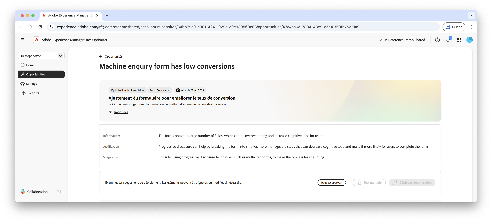

# Opportunité de conversions faibles pour les formulaires

 La fonctionnalité d’optimisation de formulaires est disponible dans le cadre du programme d’accès anticipé. Vous pouvez écrire à l’adresse aem-forms-ea@adobe.com à partir de votre identifiant e-mail officiel pour rejoindre le programme d’accès anticipé et demander l’accès à cette fonctionnalité. 

{align="center"}

L’opportunité de conversions faibles identifie les formulaires de votre site web qui présentent de faibles taux de conversion. Cette opportunité vous aide à identifier les formulaires à faible performance et fournit des suggestions d’amélioration de leurs taux d’engagement.

## Identification automatique

{align="center"}

Chaque page web possédant des formulaires à conversions faibles est répertoriée comme opportunité de **conversions faibles** à part entière. Un bref résumé de l’opportunité et une explication s’affichent en haut de la page de l’opportunité.

## Suggestion automatique

{align="center"}

La suggestion automatique fournit des variations des formulaires générées par l’IA conçues pour augmenter les conversions de vos formulaires. Chaque variation affiche l’**augmentation du taux de conversion prévue** en fonction des améliorations possibles de l’engagement du formulaire, ce qui vous permet de choisir en priorité les suggestions les plus efficaces.

>[!BEGINTABS]

>[!TAB Variation de contrôle]

{align="center"}

La variation de contrôle est le formulaire d’origine actuellement déployé sur votre site web. Cette variation est utilisée comme référence pour comparer les performances des variations suggérées.

>[!TAB Variations suggérées]

{align="center"}

Les variations suggérées sont des variations de formulaires générées par l’IA conçues pour augmenter les conversions de vos formulaires. Chaque variation affiche l’**augmentation du taux de conversion prévue** en fonction des améliorations possibles de l’engagement du formulaire, ce qui vous permet de choisir en priorité les suggestions les plus efficaces.

Cliquez sur chaque variation pour la prévisualiser dans la partie droite de l’écran. Dans la partie supérieure de la prévisualisation, les actions et informations suivantes sont disponibles :

* **Modifications** : résumé des modifications apportées à cette variation par rapport à la variation de **contrôle**.
* **Augmentation du taux de conversion prévue** : augmentation estimée de l’engagement du formulaire si cette variation est implémentée.
* **Modifier** - Cliquez pour modifier la variation dans l’instance de création AEM.

>[!ENDTABS]

<!-- 

## Auto-optimize

[!BADGE Ultimate]{type=Positive tooltip="Ultimate"}

{align="center"}

Sites Optimizer Ultimate adds the ability to deploy auto-optimization for the issues found by the low conversions opportunity.

>[!BEGINTABS]

>[!TAB Test multiple]

>[!TAB Publish selected]

{{auto-optimize-deploy-optimization-slack}}

>[!TAB Request approval]

{{auto-optimize-request-approval}}

>[!ENDTABS]

-->