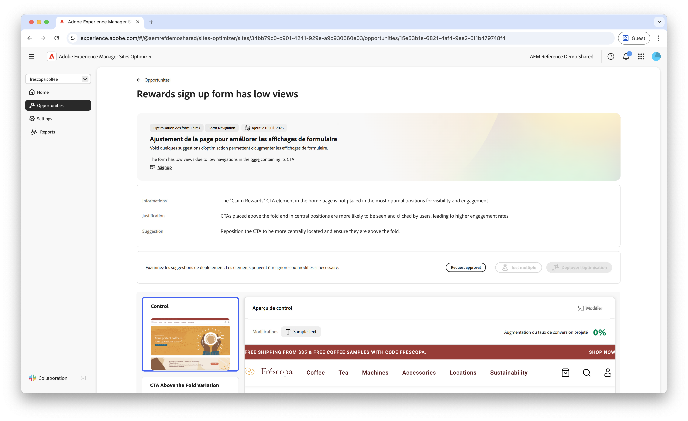

# Opportunité de vues basses

{align="center"}

L’opportunité de vues basses identifie les formulaires de votre site web qui présentent de faibles taux de vues. Cette opportunité vous aide à identifier les formulaires qui ne fonctionnent pas correctement. En outre, elle fournit des suggestions d’amélioration des taux d’engagement. En optimisant les vues de vos formulaires, vous pouvez augmenter le nombre d’envois de formulaires et améliorer les performances globales de votre site web.

## Identification automatique

{align="center"}

Chaque page web contenant un formulaire avec peu de vues est répertoriée comme opportunité de **vues basses** à part entière. Un bref résumé de l’opportunité et une justification basée sur l’IA s’affichent en haut de la page de l’opportunité.

## Suggestion automatique

{align="center"}

La suggestion automatique fournit des variations de page web générées par l’IA conçues pour augmenter les vues de vos formulaires. Chaque variation affiche l’**augmentation du taux de conversion prévue** en fonction des améliorations possibles pour l’engagement du formulaire, ce qui vous permet de prioriser les suggestions les plus efficaces.

>[!BEGINTABS]

>[!TAB Variation de contrôle]

{align="center"}

La variation de contrôle est le formulaire d’origine actif sur votre site web. Cette variation est utilisée comme référence pour comparer les performances des variations suggérées.

>[!TAB Variations suggérées]

{align="center"}

Les suggestions fournissent des variations de page web générées par l’IA conçues pour augmenter les vues de vos formulaires. Chaque variation affiche l’**augmentation du taux de conversion prévue** en fonction des améliorations possibles pour l’engagement du formulaire, ce qui vous permet de prioriser les suggestions les plus efficaces.

Cliquez sur chaque variation pour la prévisualiser dans la partie droite de l’écran. Dans la partie supérieure de la prévisualisation, les actions et informations suivantes sont disponibles :

* **Modifications** : résumé des modifications apportées à cette variation par rapport à la variation de **contrôle**.
* **Augmentation du taux de conversion prévue** : augmentation estimée de l’engagement du formulaire si cette variation est implémentée.
* **Modifier** : cliquez pour modifier la variation dans l’instance de création AEM.

>[!ENDTABS]

## Optimiser automatiquement

[!BADGE Ultimate]{type=Positive tooltip="Ultimate"}

{align="center"}

Sites Optimizer Ultimate permet de déployer l’optimisation automatique pour les problèmes détectés par l’opportunité de vues basses.

>[!BEGINTABS]

>[!TAB Test multiple]

>[!TAB Publication sélectionnée]

{{auto-optimize-deploy-optimization-slack}}

>[!TAB Demande d’approbation]

{{auto-optimize-request-approval}}

>[!ENDTABS]
