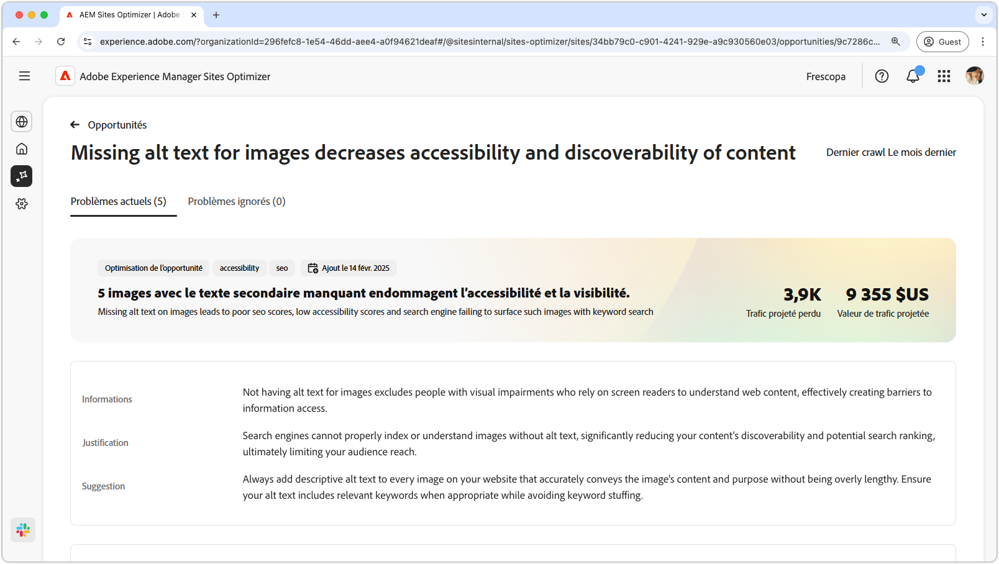
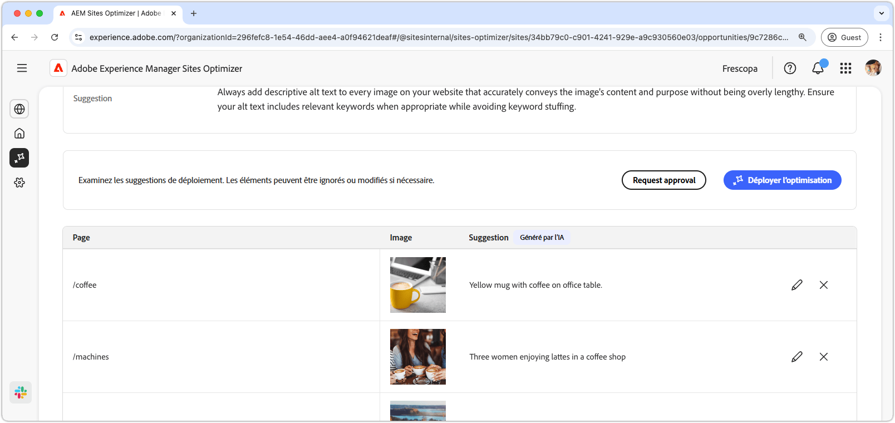
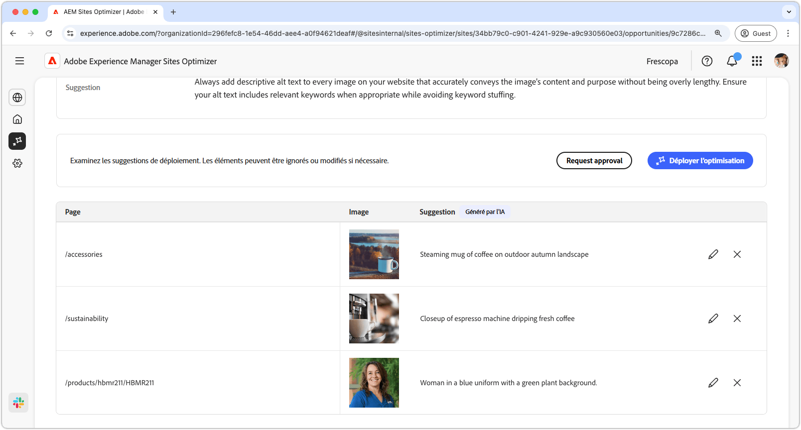
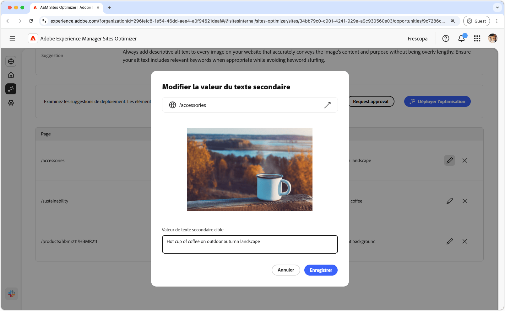
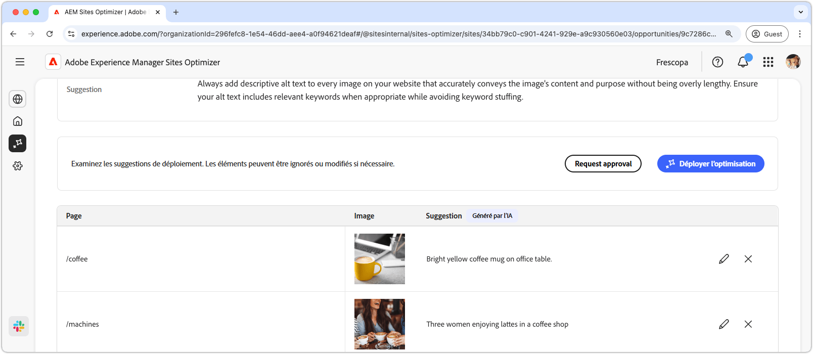

# Opportunité de texte de remplacement manquante

{align="center"}

L’opportunité de texte de remplacement manquant identifie les images sans texte de remplacement descriptif sur votre site web. Les moteurs de recherche ne peuvent pas correctement indexer ou comprendre les images sans texte secondaire, ce qui réduit considérablement la capacité de découverte de votre contenu et le classement de recherche potentiel, ce qui limite finalement la portée de votre audience. En outre, l’absence de texte secondaire pour les images exclut les personnes malvoyantes qui comptent sur les lecteurs d’écran pour comprendre le contenu web, ce qui crée des obstacles à l’accès à l’information.

L’opportunité de texte de remplacement manquante affiche un résumé en haut de la page, y compris un résumé du problème et de son impact sur votre site et votre entreprise.

* **Perte de trafic prévue** - Estimation de la perte de trafic due à un texte de remplacement manquant.
* **Valeur prévue du trafic** - Valeur estimée du trafic perdu.

Il existe également un champ supplémentaire qui affiche la justification, les informations et les suggestions liées à l’opportunité.

## Auto-identification

{align="center"}

L’opportunité Texte de remplacement manquant répertorie toutes les images de votre site web auxquelles il manque du texte de remplacement. Cette section comporte les catégories suivantes :

* **Page** - Chemin d’accès à la page qui contient le texte secondaire manquant.
* **Image** - Image sans texte de remplacement descriptif.
* **Suggestion** - Suggestion générée par l’IA pour le texte secondaire.

## Suggestion automatique

{align="center"}

La suggestion automatique fournit des suggestions générées par l’IA pour le texte secondaire des images. Les suggestions générées par l’IA sont conçues pour vous aider à ajouter rapidement du texte secondaire aux images sans avoir à analyser manuellement chaque image.

>[!BEGINTABS]

>[!TAB Modifier le texte secondaire manquant]

{align="center"}

Si vous n’êtes pas d’accord avec la suggestion générée par l’IA, vous pouvez modifier le texte secondaire suggéré en sélectionnant l’icône **Modifier**. Cela vous permet d’ajuster manuellement le texte que vous pensez être le mieux adapté à l’image. La fenêtre de modification contient les éléments suivants :

* **Chemin de la page** - Champ en lecture seule affichant le chemin d’accès à la page où le problème de texte de remplacement manquant se produit. Cliquez sur la flèche en regard du chemin d’accès pour ouvrir la page correspondante.
* **Image** - Aperçu en lecture seule de l’image qui nécessite du texte de remplacement.
* **Texte de remplacement pour Target** - Champ modifiable dans lequel vous pouvez saisir manuellement un texte de remplacement descriptif pour l’image. Veillez à ce que le texte secondaire transmette clairement le contenu et l’objectif de l’image de manière concise. Le cas échéant, incluez naturellement les mots-clés sans les surcharger.

>[!TAB Ignorer les entrées]

Vous pouvez choisir d’ignorer les entrées de la liste des opportunités. Sélectionner l’icône **ignorer** supprime l’entrée de la liste. Les entrées ignorées peuvent être réengagées à partir de l’onglet **Ignorées** en haut de la page de l’opportunité.

>[!ENDTABS]

## Optimisation automatique

[!BADGE Ultimate]{type=Positive tooltip="Ultimate"}

{align="center"}

Sites Optimizer Ultimate offre la possibilité de déployer l’optimisation automatique pour les problèmes détectés par l’opportunité de texte de remplacement manquante. <!--- TBD-need more in-depth and opportunity specific information here. What does the auto-optimization do?-->

>[!BEGINTABS]

>[!TAB Déployer l’optimisation]

{{auto-optimize-deploy-optimization-slack}}

>[!TAB Demande d’approbation]

{{auto-optimize-request-approval}}

>[!ENDTABS]
