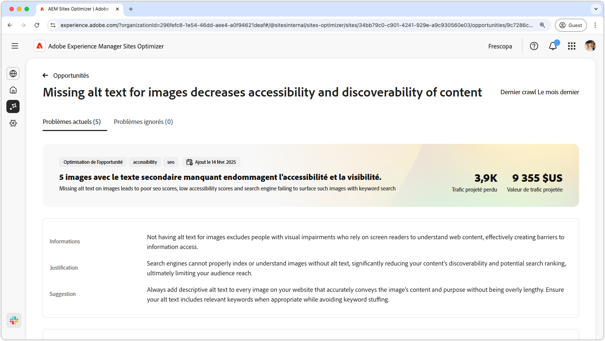
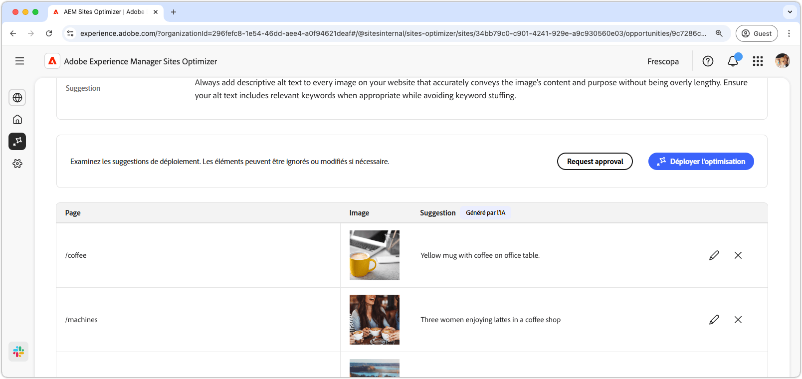
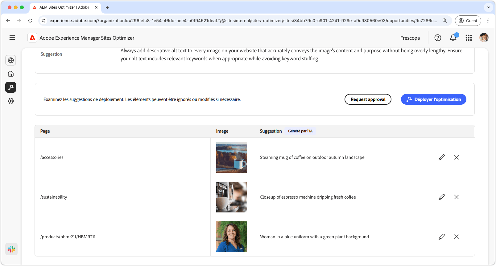
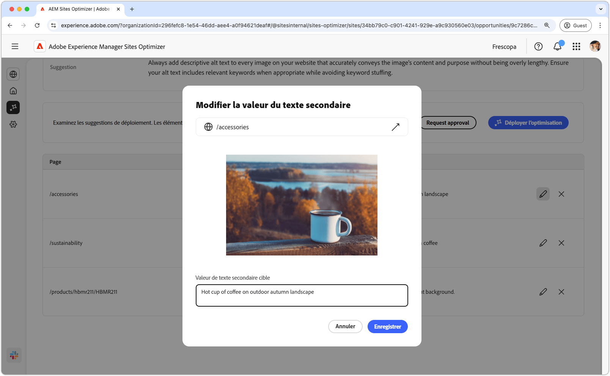
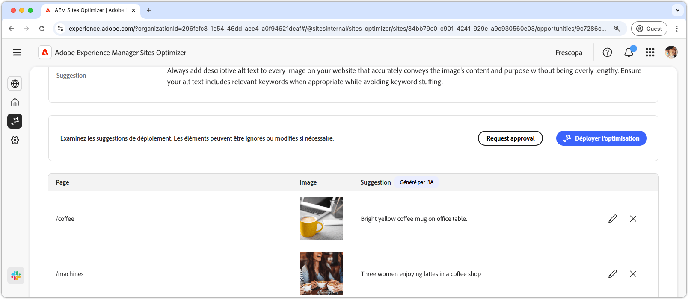

# Opportunité de texte secondaire manquant

{align="center"}

L’opportunité de texte secondaire manquant identifie les images de votre site web qui n’ont pas de texte secondaire descriptif. Sans texte secondaire, les utilisateurs qui dépendent des lecteurs d’écran ne peuvent pas interpréter le contenu visuel, ce qui crée des barrières à l’accessibilité. Il limite également la façon dont les moteurs de recherche comprennent et indexent les images, ce qui réduit la capacité de découverte du contenu et les performances de recherche. AEM Sites Optimizer identifie les problèmes de texte de remplacement manquants, fournit des recommandations d’IA spécifiques et permet un déploiement en un clic pour les résoudre, le tout dans une vue centralisée unique.

## Identification automatique

{align="center"}

AEM Sites Optimizer analyse votre site web à l’aide d’un audit en plusieurs étapes qui associe l’explore du site, les données réelles de trafic utilisateur et une analyse de l’IA afin d’identifier les images qui nécessitent un texte secondaire, mais pour lesquelles il n’est pas défini. Il évalue également les images de la page pour déterminer si le texte secondaire est nécessaire, à l’exclusion des images décoratives ou non conformément aux directives d’accessibilité du contenu web (WCAG). Les images sont analysées en fonction de leur rôle et de leur pertinence au sein de la page. La priorité est donnée aux correctifs qui ont le plus grand impact sur l’accessibilité et le SEO.

Cette opportunité fournit une liste des problèmes identifiés, notamment :

* **Page** : chemin d’accès à la page qui contient le texte secondaire manquant.
* **Image** : image sans texte secondaire descriptif.

## Suggestion automatique

{align="center"}

Pour chaque problème identifié, AEM Sites Optimizer propose un texte de remplacement descriptif pour l’image. Il utilise des modèles de vision basés sur l’IA pour analyser l’image et générer une description qui reflète son contenu et son rôle dans la page. Les recommandations sont concises, pertinentes et conformes aux bonnes pratiques en matière d’accessibilité. Chaque suggestion peut être examinée et modifiée avant d’être appliquée.

>[!BEGINTABS]

>[!TAB Modifier le texte secondaire manquant]

{align="center"}

Si vous n’êtes pas d’accord avec la suggestion générée par l’IA, vous pouvez modifier le texte secondaire suggéré en sélectionnant l’**icône Modifier**. Cela vous permet d’ajuster manuellement le texte qui, selon vous, est le plus adapté à l’image. La fenêtre de modification contient les éléments suivants :

* **Chemin de la page** : champ en lecture seule affichant le chemin d’accès à la page où le problème de texte secondaire manquant se produit. Cliquez sur la flèche en regard du chemin d’accès pour ouvrir la page correspondante.
* **Image** : prévisualisation en lecture seule de l’image qui nécessite du texte secondaire.
* **Texte secondaire cible** : champ modifiable dans lequel vous pouvez saisir manuellement un texte secondaire descriptif pour l’image. Veillez à ce que le texte de remplacement communique clairement le contenu et l’objectif de l’image de manière concise. Le cas échéant, incluez naturellement les mots-clés sans les surcharger.

>[!TAB Ignorer les entrées]

Vous pouvez choisir d’ignorer les entrées de la liste des opportunités. Sélectionner l’ supprime l’entrée de la liste. Les entrées ignorées peuvent être à nouveau traitées à partir de l’onglet **Ignoré** en haut de la page des opportunités.

>[!ENDTABS]

## Optimiser automatiquement

[!BADGE Ultimate]{type=Positive tooltip="Ultimate"}

{align="center"}

Une fois les suggestions examinées et approuvées, vous pouvez cliquer sur **Déployer l’optimisation**. AEM Sites Optimizer applique ensuite les correctifs dans l’environnement de création, en fonction de la gestion du texte secondaire dans votre implémentation. L’auteur AEM peut ensuite publier les modifications à partir du système de gestion de contenu (CMS).

Selon la configuration, les mises à jour peuvent être appliquées directement au contenu de la page, aux métadonnées des ressources ou aux modèles de contenu pris en charge. Le processus d’optimisation comprend les étapes suivantes :

* **Validation** - S’assure que les mises à jour sont appliquées en toute sécurité sans affecter les fonctionnalités existantes.
* **Déploiement** - Applique les mises à jour par le biais de processus existants, tels que les mises à jour de contenu dans AEM ou l’intégration aux API de contenu.
* **Vérification des autorisations** - Vérifie que l’utilisateur dispose des autorisations appropriées pour appliquer les modifications. Dans le cas contraire, d’autres sorties, telles que des mises à jour téléchargeables, peuvent être utilisées pour la remise.

Les mises à jour sont versionnées lorsqu’elles sont prises en charge, offrant visibilité et capacité de restauration. Cela permet de s’assurer que les mises à jour du texte secondaire sont appliquées avec précision, alignées sur les implémentations existantes et conformes aux normes de gouvernance et d’accessibilité.

AEM Sites Optimizer applique automatiquement les mises à jour de texte de remplacement en fonction de votre configuration :

* **** - Met à jour le document source (par exemple, Google Docs ou SharePoint).
* **** - Écrit des mises à jour directement via l’API de contenu avec le contrôle de version et la prise en charge de secours.
* **Digital Asset Management (facultatif)** - Met à jour le texte secondaire au niveau des ressources, le cas échéant.
