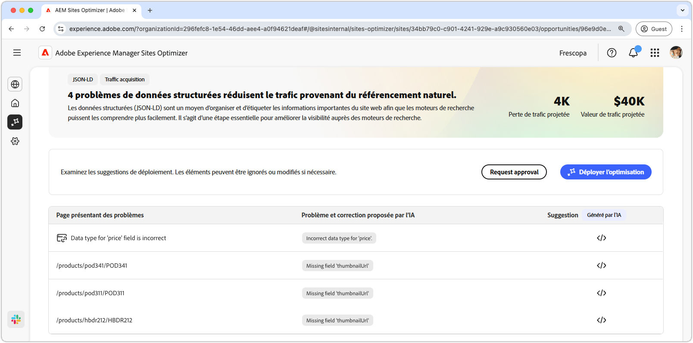
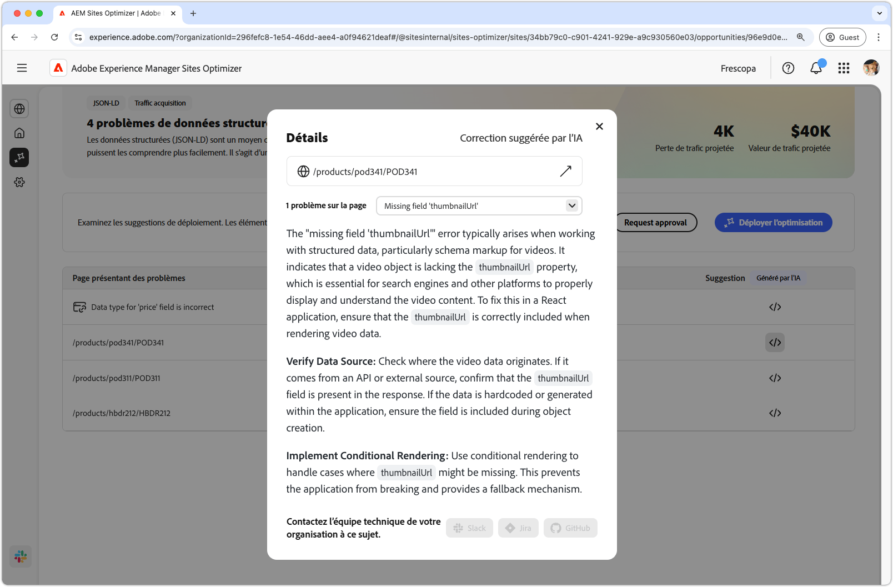

# Opportunité des données structurées manquantes ou non valides

{align="center"}

L’opportunité des données structurées manquantes ou non valides identifie les données structurées manquantes ou défectueuses au format JSON-LD standardisé. Les données structurées permettent d’organiser, de décrire et d’étiqueter les informations importantes sur votre site web. Cela permet aux moteurs de recherche d’interpréter le contenu de vos pages et améliore la visibilité dans les résultats de recherche. De meilleurs résultats de recherche peuvent inciter davantage d’utilisateurs et d’utilisatrices à interagir avec votre site web.

L’opportunité des données structurées manquantes ou non valides affiche un résumé en haut de la page, y compris une synthèse du problème et de son impact sur votre site et votre entreprise.

* **Perte de trafic prévue** : estimation de la perte de trafic due à des données structurées défectueuses.
* **Valeur prévue du trafic** : valeur estimée du trafic perdu.

## Identification automatique

{align="center"}

L’opportunité des données structurées manquantes ou non valides répertorie tous les problèmes détectés sur vos pages et contient les catégories suivantes :

* **Page avec des problèmes** : page qui contient les données structurées non valides ou manquantes.
* **Problème et correctif proposé par l’IA** : indique le type de problème de données structurées affectant la page.
* **Suggestion** : suggestion générée par l’IA pour des mises à jour de données structurées appropriées. Consultez la section ci-dessous pour plus de détails.

## Suggestion automatique

{align="center"}

L’opportunité des données structurées non valides ou manquantes fournit également des suggestions générées par l’IA sur la modification ou la mise à jour des données structurées. Lorsque vous cliquez sur le bouton des suggestions, une fenêtre contenant les éléments suivants s’affiche :

* **Chemin d’accès à la page** : champ contenant le chemin d’accès à la page avec des données structurées non valides ou manquantes.
* **Problèmes** : champ qui contient le nombre de problèmes et un menu déroulant qui répertorie tous les problèmes.
* **Champ des suggestions** : description et suggestions générées par l’IA pour des mises à jour de données structurées appropriées. Vous pouvez faire défiler l’écran vers le bas pour consulter d’autres suggestions et problèmes.

## Optimiser automatiquement

[!BADGE Ultimate]{type=Positive tooltip="Ultimate"}

{align="center"}

Sites Optimizer Ultimate permet de déployer l’optimisation automatique pour les problèmes détectés par l’opportunité des données structurées non valides ou manquantes. <!--- TBD-need more in-depth and opportunity specific information here. What does the auto-optimization do?-->

>[!BEGINTABS]

>[!TAB Déployer l’optimisation]

{{auto-optimize-deploy-optimization-slack}}

>[!TAB Demande d’approbation]

{{auto-optimize-request-approval}}

>[!ENDTABS]
