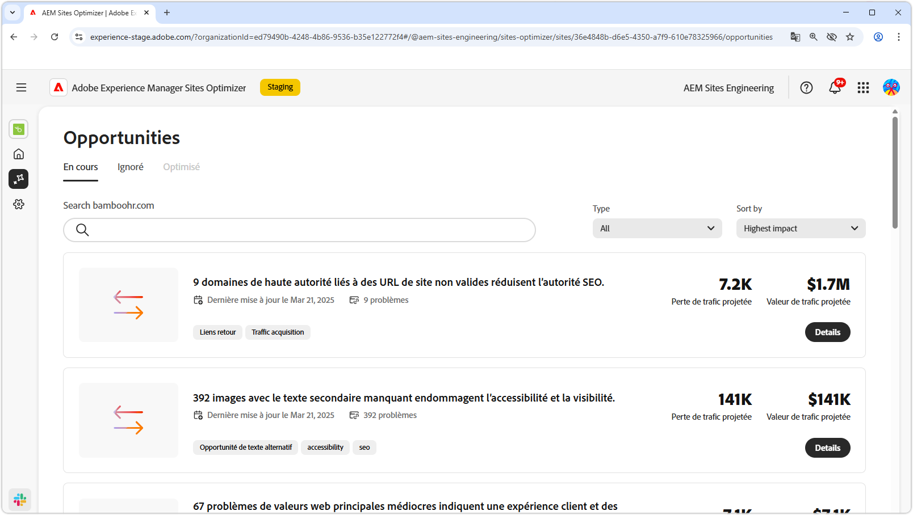
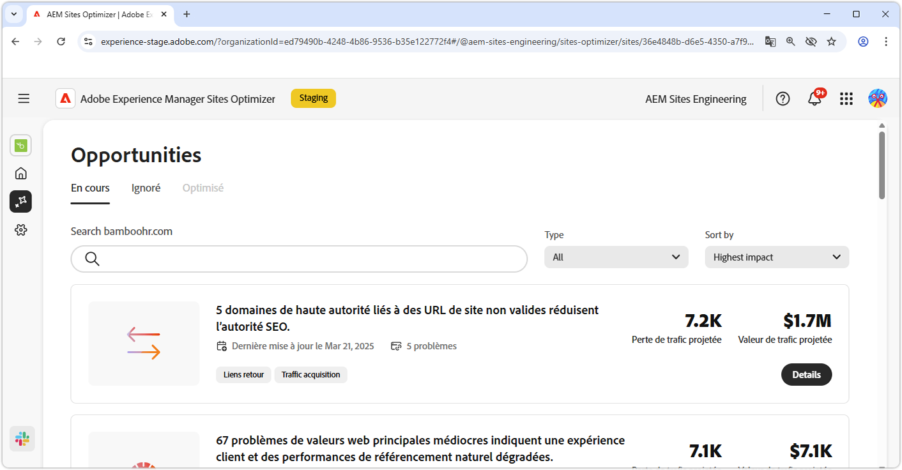
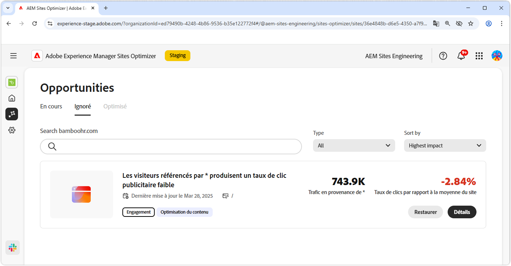

# Documentation sur les opportunités

{align="center"}

Sites Optimizer se compose d’un ensemble d’opportunités sans cesse croissant, optimisé par l’IA d’Adobe, conçu pour identifier et suggérer des améliorations à apporter à votre site web. Chaque opportunité offre des informations sur la valeur commerciale potentielle, met en évidence les domaines nécessitant une attention particulière et fournit des recommandations d’optimisation exploitables. Cliquez sur chaque opportunité pour explorer les problèmes identifiés, les améliorations suggérées et des conseils détaillés sur la façon d’implémenter ces modifications pour améliorer les performances du site web et l’expérience client.

Les opportunités sont disponibles via l’option de menu **Opportunités** dans la [navigation persistante de Sites Optimizer](/help/documentation/basics.md#navigation).

## Statut des opportunités

Utilisez les onglets situés en haut pour organiser et filtrer les opportunités par statut.

>[!BEGINTABS]

>[!TAB Actuelles]

{align="center"}

Opportunités actuellement en attente.

>[!TAB Ignorées]

{align="center"}

Opportunités qui ont été ignorées. Les opportunités ignorées peuvent être restaurées à partir de cette vue.

>[!TAB Optimisées]

Liste historique des opportunités optimisées.

>[!ENDTABS]

## Opportunités

Lorsque le [statut de l’opportunité](#opportunity-status) est sélectionné, vous pouvez afficher une liste d’opportunités. Vous pouvez filtrer la liste des opportunités des manières suivantes :

* **Recherche** : recherche d’opportunités par **mots-clés, balises ou URL**.
* **Type d’opportunité** : utilisez la liste déroulante **Type** pour filtrer les opportunités par [type d’opportunité](/help/opportunity-types/overview.md).

### Détails de l’opportunité

{align="center"}

Chaque opportunité fournit une brève description du problème, son impact potentiel sur votre site et un lien vers des détails complets. Vous pouvez également consulter son statut, qui indique si elle a été optimisée ou si elle est toujours en attente.

* **Titre de l’opportunité** : brève description du problème et de son impact potentiel sur les performances de votre site.
* **Dernière mise à jour** - Sites Optimizer a mis à jour l’opportunité pour la dernière fois avec de nouvelles données à cette date.
* **Nombre de problèmes** : nombre d’occurrences du problème identifié sur votre site.
* **Types d’opportunité** - Les [types d’opportunité](/help/opportunity-types/overview.md) dont cette opportunité fait partie, tels que l’acquisition du trafic, l’engagement, la conversion ou l’intégrité du site.

Les informations récapitulatives de chaque opportunité varient selon le type et peuvent inclure des détails sur l’impact sur le chiffre d’affaires, le trafic, l’interaction client ou les menaces pour la sécurité.

Pour afficher les détails d’une opportunité, cliquez sur le bouton **Détails**.

Pour exclure une opportunité du tableau de bord Sites Optimizer, cliquez sur le bouton **Ignorer**.  Cette action déplace l’opportunité vers l’onglet [**Ignorées**](#opportunity-status).

## Toutes les opportunités

Explorez toutes les opportunités disponibles dans Sites Optimizer :

<!-- CARDS

* ./accessibility-issues.md
  {title=Accessibility issues}
  {image=../../assets/common/card-arrows.png} 
* ./broken-backlinks.md
  {title=Broken backlinks}
  {image=../../assets/common/card-arrows.png}
* ./broken-internal-links.md
  {title=Broken internal links}
  {image=../../assets/common/card-link.png}
* ./cors-configuration.md
  {title=CORS configuration}
  {image=../../assets/common/card-code.png}
* ./core-web-vitals.md
  {title=Core web vitals}
  {image=../../assets/common/card-performance.png}
* ./cross-site-scripting.md
  {title=Cross-site scripting}
  {image=../../assets/common/card-code.png}
* ./high-bounce-rate.md
  {title=High bounce rate}
  {image=../../assets/common/card-arrows.png}    
* ./invalid-or-missing-metadata.md
  {title=Invalid or missing metadata}
  {image=../../assets/common/card-code.png}
* ./low-conversions.md
  {title=Low conversions}
  {image=../../assets/common/card-bag.png}
* ./low-views.md
  {title=Low views}
  {image=../../assets/common/card-bag.png} 
* ./missing-alt-text.md
  {title=Missing alt text}
  {image=../../assets/common/card-arrows.png}
* ./missing-invalid-structured-data.md
  {title=Missing or invalid structured data}
  {image=../../assets/common/card-bag.png}
* ./sitemap-issues.md
  {title=Sitemap issues}
  {image=../../assets/common/card-relationship.png}
* ./website-permissions.md
  {title=Website permissions}
  {image=../../assets/common/card-people.png}
* ./website-vulnerabilities.md
  {title=Website vulnerabilities}
  {image=../../assets/common/card-puzzle.png}
  
--->
<!-- START CARDS HTML - DO NOT MODIFY BY HAND -->

    

        

            

                <figure class="image x-is-16by9">
                    
                </figure>
            

            

                

                    

                        <a href="./accessibility-issues.md" target="_blank" rel="referrer" title="Problèmes d’accessibilité">Problèmes d’accessibilité</a>
                    

                    
Découvrez l’opportunité des problèmes d’accessibilité et comment l’utiliser pour renforcer la sécurité de votre site web.

                

                <a href="./accessibility-issues.md" target="_blank" rel="referrer" class="spectrum-Button spectrum-Button--outline spectrum-Button--primary spectrum-Button--sizeM" style="align-self: flex-start; margin-top: 1rem;">
En savoir plus
</a>
            

        

    

    

        

            

                <figure class="image x-is-16by9">
                    
                </figure>
            

            

                

                    

                        <a href="./broken-backlinks.md" target="_blank" rel="referrer" title="Backlinks rompus">Backlinks rompus</a>
                    

                    
Découvrez l’opportunité des backlinks rompus et comment l’utiliser pour améliorer l’acquisition du trafic.

                

                <a href="./broken-backlinks.md" target="_blank" rel="referrer" class="spectrum-Button spectrum-Button--outline spectrum-Button--primary spectrum-Button--sizeM" style="align-self: flex-start; margin-top: 1rem;">
En savoir plus
</a>
            

        

    

    

        

            

                <figure class="image x-is-16by9">
                    
                </figure>
            

            

                

                    

                        <a href="./broken-internal-links.md" target="_blank" rel="referrer" title="Liens internes rompus">Liens internes rompus</a>
                    

                    
Découvrez l’opportunité des liens rompus et comment l’utiliser pour améliorer l’engagement sur votre site web.

                

                <a href="./broken-internal-links.md" target="_blank" rel="referrer" class="spectrum-Button spectrum-Button--outline spectrum-Button--primary spectrum-Button--sizeM" style="align-self: flex-start; margin-top: 1rem;">
En savoir plus
</a>
            

        

    

    

        

            

                <figure class="image x-is-16by9">
                    
                </figure>
            

            

                

                    

                        <a href="./cors-configuration.md" target="_blank" rel="referrer" title="Configuration CORS">Configuration CORS</a>
                    

                    
Découvrez l’opportunité de configuration CORS et identifiez et corrigez les vulnérabilités de sécurité du site.

                

                <a href="./cors-configuration.md" target="_blank" rel="referrer" class="spectrum-Button spectrum-Button--outline spectrum-Button--primary spectrum-Button--sizeM" style="align-self: flex-start; margin-top: 1rem;">
En savoir plus
</a>
            

        

    

    

        

            

                <figure class="image x-is-16by9">
                    
                </figure>
            

            

                

                    

                        <a href="./core-web-vitals.md" target="_blank" rel="referrer" title="Valeurs web principales">Valeurs web principales</a>
                    

                    
Découvrez l’opportunité des valeurs web principales et comment l’utiliser pour améliorer l’acquisition du trafic.

                

                <a href="./core-web-vitals.md" target="_blank" rel="referrer" class="spectrum-Button spectrum-Button--outline spectrum-Button--primary spectrum-Button--sizeM" style="align-self: flex-start; margin-top: 1rem;">
En savoir plus
</a>
            

        

    

    

        

            

                <figure class="image x-is-16by9">
                    
                </figure>
            

            

                

                    

                        <a href="./cross-site-scripting.md" target="_blank" rel="referrer" title="Cross-site scripting">Cross-site scripting</a>
                    

                    
Découvrez l’opportunité de cross-site scripting et identifiez et corrigez les vulnérabilités de sécurité du site.

                

                <a href="./cross-site-scripting.md" target="_blank" rel="referrer" class="spectrum-Button spectrum-Button--outline spectrum-Button--primary spectrum-Button--sizeM" style="align-self: flex-start; margin-top: 1rem;">
En savoir plus
</a>
            

        

    

    

        

            

                <figure class="image x-is-16by9">
                    
                </figure>
            

            

                

                    

                        <a href="./high-bounce-rate.md" target="_blank" rel="referrer" title="Taux de rebond élevé">Taux de rebond élevé</a>
                    

                    
Découvrez l’opportunité de vues basses et comment l’utiliser pour améliorer l’engagement des formulaires sur votre site web.

                

                <a href="./high-bounce-rate.md" target="_blank" rel="referrer" class="spectrum-Button spectrum-Button--outline spectrum-Button--primary spectrum-Button--sizeM" style="align-self: flex-start; margin-top: 1rem;">
En savoir plus
</a>
            

        

    

    

        

            

                <figure class="image x-is-16by9">
                    
                </figure>
            

            

                

                    

                        <a href="./invalid-or-missing-metadata.md" target="_blank" rel="referrer" title="Métadonnées non valides ou manquantes">Métadonnées non valides ou manquantes</a>
                    

                    
Découvrez l’opportunité des métadonnées non valides ou manquantes et comment l’utiliser pour améliorer l’acquisition du trafic.

                

                <a href="./invalid-or-missing-metadata.md" target="_blank" rel="referrer" class="spectrum-Button spectrum-Button--outline spectrum-Button--primary spectrum-Button--sizeM" style="align-self: flex-start; margin-top: 1rem;">
En savoir plus
</a>
            

        

    

        

            

                <figure class="image x-is-16by9">
                    
                </figure>
            

            

                

                    

                        <a href="./low-conversions.md" target="_blank" rel="referrer" title="Conversions faibles de Forms">Conversions faibles de Forms</a>
                    

                    
Découvrez l’opportunité des faibles conversions et comment l’utiliser pour améliorer l’engagement des formulaires sur votre site web.

                

                <a href="./low-conversions.md" target="_blank" rel="referrer" class="spectrum-Button spectrum-Button--outline spectrum-Button--primary spectrum-Button--sizeM" style="align-self: flex-start; margin-top: 1rem;">
En savoir plus
</a>
            

        

    

    

        

            

                <figure class="image x-is-16by9">
                    
                </figure>
            

            

                

                    

                        <a href="./low-views.md" target="_blank" rel="referrer" title="Vues basses">Vues basses de Forms</a>
                    

                    
Découvrez l’opportunité de vues basses des formulaires et comment l’utiliser pour améliorer l’engagement des formulaires sur votre site web.

                

                <a href="./low-views.md" target="_blank" rel="referrer" class="spectrum-Button spectrum-Button--outline spectrum-Button--primary spectrum-Button--sizeM" style="align-self: flex-start; margin-top: 1rem;">
En savoir plus
</a>
            

        

    

    

        

            

                <figure class="image x-is-16by9">
                    
                </figure>
            

            

                

                    

                        <a href="./low-navigation.md" target="_blank" rel="referrer" title="Navigation basse dans Forms">Navigation basse dans Forms</a>
                    

                    
Découvrez l’opportunité de navigation basse pour les formulaires et comment l’utiliser pour améliorer l’engagement des formulaires sur votre site web.

                

                <a href="./low-navigation.md" target="_blank" rel="referrer" class="spectrum-Button spectrum-Button--outline spectrum-Button--primary spectrum-Button--sizeM" style="align-self: flex-start; margin-top: 1rem;">
En savoir plus
</a>
            

        

    

    

        

            

                <figure class="image x-is-16by9">
                    
                </figure>
            

            

                

                    

                        <a href="./forms-accessibility-issues.md" target="_blank" rel="referrer" title="Problèmes d’accessibilité liés à Forms">Problèmes d’accessibilité de Forms</a>
                    

                    
Découvrez l’opportunité des problèmes d’accessibilité des formulaires et comment l’utiliser pour améliorer l’engagement sur votre site web.

                

                <a href="./forms-accessibility-issues.md" target="_blank" rel="referrer" class="spectrum-Button spectrum-Button--outline spectrum-Button--primary spectrum-Button--sizeM" style="align-self: flex-start; margin-top: 1rem;">
En savoir plus
</a>
            

        

    

    

        

            

                <figure class="image x-is-16by9">
                    
                </figure>
            

            

                

                    

                        <a href="./missing-alt-text.md" target="_blank" rel="referrer" title="Texte secondaire manquant">Texte secondaire manquant</a>
                    

                    
Découvrez l’opportunité de texte secondaire manquant et comment l’utiliser pour améliorer l’engagement sur votre site web.

                

                <a href="./missing-alt-text.md" target="_blank" rel="referrer" class="spectrum-Button spectrum-Button--outline spectrum-Button--primary spectrum-Button--sizeM" style="align-self: flex-start; margin-top: 1rem;">
En savoir plus
</a>
            

        

    

    

        

            

                <figure class="image x-is-16by9">
                    
                </figure>
            

            

                

                    

                        <a href="./missing-invalid-structured-data.md" target="_blank" rel="referrer" title="Données structurées manquantes ou non valides">Données structurées manquantes ou non valides</a>
                    

                    
Découvrez l’opportunité des données structurées manquantes ou non valides et comment l’utiliser pour améliorer l’acquisition du trafic.

                

                <a href="./missing-invalid-structured-data.md" target="_blank" rel="referrer" class="spectrum-Button spectrum-Button--outline spectrum-Button--primary spectrum-Button--sizeM" style="align-self: flex-start; margin-top: 1rem;">
En savoir plus
</a>
            

        

    

    

        

            

                <figure class="image x-is-16by9">
                    
                </figure>
            

            

                

                    

                        <a href="./sitemap-issues.md" target="_blank" rel="referrer" title="Problèmes de plan de site">Problèmes de plan de site</a>
                    

                    
Découvrez l’opportunité des problèmes de plan de site et comment l’utiliser pour améliorer l’acquisition du trafic.

                

                <a href="./sitemap-issues.md" target="_blank" rel="referrer" class="spectrum-Button spectrum-Button--outline spectrum-Button--primary spectrum-Button--sizeM" style="align-self: flex-start; margin-top: 1rem;">
En savoir plus
</a>
            

        

    

    

        

            

                <figure class="image x-is-16by9">
                    
                </figure>
            

            

                

                    

                        <a href="./website-permissions.md" target="_blank" rel="referrer" title="Autorisations du site web">Autorisations du site web</a>
                    

                    
Découvrez l’opportunité des autorisations du site web et comment l’utiliser pour renforcer la sécurité de votre site web.

                

                <a href="./website-permissions.md" target="_blank" rel="referrer" class="spectrum-Button spectrum-Button--outline spectrum-Button--primary spectrum-Button--sizeM" style="align-self: flex-start; margin-top: 1rem;">
En savoir plus
</a>
            

        

    

    

        

            

                <figure class="image x-is-16by9">
                    
                </figure>
            

            

                

                    

                        <a href="./website-vulnerabilities.md" target="_blank" rel="referrer" title="Vulnérabilités du site web">Vulnérabilités du site web</a>
                    

                    
Découvrez l’opportunité des vulnérabilités du site web et comment l’utiliser pour renforcer la sécurité de votre site web.

                

                <a href="./website-vulnerabilities.md" target="_blank" rel="referrer" class="spectrum-Button spectrum-Button--outline spectrum-Button--primary spectrum-Button--sizeM" style="align-self: flex-start; margin-top: 1rem;">
En savoir plus
</a>
            

        

    

<!-- END CARDS HTML - DO NOT MODIFY BY HAND -->

