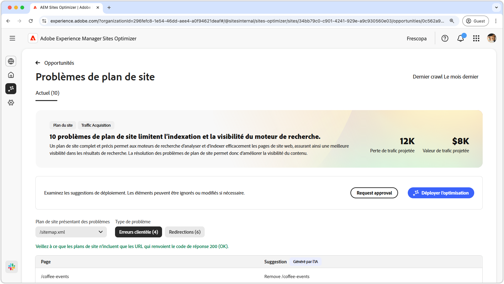
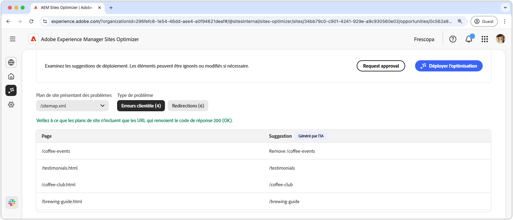
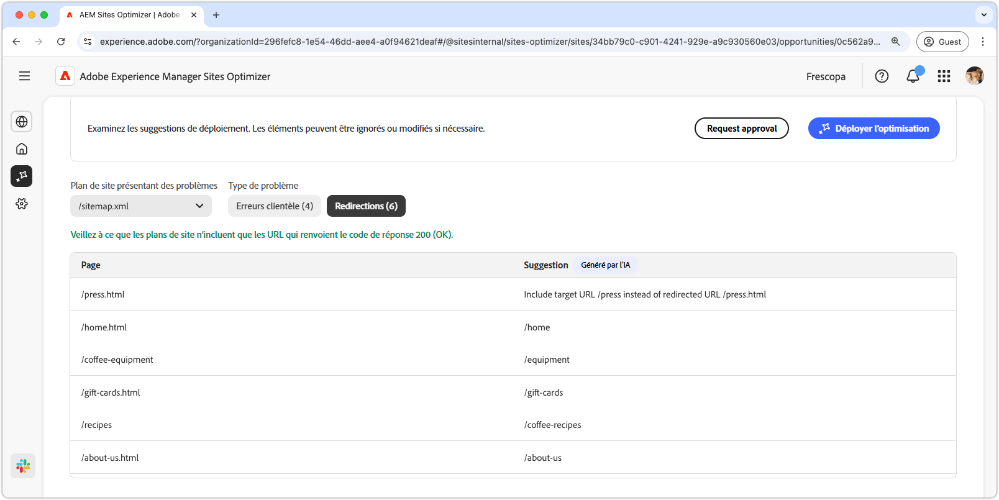
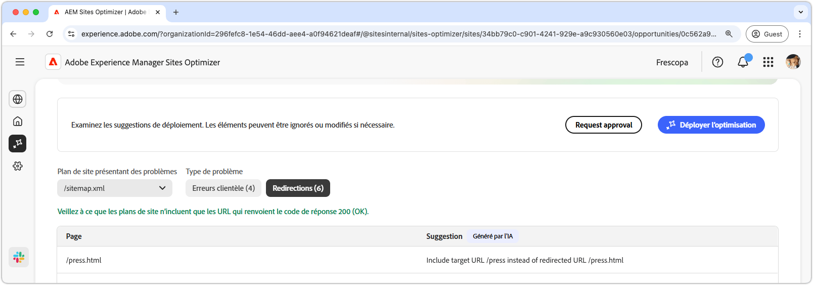

# Opportunité des problèmes de plan de site

{align="center"}

Un plan de site complet et précis permet aux moteurs de recherche d’analyser et d’indexer efficacement les pages de site web, assurant ainsi une meilleure visibilité dans les résultats de recherche. L’opportunité de plan de site identifie les problèmes potentiels avec votre plan de site. La résolution de ces problèmes peut améliorer considérablement l’indexation du moteur de recherche et la visibilité du contenu sur votre site.

Un résumé s’affiche en haut de la page, y compris une synthèse du problème et de son impact sur votre site et votre entreprise.

* **Perte de trafic prévue** : estimation de la perte de trafic due aux problèmes de plan de site.
* **Valeur prévue du trafic** : valeur estimée du trafic perdu.

## Identification automatique

Les problèmes de plan de site peuvent être filtrés à l’aide des critères suivants :

* **Plan de site avec des problèmes** : URL de plan de site analysée contenant des problèmes potentiels.
* **Type de problème** : type de problème identifié dans le plan du site :
   * **Erreurs du client** : entrées qui ne renvoient pas de réponse `200 Success`.
   * **Redirections** : redirections défectueuses ou mal configurées.

>[!BEGINTABS]

>[!TAB Erreurs du client]

{align="center"}

Si les URL de votre plan de site renvoient ces informations, les moteurs de recherche peuvent supposer que votre plan de site est obsolète ou que les pages ont été supprimées par erreur. Le client indique que la requête du client (navigateur ou robot d’exploration) n’était pas valide. Parmi les plus courantes figurent :

* **404 Introuvable**  la page demandée n’existe pas.
* **403 Accès interdit** : le serveur refuse l’accès à la page demandée.
* **410 Gone** : la page a été supprimée intentionnellement et ne reviendra pas.
* **401 Non autorisé** : l’authentification est requise mais non fournie.

Ces erreurs peuvent nuire au SEO, en particulier si des pages importantes renvoient des erreurs **404 ou 410**, car les moteurs de recherche peuvent les désindexer.

Chaque problème est affiché dans un tableau, avec la colonne **Page** identifiant l’entrée de plan de site concernée :

* **Page** : URL de l’entrée du plan du site présentant un problème.

>[!TAB Redirections]

{align="center"}

Les plans de site doivent uniquement inclure les URL de destination finale, et non celles qui redirigent. Les redirections sont destinées à guider les utilisateurs et les utilisatrices ainsi que les robots d’exploration vers l’emplacement correct, mais peuvent entraîner des problèmes si elles sont mal configurées :

* **302 Trouvé (redirection temporaire)** : peut entraîner des problèmes SEO si elle est utilisée par erreur au lieu d’un message **301**.
* **307 Redirection temporaire** : similaire à 302, mais conserve la méthode HTTP.
* **Boucles de redirection** : lorsqu’une page se redirige vers elle-même ou crée une boucle infinie.
* **Redirections rompues** : lorsqu’une redirection mène à une page inexistante ou renvoyant une erreur 4xx.

Chaque problème est affiché dans un tableau, avec la colonne **Page** identifiant l’entrée de plan de site concernée :

* **Page** : URL de l’entrée du plan du site présentant un problème.

>[!ENDTABS]

## Suggestion automatique

Chaque problème de plan de site [qui répond aux critères de filtrage](#auto-identify) est répertorié dans un tableau avec les colonnes suivantes :

* **Page** : URL de l’entrée du plan du site présentant un problème.
* **Suggestion** : correctif recommandé pour le problème.

Les suggestions incluent généralement un chemin de site mis à jour pour corriger l’entrée du plan du site. Dans certains cas, elles peuvent également fournir des instructions plus détaillées, telles que la spécification de la cible de redirection correcte.

## Optimiser automatiquement

[!BADGE Ultimate]{type=Positive tooltip="Ultimate"}

{align="center"}

Sites Optimizer Ultimate permet de déployer des optimisations automatiques des plans de site.

>[!BEGINTABS]

>[!TAB Déployer l’optimisation]

{{auto-optimize-deploy-optimization-slack}}

>[!TAB Demande d’approbation]

{{auto-optimize-request-approval}}

>[!ENDTABS]
