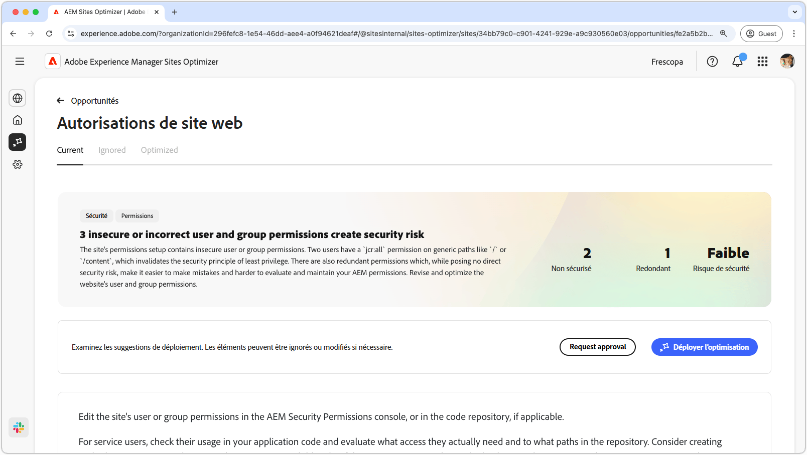
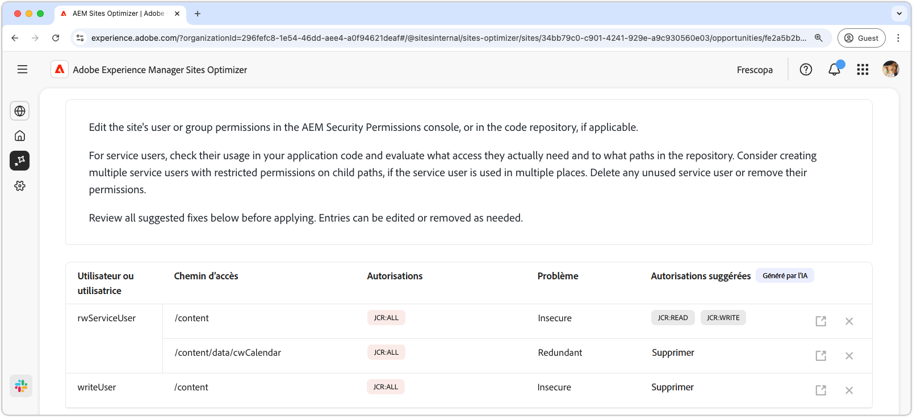
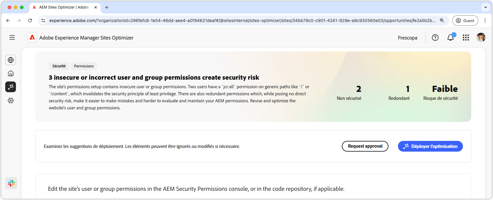

# Opportunité d’autorisations de site web

{align="center"}

L’opportunité Autorisations du site web optimise les autorisations du site web, essentielles pour maintenir un environnement AEM sécurisé et gérable. Cette opportunité vous permet d’affiner les contrôles d’accès en supprimant les autorisations trop générales, telles que les `jcr:all` sur des chemins d’accès génériques tels que `/` ou `/content`, et en alignant l’accès des utilisateurs et utilisatrices sur le principe de moindre privilège. En rationalisant les autorisations et en éliminant les redondances, vous pouvez réduire les risques de sécurité, améliorer la maintenabilité et empêcher de futures erreurs de configuration. Agissez en examinant et en mettant à jour les autorisations dans la console Autorisations de sécurité d’AEM ou dans votre référentiel de code, en vous assurant que les utilisateurs du service disposent uniquement de l’accès dont ils ont réellement besoin.

## Auto-identification

{align="center"}

La fonctionnalité **Autorisations de site web** identifie et répertorie automatiquement

* **Utilisateur** - Compte utilisateur disposant de l’autorisation suspecte.
* **Path** - Chemin d’accès dans AEM affecté par l’autorisation.
* **Autorisation** - Autorisation suspecte.
* **Problème** - Indique le type de problème ayant un impact sur l’autorisation.

## Suggestion automatique

{align="center"}

La suggestion automatique fournit des recommandations générées par l’IA dans le champ **Autorisations suggérées**, ce qui vous permet de remplacer toutes les autorisations marquées par des alternatives sécurisées.

## Optimisation automatique

[!BADGE Ultimate]{type=Positive tooltip="Ultimate"}

{align="center"}

Sites Optimizer Ultimate offre la possibilité de déployer une optimisation automatique pour les vulnérabilités détectées.

>[!BEGINTABS]

>[!TAB Déployer l’optimisation]

{{auto-optimize-deploy-optimization-slack}}

>[!TAB Demande d’approbation]

{{auto-optimize-request-approval}}

>[!ENDTABS]
