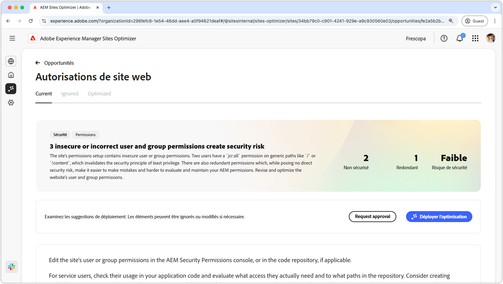
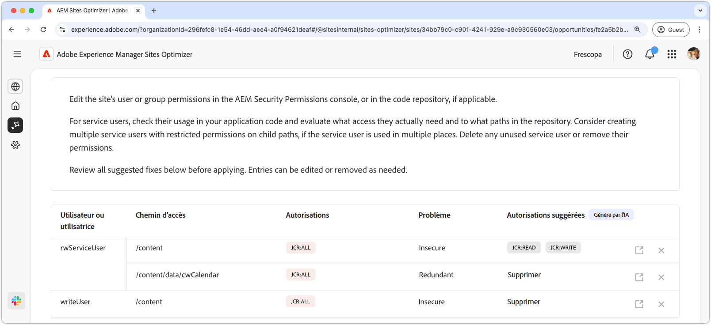
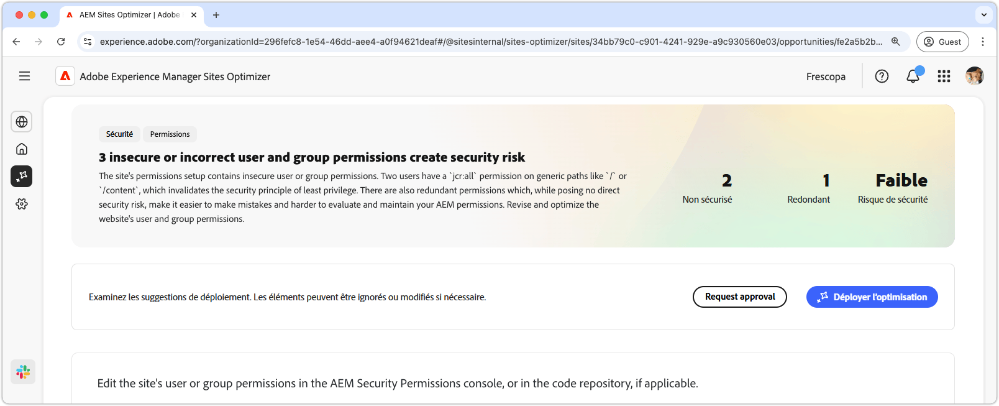

# Opportunité des autorisations du site web

{align="center"}

L’opportunité des autorisations du site web optimise les autorisations du site web, essentielles pour maintenir un environnement AEM sécurisé et gérable. Cette opportunité vous permet d’affiner les contrôles d’accès en supprimant les autorisations trop étendues, telles que `jcr:all` sur des chemins d’accès génériques tels que `/` ou `/content`, et en alignant l’accès des utilisateurs et utilisatrices sur le principe de moindre privilège. En rationalisant les autorisations et en éliminant les redondances, vous pouvez réduire les risques de sécurité, améliorer la maintenabilité et empêcher de futures erreurs de configuration. Vérifiez et mettez à jour les autorisations dans la console Autorisations de sécurité d’AEM ou dans votre référentiel de code. Cela permet de s’assurer que les utilisateurs et utilisatrices du service ne disposent que de l’accès dont ils ont réellement besoin.

## Identification automatique

{align="center"}

La fonctionnalité **Opportunité des autorisations du site web** identifie et répertorie automatiquement les éléments suivants :

* **Utilisateur ou utilisatrice** : compte de l’utilisateur ou utilisatrice disposant de l’autorisation suspecte.
* **Chemin d’accès** : utilisez les onglets situés en haut pour organiser et filtrer les opportunités par statut.
* **Autorisation** : autorisation soupçonnée.
* **Problème** : indique le type de problème ayant un impact sur l’autorisation.

## Suggestion automatique

{align="center"}

La suggestion automatique fournit des recommandations générées par l’IA dans le champ **Autorisations suggérées**, ce qui vous permet de remplacer toutes les autorisations marquées par des alternatives sécurisées.

## Optimiser automatiquement

[!BADGE Ultimate]{type=Positive tooltip="Ultimate"}

{align="center"}

Sites Optimizer Ultimate permet de déployer une optimisation automatique pour les vulnérabilités détectées.

>[!BEGINTABS]

>[!TAB Déployer l’optimisation]

{{auto-optimize-deploy-optimization-slack}}

>[!TAB Demande d’approbation]

{{auto-optimize-request-approval}}

>[!ENDTABS]
