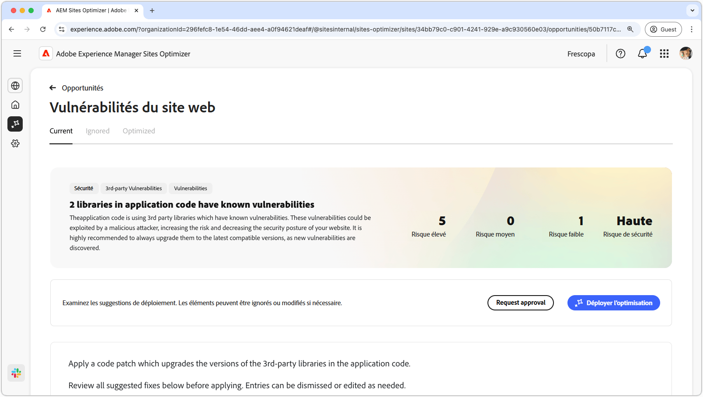
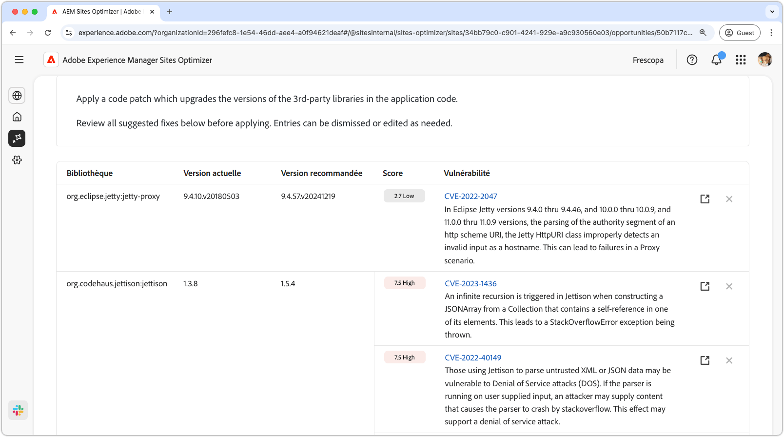
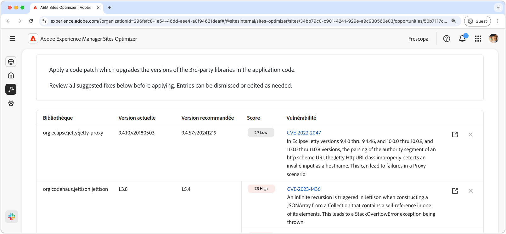
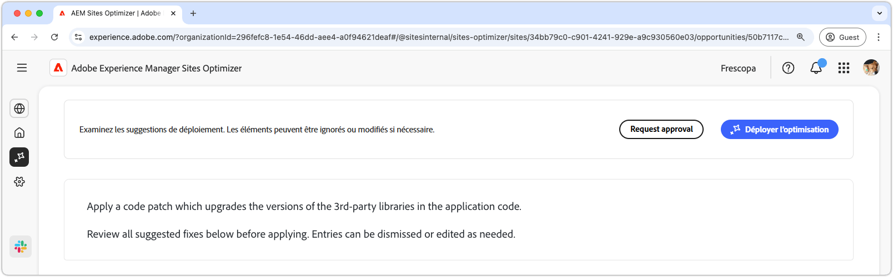

# Opportunité des vulnérabilités du site web

{align="center"}

L’opportunité Vulnérabilités du site Web identifie les vulnérabilités de sécurité dans les bibliothèques tierces utilisées par le code de votre application. Les attaquant(e)s malveillants exploitent ces vulnérabilités, augmentant les risques et réduisant la posture de sécurité de votre site web.

L’opportunité des vulnérabilités du site web affiche un résumé en haut de la page, comprenant les éléments suivants :

* **Problèmes détectés** : nombre de vulnérabilités détectées, classées par risque de sécurité qu’elles représentent (faible, moyen, élevé).
* **Risque de sécurité agrégé** : risque de sécurité global associé à votre site web en fonction des vulnérabilités identifiées par l’opportunité.

## Identification automatique

{align="center"}

La fonctionnalité **Opportunité des vulnérabilités du site web** identifie et répertorie automatiquement les vulnérabilités trouvées dans les bibliothèques tierces utilisées par le code de votre application. Elle fournit les détails suivants :

* **Bibliothèque** : bibliothèque tierce contenant la vulnérabilité. Une seule bibliothèque peut comporter plusieurs vulnérabilités.
* **Version actuelle** : version de la bibliothèque actuellement utilisée.
* **Version recommandée** : version suggérée qui résout la vulnérabilité.
* **Score** : évaluation de la gravité de la vulnérabilité, également résumée en haut de la page.
* **Vulnérabilité** : l’identifiant de la vulnérabilité, une brève description et un lien vers la base de données nationale sur les vulnérabilités (NVD) pour plus de détails. Accédez au lien NVD en cliquant sur l’identifiant ou sur le lien en regard de la description.

## Suggestion automatique

{align="center"}

La fonction de suggestion automatique fournit des suggestions générées par l’IA pour la **version recommandée** d’une bibliothèque vulnérable vers laquelle vous devez effectuer la mise à niveau. Chaque entrée comporte un **score** indiquant sa gravité globale, ce qui permet de hiérarchiser les vulnérabilités les plus critiques.

>[!BEGINTABS]

>[!TAB Détails sur les vulnérabilités]

Chaque vulnérabilité contient un lien vers les informations détaillées de la [base de données nationale sur les vulnérabilités (NVD)](https://nvd.nist.gov/). Cliquez sur l’identifiant de vulnérabilité ou sur l’élément de lien situé à droite de la description pour accéder à la page NVD de cette vulnérabilité.

>[!TAB Ignorer les entrées]

Vous pouvez choisir d’ignorer les entrées de la liste des vulnérabilités. Sélectionner  supprime l’entrée de la liste. Les entrées ignorées peuvent être à nouveau traitées à partir de l’onglet **Ignorées** en haut de la page des opportunités.<!---right now it does not seem to be implemented, but the page description mentions this functionality-->

>[!ENDTABS]

## Optimiser automatiquement

[!BADGE Ultimate]{type=Positive tooltip="Ultimate"}

{align="center"}

Sites Optimizer Ultimate permet de déployer une optimisation automatique pour les vulnérabilités détectées.

>[!BEGINTABS]

>[!TAB Déployer l’optimisation]

{{auto-optimize-deploy-optimization-slack}}

>[!TAB Demande d’approbation]

{{auto-optimize-request-approval}}

>[!ENDTABS]