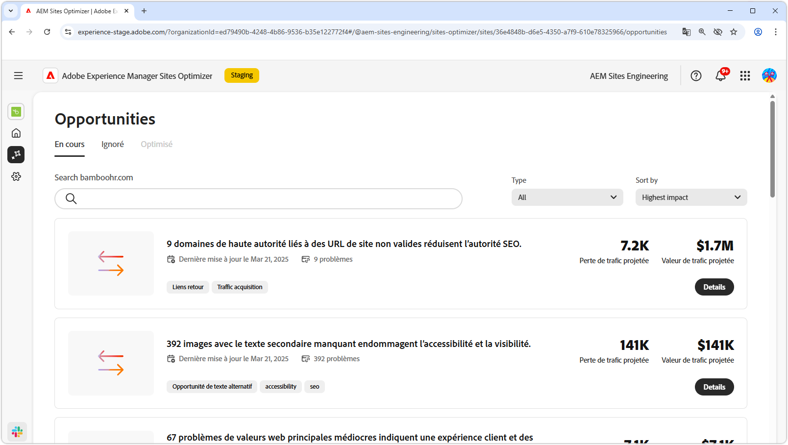

# Documentation de Sites Optimizer

{align="center"}

Bienvenue dans la documentation de Sites Optimizer. Vous trouverez ici des informations sur l’utilisation de Sites Optimizer pour optimiser vos sites AEM.

## Concepts de base de Sites Optimizer

Consultez la documentation d’AEM Sites Optimizer pour en savoir plus sur les principaux composants de l’interface d’utilisation, notamment le tableau de bord de l’accueil, les configurations des paramètres et la liste des opportunités pour obtenir des informations sur l’optimisation.

<!-- CARDS 

* ./basics.md
  {title = Basics}
  {image = ./assets/basics/card.png}
* ./opportunities/overview.md
  {title = Opportunities}
* ./settings.md
  {title = Settings}

-->
<!-- START CARDS HTML - DO NOT MODIFY BY HAND -->

    

        

            

                <figure class="image x-is-16by9">
                    
                </figure>
            

            

                

                    

                        <a href="./basics.md" target="_blank" rel="referrer" title="Concepts de base">Concepts de base</a>
                    

                    
Découvrez les concepts de base de Sites Optimizer et comment y naviguer.

                

                <a href="./basics.md" target="_blank" rel="referrer" class="spectrum-Button spectrum-Button--outline spectrum-Button--primary spectrum-Button--sizeM" style="align-self: flex-start; margin-top: 1rem;">
En savoir plus
</a>
            

        

    

    

        

            

                <figure class="image x-is-16by9">
                    
                </figure>
            

            

                

                    

                        <a href="./opportunities/overview.md" target="_blank" rel="referrer" title="Opportunités">Opportunités</a>
                    

                    
Découvrez toutes les opportunités de Sites Optimizer disponibles et comment les utiliser pour améliorer les performances de votre site.

                

                <a href="./opportunities/overview.md" target="_blank" rel="referrer" class="spectrum-Button spectrum-Button--outline spectrum-Button--primary spectrum-Button--sizeM" style="align-self: flex-start; margin-top: 1rem;">
En savoir plus
</a>
            

        

    

    

        

            

                <figure class="image x-is-16by9">
                    
                </figure>
            

            

                

                    

                        <a href="./settings.md" target="_blank" rel="referrer" title="Paramètres">Paramètres</a>
                    

                    
Découvrez comment configurer les paramètres de Sites Optimizer et les intégrer à d’autres outils.

                

                <a href="./settings.md" target="_blank" rel="referrer" class="spectrum-Button spectrum-Button--outline spectrum-Button--primary spectrum-Button--sizeM" style="align-self: flex-start; margin-top: 1rem;">
En savoir plus
</a>
            

        

    

<!-- END CARDS HTML - DO NOT MODIFY BY HAND -->

