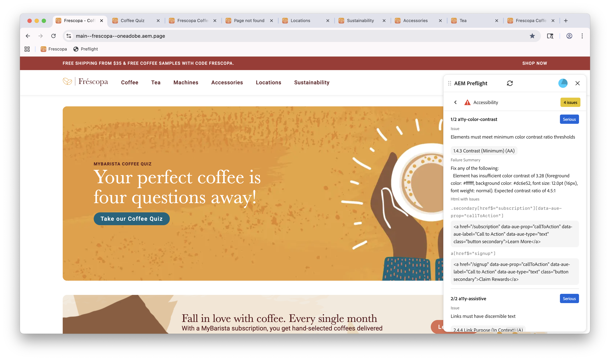

# Opportunité d’accessibilité du contrôle en amont

{align="center"}

L’opportunité d’accessibilité Contrôle en amont dans Sites Optimizer vous permet d’identifier et de résoudre les problèmes d’accessibilité de votre site web afin de vous assurer qu’il est utilisable par toutes les personnes, y compris les personnes en situation de handicap. Cette opportunité se concentre sur l’évaluation de la conformité de votre site aux normes d’accessibilité et fournit des recommandations pratiques pour l’amélioration.
