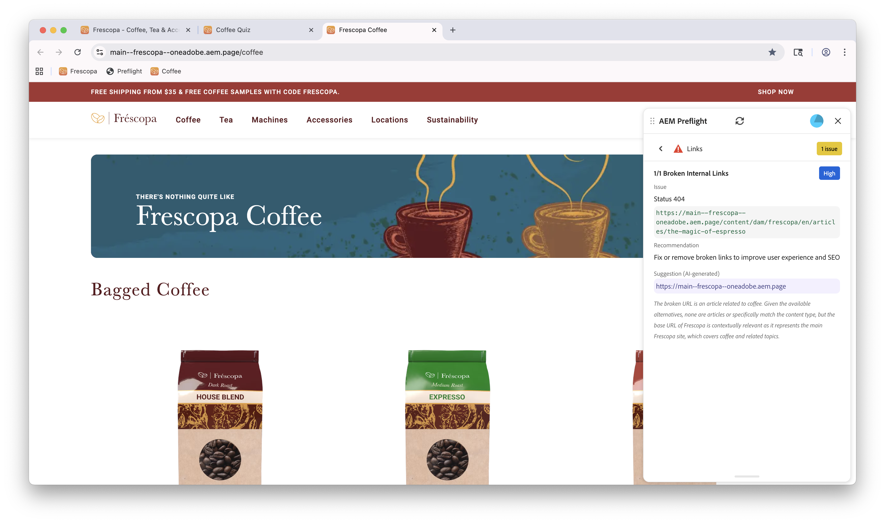

# Opportunité de contrôle en amont des liens

{align="center"}

L’opportunité de contrôle en amont des liens dans Sites Optimizer vous permet d’identifier et de résoudre les problèmes liés aux liens sur votre site web. Cette opportunité est focalisée sur l’évaluation de la structure des liens de votre site et fournit des recommandations pratiques d’amélioration.
