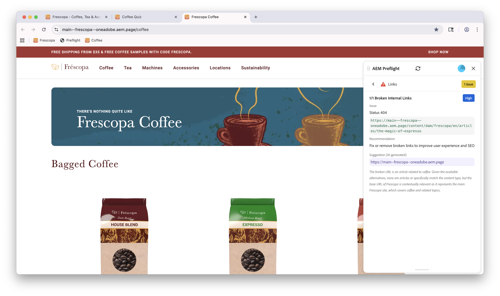

# Opportunités de Preflight

{align="center"}

Les opportunités de contrôle en amont de Sites Optimizer se composent d’un ensemble d’évaluations qui analysent différents aspects du contenu et de la structure de votre site web avant la publication de la page web. Ces évaluations permettent d’identifier les problèmes potentiels et fournissent des recommandations exploitables pour améliorer la qualité globale et les performances de votre site.

## Configuration en amont

Suivez les étapes du guide [Configuration du contrôle en amont](./setup.md) pour configurer l’extension de contrôle en amont sur votre site web.

## Opportunités de Preflight

<!-- CARDS
* ./accessibility.md
* ./h1-count.md
* ./links.md
* ./meta-data.md
* ./readability.md
-->
<!-- START CARDS HTML - DO NOT MODIFY BY HAND -->

    

        

            

                <figure class="image x-is-16by9">
                    
                </figure>
            

            

                

                    

                        <a href="./accessibility.md" target="_blank" rel="referrer" title="Opportunité d’accessibilité du contrôle en amont">Opportunité d’accessibilité du contrôle en amont</a>
                    

                    
Découvrez l’opportunité d’accessibilité du contrôle en amont dans Sites Optimizer.

                

                <a href="./accessibility.md" target="_blank" rel="referrer" class="spectrum-Button spectrum-Button--outline spectrum-Button--primary spectrum-Button--sizeM" style="align-self: flex-start; margin-top: 1rem;">
En savoir plus
</a>
            

        

    

    

        

            

                <figure class="image x-is-16by9">
                    
                </figure>
            

            

                

                    

                        <a href="./h1-count.md" target="_blank" rel="referrer" title="Opportunité du nombre H1 de contrôle en amont">Opportunité du nombre H1 de contrôle en amont</a>
                    

                    
Découvrez l’opportunité d’accessibilité du contrôle en amont dans Sites Optimizer.

                

                <a href="./h1-count.md" target="_blank" rel="referrer" class="spectrum-Button spectrum-Button--outline spectrum-Button--primary spectrum-Button--sizeM" style="align-self: flex-start; margin-top: 1rem;">
En savoir plus
</a>
            

        

    

    

        

            

                <figure class="image x-is-16by9">
                    
                </figure>
            

            

                

                    

                        <a href="./links.md" target="_blank" rel="referrer" title="Opportunité des liens de contrôle en amont">Opportunité des liens de contrôle en amont</a>
                    

                    
Découvrez l’opportunité Liens de contrôle en amont dans Sites Optimizer.

                

                <a href="./links.md" target="_blank" rel="referrer" class="spectrum-Button spectrum-Button--outline spectrum-Button--primary spectrum-Button--sizeM" style="align-self: flex-start; margin-top: 1rem;">
En savoir plus
</a>
            

        

    

    

        

            

                <figure class="image x-is-16by9">
                    
                </figure>
            

            

                

                    

                        <a href="./meta-data.md" target="_blank" rel="referrer" title="Opportunité de métadonnées de contrôle en amont">Opportunité de métadonnées de contrôle en amont</a>
                    

                    
Découvrez l’opportunité de contrôle en amont des métadonnées dans Sites Optimizer.

                

                <a href="./meta-data.md" target="_blank" rel="referrer" class="spectrum-Button spectrum-Button--outline spectrum-Button--primary spectrum-Button--sizeM" style="align-self: flex-start; margin-top: 1rem;">
En savoir plus
</a>
            

        

    

    

        

            

                <figure class="image x-is-16by9">
                    
                </figure>
            

            

                

                    

                        <a href="./readability.md" target="_blank" rel="referrer" title="Opportunité de lisibilité de contrôle en amont">Opportunité de lisibilité de contrôle en amont</a>
                    

                    
Découvrez l’opportunité de lisibilité du contrôle en amont dans Sites Optimizer.

                

                <a href="./readability.md" target="_blank" rel="referrer" class="spectrum-Button spectrum-Button--outline spectrum-Button--primary spectrum-Button--sizeM" style="align-self: flex-start; margin-top: 1rem;">
En savoir plus
</a>
            

        

    

<!-- END CARDS HTML - DO NOT MODIFY BY HAND -->
