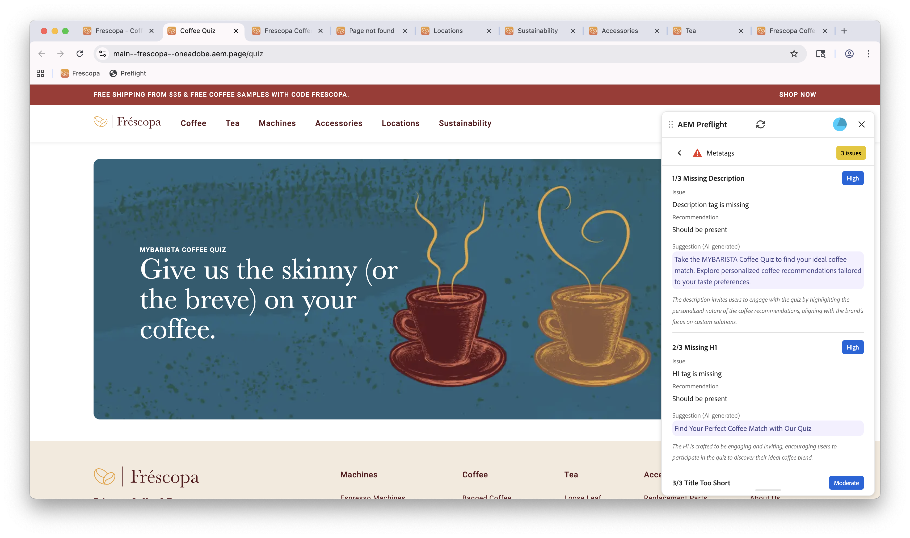
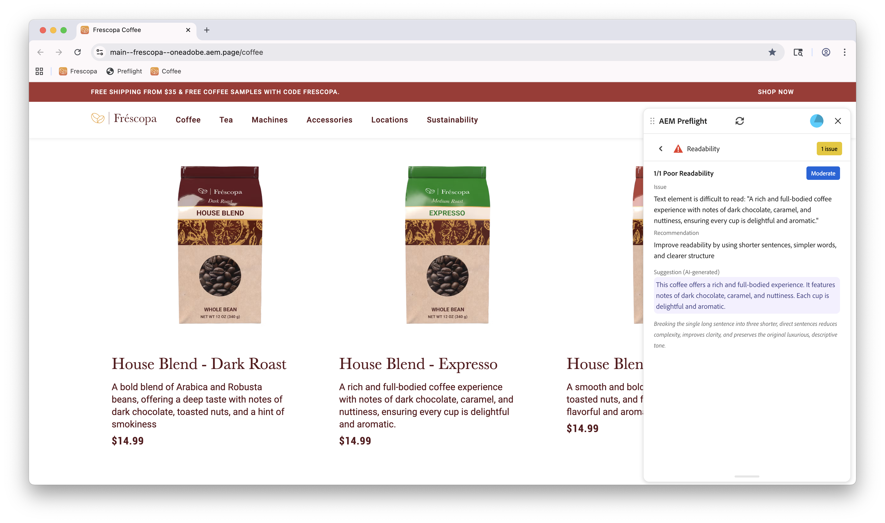

# Contrôle en amont d’AEM Sites Optimizer

{align="center"}

Le contrôle en amont dans AEM Sites Optimizer vous permet de valider et d’optimiser les pages avant leur mise en ligne en analysant le contenu et la structure et en signalant les problèmes avec des recommandations exploitables. Il est conçu pour les auteurs, les spécialistes du marketing et les développeurs qui souhaitent s’assurer que les pages sont de haute qualité, performantes et prêtes à être publiées tout en réduisant la refonte.

Au cœur du contrôle en amont se trouvent les opportunités, qui sont identifiées au moyen d’un ensemble d’audits qui évaluent les principaux aspects de votre page avant sa publication. Ces audits mettent en évidence les problèmes potentiels et fournissent des recommandations claires et exploitables pour améliorer la qualité globale et le rendement.

## Prise en main du contrôle en amont

La prise en main du contrôle en amont est simple. Il vous suffit de configurer le contrôle en amont, de l’ouvrir dans votre environnement de création et d’exécuter un audit sur votre page. Le contrôle en amont effectue le reste.

1. [Configuration du contrôle en amont](./setup.md) - Découvrez comment configurer le contrôle en amont pour votre instance AEM
1. [Accéder au contrôle en amont](./access-preflight.md) - Découvrez où le contrôle en amont apparaît dans votre environnement de création.
1. [Exécuter des audits](./audits.md) - Découvrez comment démarrer un audit de contrôle en amont
1. [Résultats d’audit et opportunités](./audit-results.md) - Découvrez comment interpréter les résultats d’audit

## Opportunités de contrôle en amont

<!--
CARDS

* ./opportunities/accessibility.md
* ./opportunities/h1-count.md
* ./opportunities/links.md
* ./opportunities/meta-data.md
* ./opportunities/readability.md
-->
<!-- START CARDS HTML - DO NOT MODIFY BY HAND -->

    

        

            

                <figure class="image x-is-16by9">
                    
                </figure>
            

            

                

                    

                        <a href="./opportunities/accessibility.md" target="_blank" rel="referrer" title="Opportunité de contrôle en amont de l’accessibilité">Opportunité de contrôle en amont de l’accessibilité</a>
                    

                    
Découvrez l’opportunité de contrôle en amont de l’accessibilité dans Sites Optimizer.

                

                <a href="./opportunities/accessibility.md" target="_blank" rel="referrer" class="spectrum-Button spectrum-Button--outline spectrum-Button--primary spectrum-Button--sizeM" style="align-self: flex-start; margin-top: 1rem;">
                     En savoir plus 
                </a>
            

        

    

    

        

            

                <figure class="image x-is-16by9">
                    
                </figure>
            

            

                

                    

                        <a href="./opportunities/h1-count.md" target="_blank" rel="referrer" title="Opportunité de contrôle en amont du nombre de H1">Opportunité de contrôle en amont du nombre de H1</a>
                    

                    
Découvrez l’opportunité de contrôle en amont de l’accessibilité dans Sites Optimizer.

                

                <a href="./opportunities/h1-count.md" target="_blank" rel="referrer" class="spectrum-Button spectrum-Button--outline spectrum-Button--primary spectrum-Button--sizeM" style="align-self: flex-start; margin-top: 1rem;">
                     En savoir plus 
                </a>
            

        

    

    

        

            

                <figure class="image x-is-16by9">
                    
                </figure>
            

            

                

                    

                        <a href="./opportunities/links.md" target="_blank" rel="referrer" title="Opportunité de contrôle en amont des liens">Opportunité de contrôle en amont des liens</a>
                    

                    
Découvrez l’opportunité de contrôle en amont des liens dans Sites Optimizer.

                

                <a href="./opportunities/links.md" target="_blank" rel="referrer" class="spectrum-Button spectrum-Button--outline spectrum-Button--primary spectrum-Button--sizeM" style="align-self: flex-start; margin-top: 1rem;">
                     En savoir plus 
                </a>
            

        

    

    

        

            

                <figure class="image x-is-16by9">
                    
                </figure>
            

            

                

                    

                        <a href="./opportunities/meta-data.md" target="_blank" rel="referrer" title="Opportunité de contrôle en amont des métadonnées">Opportunité de contrôle en amont des métadonnées</a>
                    

                    
Découvrez l’opportunité de contrôle en amont des métadonnées dans Sites Optimizer.

                

                <a href="./opportunities/meta-data.md" target="_blank" rel="referrer" class="spectrum-Button spectrum-Button--outline spectrum-Button--primary spectrum-Button--sizeM" style="align-self: flex-start; margin-top: 1rem;">
                     En savoir plus 
                </a>
            

        

    

    

        

            

                <figure class="image x-is-16by9">
                    
                </figure>
            

            

                

                    

                        <a href="./opportunities/readability.md" target="_blank" rel="referrer" title="Opportunité de contrôle en amont de la lisibilité">Opportunité de contrôle en amont de la lisibilité</a>
                    

                    
Découvrez l’opportunité de contrôle en amont de la lisibilité dans Sites Optimizer.

                

                <a href="./opportunities/readability.md" target="_blank" rel="referrer" class="spectrum-Button spectrum-Button--outline spectrum-Button--primary spectrum-Button--sizeM" style="align-self: flex-start; margin-top: 1rem;">
                     En savoir plus 
                </a>
            

        

    

<!-- END CARDS HTML - DO NOT MODIFY BY HAND -->
