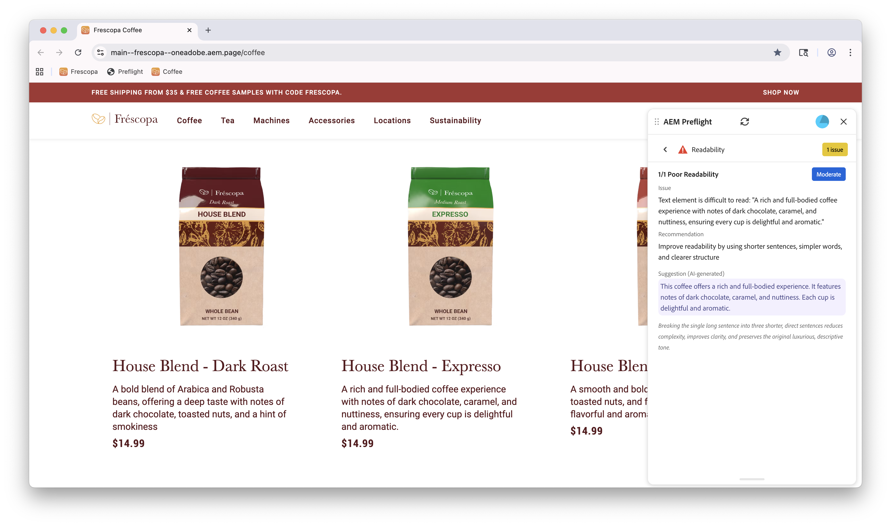

# Opportunité de lisibilité de contrôle en amont

{align="center"}

L’opportunité de lisibilité de contrôle en amont dans Sites Optimizer vous permet d’identifier et de résoudre les problèmes liés à la lisibilité du contenu de votre site web. Cette opportunité se concentre sur l’évaluation de la structure de contenu de votre site et fournit des recommandations pratiques pour l’amélioration.

Les opportunités de lisibilité en amont sont disponibles dans plusieurs langues, notamment :

* Anglais
* Français
* Espagnol
* Italien
* Allemand
* Néerlandais

Cela permet aux équipes d’évaluer et d’optimiser la lisibilité du contenu pour un large éventail d’audiences.
