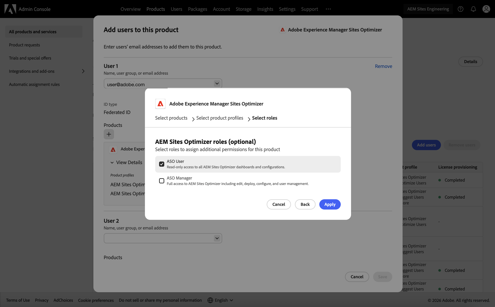

# Paramètres de Sites Optimizer

{align="center"}

Les paramètres de Sites Optimizer servent de hub central pour configurer votre expérience Sites Optimizer.

## Google Search Console

{align="center"}

Le connecteur de paramètres de Google Search Console dans AEM Sites Optimizer permet d’analyser les mesures d’optimisation du moteur de recherche clés telles que les classements de recherche, les taux de clics et les valeurs web principales. En connectant Google Search Console, vous pouvez tirer parti de l’analyse JSON pour découvrir des opportunités d’optimisation et améliorer les performances du site.

Pour configurer ce connecteur, vous devez disposer d’informations d’identification disposant d’un accès administratif à Google Search Console pour le domaine.

## Se connecter à AEM Sites

Ce guide explique comment connecter votre site Edge Delivery Services (EDS) existant à AEM Sites Optimizer. Avant de commencer, assurez-vous que votre site EDS est déjà configuré et fonctionnel. Cette connexion est réservée à AEM Sites Optimizer pour accéder à votre contenu.

La connexion nécessite deux étapes :

1. Fournissez votre URL de référentiel de code et l’URL de la source du contenu.
2. Accordez à AEM Sites Optimizer l’accès à votre source de contenu.

### Étape 1 : associer votre référentiel de code et votre source de contenu

Dans AEM Sites Optimizer, accédez à **Paramètres → Connecter à AEM Sites** et saisissez les informations suivantes :

- **URL du référentiel de code** : URL GitHub de votre site EDS, par exemple :
  `https://github.com/owner/repo`

- **URL de la source du contenu** : URL du dossier SharePoint ou du dossier Google Drive qui soutient votre site EDS, par exemple :
  `https://drive.google.com/drive/folders/...` ou `https://myorg.sharepoint.com/...`

Une fois que vous avez saisi l’URL de la source du contenu, AEM Sites Optimizer détecte le type de votre source de contenu et affiche les instructions d’accès appropriées ci-dessous.

### Étape 2 : accorder l’accès à votre source de contenu

Suivez la section correspondant à votre source de contenu.

#### SharePoint – Domaine Adobe

{align="center"}

Si l’URL de la source du contenu utilise le domaine Adobe SharePoint, aucune autre action n’est requise. L’accès est déjà configuré. Cliquez sur **Enregistrer** pour terminer la connexion.

#### SharePoint – Domaine personnalisé

Si l’URL de la source du contenu utilise le domaine SharePoint de votre entreprise, vous devez enregistrer une application Azure et fournir ses informations d’identification à AEM Sites Optimizer.

##### L’objet de votre création

- Autorisation d’enregistrer des applications sur le portail Azure ou contact pouvant enregistrer des applications en votre nom.
- Droits d’administration de locataire pour accorder le consentement de l’API, ou administrateur ou administratrice pouvant approuver le consentement de l’API pour vous.

##### Étape 2a : enregistrer une application dans Azure

1. Accédez à **Portail Azure → Microsoft Entra ID → Enregistrements d’application → Nouvel enregistrement**.
2. Donnez-lui un nom, par exemple : `AEM Sites Optimizer`.
3. Conservez toutes les autres valeurs par défaut et cliquez sur **Enregistrer**.
4. Sur la page **Vue d’ensemble**, notez ce qui suit :
   - **ID d’application (client)**
   - **ID de répertoire (locataire)**

##### Étape 2b : ajouter des autorisations API

1. Accédez à **Autorisations API → Ajouter une autorisation → Microsoft Graph → Autorisations d’application**.
2. Ajoutez les deux éléments suivants :
   - `Sites.Selected` : accès limité à des collections de sites SharePoint spécifiques.
   - `Files.SelectedOperations.Selected` : accès aux fichiers sans utilisateur ou utilisatrice connecté.
3. Cliquez sur **Accorder le consentement d’administration** pour les deux.

{align="center"}

>[!NOTE]
>
>L’octroi du consentement d’administration nécessite des droits d’administration de locataire. Si vous n’en disposez pas, demandez à votre administrateur ou administratrice informatique ou Azure de terminer cette étape avant de continuer.

##### Étape 2c : créer un secret client

{align="center"}

1. Accédez à **Certificats et secrets → Nouveau secret client**.
2. Définissez une description et une date d’expiration, puis cliquez sur **Ajouter**.
3. Copiez immédiatement la valeur du secret. Elle n’est affichée qu’une seule fois.

##### Étape 2d : accorder à l’application l’accès à votre site SharePoint

Vous pouvez accorder l’accès à l’application à l’aide de Microsoft Graph Explorer, de PowerShell ou des appels directs de l’API Graph.

Accédez à [Microsoft Graph Explorer](https://developer.microsoft.com/graph/graph-explorer), connectez-vous avec votre compte Microsoft et exécutez les requêtes suivantes :

1. Trouver votre ID de site :

```
GET https://graph.microsoft.com/v1.0/sites/{tenant}.sharepoint.com:/sites/{site-name}
```

1. Copiez l’`id` de la réponse, puis accordez l’accès au niveau du site :

```
POST https://graph.microsoft.com/v1.0/sites/{siteId}/permissions
```

Corps :

```json
{
  "roles": ["write"],
  "grantedToIdentities": [{
    "application": {
      "id": "{your-client-id}",
      "displayName": "{Your app name}"
    }
  }]
}
```

##### Étape 2e : saisir les informations d’identification dans AEM Sites Optimizer

{align="center"}

De retour dans la boîte de dialogue **Connecter à AEM Sites**, saisissez ce qui suit sous **Connexion au référentiel de contenu via SharePoint** :

- **ID de locataire (Azure AD)** : depuis Enregistrement d’application → Vue d’ensemble.
- **ID de client (enregistrement d’application)** : depuis Enregistrement d’application → Vue d’ensemble.
- **Secret client** : créé à l’étape 2c.

Cliquez sur **Valider la connexion** pour confirmer l’accès, puis sur **Enregistrer**.

#### Google Drive

{align="center"}

1. Dans Google Drive, cliquez avec le bouton droit sur le dossier qui contient votre site EDS et sélectionnez **Partager**.
2. Dans le champ **Ajouter des personnes et des groupes**, saisissez l’adresse e-mail du compte de service affiché dans la boîte de dialogue **Connecter à AEM Sites** :
   `aem-sites-optimizer@adbe-gcp0843.iam.gserviceaccount.com`
3. Définissez le niveau d’autorisation sur **Éditeur**.
4. Décochez **Envoyer une notification** et cliquez sur **Envoyer**.

Une fois le partage terminé, cliquez sur **Valider la connexion** dans la boîte de dialogue, puis cliquez sur **Enregistrer**.

## Gestion des autorisations utilisateur

Contrôlez qui peut accéder à un site dans Sites Optimizer et ce qu’il peut en faire. Access est construit à partir d&#39;un petit ensemble de *fonctionnalités* indépendantes — Afficher, Modifier, Déployer, Configurer et Gérer les utilisateurs — que vous accordez à chaque personne.

L’accès est **additif** : les autorisations d’une personne représentent la somme de tout ce qui lui a été accordé. Il n&#39;y a pas de « refus », donc les subventions ne se contredisent jamais ou ne s&#39;annulent jamais. Pour accorder moins d’accès à quelqu’un, supprimez une autorisation plutôt que d’essayer de la remplacer.

### Accorder l’accès

Une personne peut y accéder de deux manières différentes, qui fonctionnent ensemble :

- **Accès à l’échelle de l’organisation** : attribué par l’administrateur de l’organisation Adobe dans le [Adobe Admin Console](https://adminconsole.adobe.com/). Elle s’applique à tous les sites de votre entreprise. Utilisez-le pour les personnes qui ont besoin du même accès partout.
- **Accès au niveau du site** : attribué dans Sites Optimizer, sur la page **Paramètres → Autorisations**. Il s’applique à un seul site et peut être aussi large ou étroit que vous le souhaitez. Aucun accès Admin Console n’est requis.

>[!NOTE]
>
>Les deux calques s’additionnent. Une personne disposant d’un accès en affichage à l’échelle de l’organisation qui bénéficie également de la autorisation Modifier sur un site peut afficher chaque site et le modifier. Pour limiter une personne à un seul site, veillez à ce qu’elle ne détienne pas également un rôle à l’échelle de l’organisation.

#### Rôles à l’échelle de l’organisation (Admin Console)

L’accès à l’échelle de l’organisation provient de l’un des deux **rôles de produit**, affectés dans le [Adobe Admin Console](https://adminconsole.adobe.com/) :

- **ASO Manager** — Accès complet à tous les sites, y compris **Gérer les utilisateurs**. Un responsable peut ouvrir la page **Autorisations** pour n’importe quel site et attribuer l’accès à d’autres.
- **Utilisateur ASO** — accès en lecture seule à chaque site. Aucune modification et aucune gestion des utilisateurs.

Pour attribuer un rôle, vous devez être un **administrateur système** pour l’organisation ou un **administrateur de produit** pour AEM Sites Optimizer.

1. Connectez-vous à [&#128279;](https://adminconsole.adobe.com/).
1. Accédez à **Produits** et sélectionnez **AEM Sites Optimizer**.
1. Ouvrez l’onglet **Utilisateurs** et ajoutez l’utilisateur par e-mail (ou sélectionnez un utilisateur existant).
1. Cliquez sur l’icône **+** (ajouter) pour ajouter un profil de produit, puis choisissez le profil de produit.

   {align="center"}

1. Cliquez sur **Suivant**.
1. Choisissez le rôle **ASO Manager** pour un accès complet ou **ASO User** pour un accès en lecture seule, puis cliquez sur **Appliquer**.

   {align="center"}

   {align="center"}

Pour plus d’informations sur l’ajout d’utilisateurs, voir [Intégration d’utilisateurs](setup/onboard-users.md).

>[!IMPORTANT]
>
>Seul un administrateur d’organisation peut octroyer des **Gérer les utilisateurs** à l’échelle de l’organisation. Un membre disposant de l’autorisation **Gérer les utilisateurs** sur un site peut attribuer un accès à ce site, mais ne peut pas créer d’autorisation **ASO Manager** à l’échelle de l’organisation.

### Niveaux de fonctionnalité

Chaque fonctionnalité contrôle un type d’action. Ils sont indépendants ; par exemple, vous pouvez accorder Déployer sans modifier.

| Fonction | Ce que cela permet | Ce qu’il ne permet pas |
|---|---|---|
| Mode | Affichez les données du site (opportunités, suggestions, correctifs, rapports et configuration) sans rien modifier. | Toute modification. |
| Modifier | Créer et modifier des opportunités et des suggestions (ce qui doit changer). | Publier des modifications, modifier des paramètres ou gérer des utilisateurs. |
| Déployer | Publiez les correctifs en direct sur le site et annulez-les. | Gestion des utilisateurs. |
| Configurer | Modifiez les paramètres et les connexions du site. | Publication de correctifs ou gestion des utilisateurs. |
| Gérer les utilisateurs et les utilisatrices | Accorder ou révoquer l&#39;accès d&#39;autres membres au site. | Gestion d’un site auquel la personne n’a pas déjà accès |

>[!NOTE]
>
>**La vue est toujours incluse.** Chaque subvention inclut l&#39;option Afficher automatiquement — vous ne pouvez pas gérer, configurer, modifier ou déployer quelque chose que vous ne pouvez pas voir. Pour cette raison, la vue ne peut pas être supprimée seule. Pour supprimer complètement l’accès d’une personne, supprimez le membre (voir [Modifier ou supprimer un membre](#edit-or-remove-a-member) ci-dessous) au lieu de décocher toutes les fonctionnalités.

### Étendue de l’accès aux types d’opportunités

Sur un seul site, vous pouvez accorder l’autorisation Afficher, Modifier et Déployer pour **types d’opportunité spécifiques** (par exemple, Core Web Vitals ou liens internes rompus) plutôt que pour l’ensemble du site. Cela permet à une seule personne de modifier Core Web Vitals tout en ne visualisant que le reste.

- **Affichage**, **Modification** et **Déploiement** peuvent être limités à un ou plusieurs types d’opportunités, ou à **Tous** types d’opportunités.
- Les **Configurer** et **Gérer les utilisateurs** s’appliquent toujours à l’ensemble du site. Elles ne peuvent pas être limitées à un type d’opportunité.

Chaque subvention étendue apparaît comme sa propre ligne pour le membre, avec une colonne **S&#39;applique à** indiquant le type d&#39;opportunité, **Tous** ou **à l&#39;échelle du site**.

>[!CAUTION]
>
>La définition de la portée limite uniquement ce que *cette subvention* donne : elle ne supprime jamais l’accès qu’une autre subvention fournit. Si une personne dispose également d’un accès à l’échelle de l’organisation ou d’une autorisation de type **Tous**, cet accès plus large s’applique toujours. Donc, pour vraiment limiter quelqu&#39;un à des types d&#39;opportunités spécifiques, assurez-vous qu&#39;il ne détient pas également un rôle plus large ou une subvention **tous** types.

### Ajouter un membre

1. Accédez à **Paramètres → autorisations** et sélectionnez le site.
1. Cliquez sur **Ajouter des membres**.
1. Effectuez une recherche par nom ou adresse e-mail et sélectionnez une ou plusieurs personnes.
1. Sélectionnez le ou les **type(s) d’opportunité)** auxquels l’accès s’applique (ou **tous**), puis sélectionnez les fonctionnalités à accorder.
1. Cliquez sur **Ajouter**.

<!-- MEDIA PENDING: Site Manager / Site User walkthrough videos are being re-recorded with demo data to remove PII, then re-uploaded to video.tv.adobe.com and embedded here with >[!VIDEO]. The earlier uploads v/3503767 and v/3503768 (KT-22672 / KT-22673) contain PII and must not be used. -->

### Modifier ou supprimer un membre

Dans le tableau **Membres** :

- Cliquez sur **Modifier les fonctionnalités** sur la ligne d’un membre pour modifier ce qu’il peut faire. Lorsque vous modifiez une subvention existante, son type d’opportunité reste fixe : vous modifiez uniquement les fonctionnalités et au moins une fonctionnalité doit rester sélectionnée.
- Cliquez sur **Supprimer** pour révoquer l&#39;accès de ce membre au site.

>[!NOTE]
>
>La modification des fonctionnalités et la suppression d’un membre sont des actions différentes. Pour supprimer tous les accès, utilisez **Supprimer** — vous ne pouvez pas le faire en décochant les fonctionnalités, car une subvention doit conserver au moins une fonctionnalité (et la vue reste toujours).

### Qui peut gérer les autorisations ?

La page **Autorisations** d’un site permet d’effectuer les opérations suivantes :

- Membres disposant de la fonctionnalité **Gérer les utilisateurs** sur ce site, et
- Administrateurs de l’organisation (un responsable ASO).

Les membres ne disposant pas de l’autorisation **Gérer les utilisateurs** voient un message indiquant qu’ils ne sont pas autorisés à gérer l’accès à ce site.

### Activer la gestion des utilisateurs et des accès

La gestion des utilisateurs et des accès est contrôlée par un paramètre pour votre organisation. Vous pouvez attribuer un accès avant qu’il ne soit activé, mais il n’est appliqué qu’une **fois** paramètre activé.

Si elle n’est pas encore activée, la page **Autorisations** affiche une bannière vous demandant de contacter votre équipe de compte. Contactez votre équipe de compte Sites Optimizer pour l’activer.

>[!NOTE]
>
>Tant que la gestion des utilisateurs et des accès n’est pas activée, les autorisations que vous attribuez sont enregistrées, mais pas appliquées.

### Questions fréquentes

**Les membres au niveau du site ont-ils besoin d’un rôle Admin Console ?**

Non. L’accès au niveau du site est entièrement accordé dans Sites Optimizer, sur la page **Autorisations**. Seuls les rôles à l’échelle de l’organisation sont affectés dans Admin Console.

**Que se passe-t-il si une personne dispose d’un accès à la fois au niveau de l’organisation et du site ?**

Les deux s’appliquent. Leur accès effectif est la combinaison des deux. Les autorisations n’entrent jamais en conflit, car aucune autorisation ne peut refuser l’accès.

**Pourquoi un membre ne peut-il pas créer un responsable à l’échelle de l’organisation avec Gérer les utilisateurs ?**

La création d’un rôle à l’échelle de l’organisation est une action Admin Console. Un membre disposant du droit **Gérer les utilisateurs** peut attribuer l’accès à son propre site, mais seul un administrateur d’organisation peut accorder des rôles à l’échelle de l’organisation.

**Comment puis-je révoquer l’accès d’une personne à un site ?**

Supprimez leur octroi sur la page **Autorisations**. Cela diffère des fonctionnalités d’édition, qui doivent toujours conserver au moins une fonctionnalité.

**Puis-je limiter une personne à des types d’opportunités spécifiques ?**

Oui — accorder l’affichage, la modification ou le déploiement limité à des types d’opportunités spécifiques au lieu de **Tous**. Comme l&#39;accès est cumulatif, il ne prend effet que si la personne ne dispose pas également d&#39;un accès à l&#39;échelle de l&#39;organisation ou d&#39;une autorisation de type **Tous**.
