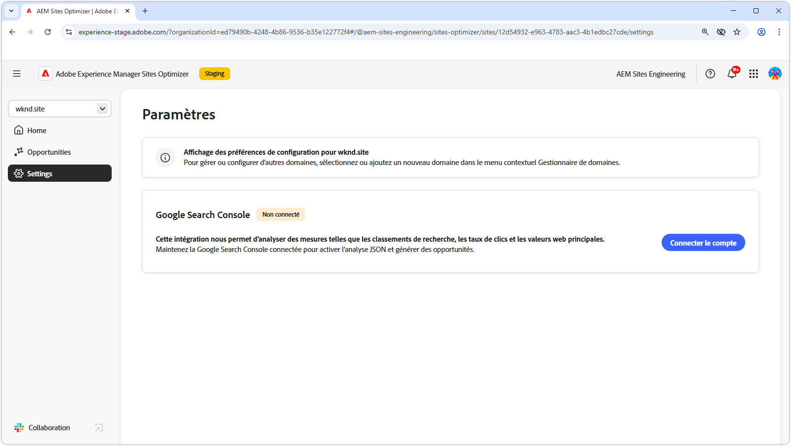
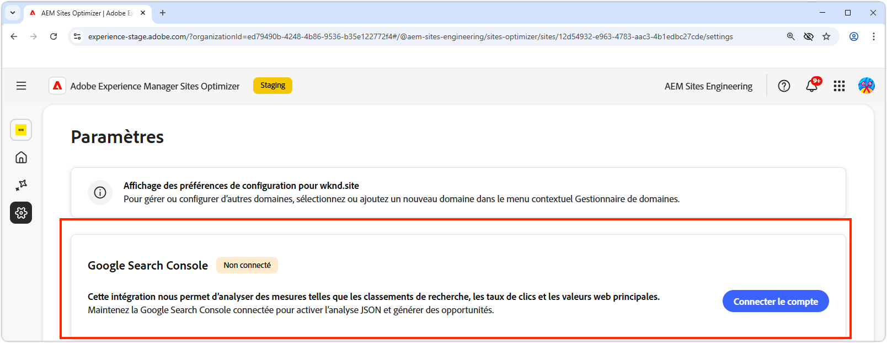
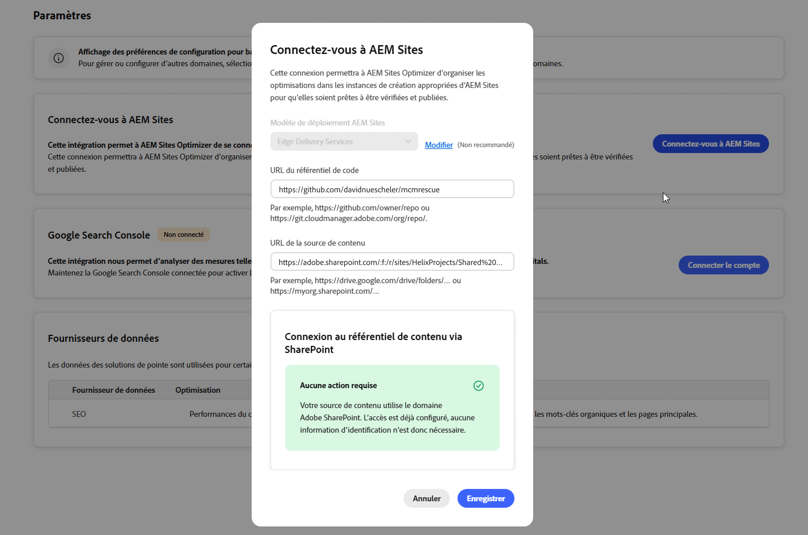
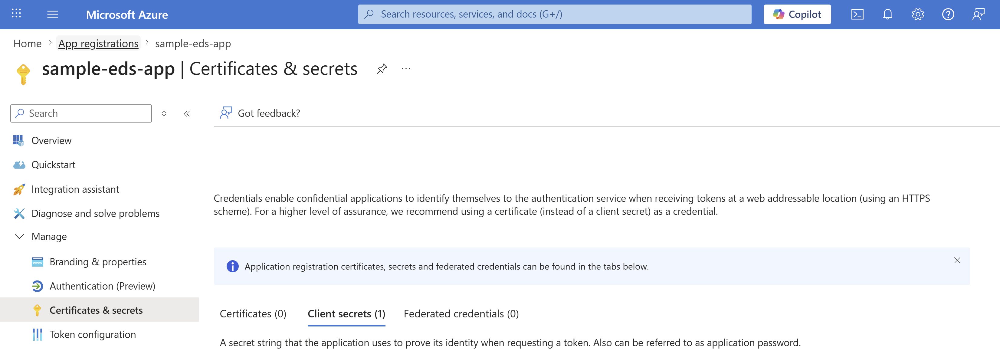
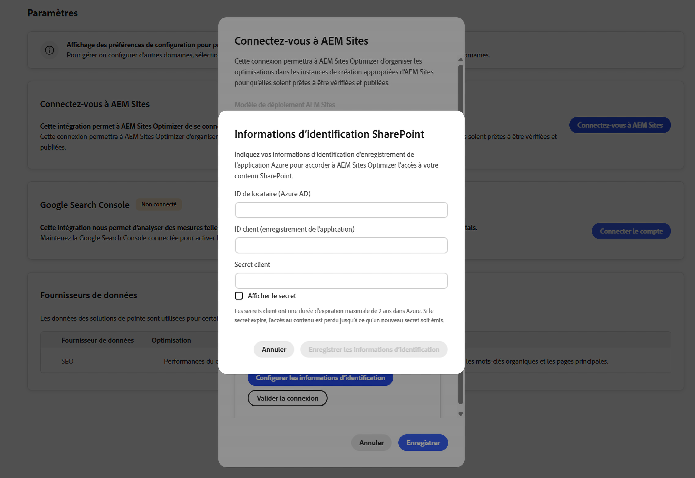
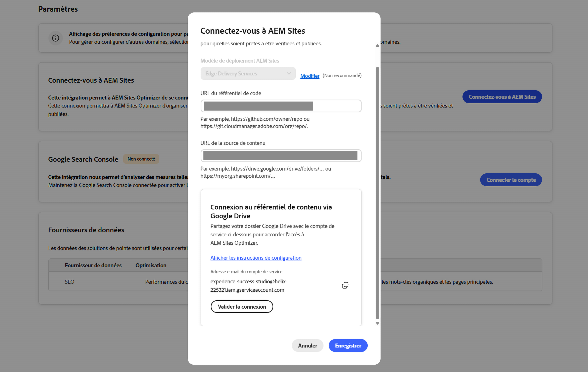

# Paramètres de Sites Optimizer

{align="center"}

Les paramètres de Sites Optimizer sont le hub central pour configurer votre expérience Sites Optimizer.

## Google Search Console

{align="center"}

Le connecteur de paramètres de Google Search Console dans AEM Sites Optimizer permet d’analyser les mesures d’optimisation du moteur de recherche clés telles que les classements de recherche, les taux de clics et les valeurs web principales. En connectant Google Search Console, vous pouvez tirer parti de l’analyse JSON pour découvrir des opportunités d’optimisation et améliorer les performances du site.

Pour configurer ce connecteur, vous devez disposer d’informations d’identification disposant d’un accès administratif à Google Search Console pour le domaine.

## Connexion à AEM Sites

Ce guide explique comment connecter votre site Edge Delivery Services (EDS) existant à AEM Sites Optimizer. Avant de commencer, assurez-vous que votre site EDS est déjà configuré et fonctionnel. Cette connexion est réservée à AEM Sites Optimizer pour accéder à votre contenu.

La connexion nécessite deux étapes :

1. Fournissez votre URL de référentiel de code et l’URL de la source de contenu.
2. Accordez à AEM Sites Optimizer l’accès à votre source de contenu.

### Étape 1 — Lier votre référentiel de code et votre source de contenu

Dans AEM Sites Optimizer, accédez à **Paramètres → Se connecter à AEM Sites** et saisissez les informations suivantes :

- **URL du référentiel de code** — URL GitHub de votre site EDS, par exemple :
  `https://github.com/owner/repo`

- **URL de Source de contenu** : URL du dossier SharePoint ou du dossier du lecteur Google qui soutient votre site EDS, par exemple :
  `https://drive.google.com/drive/folders/...` ou `https://myorg.sharepoint.com/...`

Une fois que vous avez saisi l’URL de Source de contenu, AEM Sites Optimizer détecte votre type de source de contenu et affiche les instructions d’accès appropriées ci-dessous.

### Étape 2 — Accorder l’accès à votre source de contenu

Suivez la section correspondant à votre source de contenu.

#### SharePoint — domaine Adobe

{align="center"}

Si l’URL de Source de contenu utilise le domaine Adobe SharePoint, aucune autre action n’est requise. L&#39;accès est déjà configuré. Cliquez sur **Enregistrer** pour terminer la connexion.

#### SharePoint — Domaine personnalisé

Si l’URL de Source de contenu utilise le domaine SharePoint de votre entreprise, vous devez enregistrer une application Azure et fournir ses informations d’identification à AEM Sites Optimizer.

##### L’objet de votre création

- Autorisation d’enregistrer des applications sur le portail Azure ou contact pouvant enregistrer des applications en votre nom.
- Les droits d’administrateur du client pour accorder le consentement de l’API ou un administrateur qui peut approuver le consentement de l’API pour vous.

##### Étape 2a — Enregistrer une application dans Azure

1. Accédez à **Azure Portal → Microsoft Entra ID → Enregistrements d’application → Nouvel enregistrement**.
2. Donnez-lui un nom, par exemple : `AEM Sites Optimizer`.
3. Conservez toutes les autres valeurs par défaut et cliquez sur **S’inscrire**.
4. Sur la page **Aperçu**, notez ce qui suit :
   - **Identifiant (client) de l’application**
   - **ID de répertoire (client)**

##### Étape 2b — Ajout des autorisations API

1. Accédez à **Autorisations d’API → Ajouter une autorisation → les autorisations de l’application Microsoft Graph →**.
2. Ajoutez les deux éléments suivants :
   - `Sites.Selected` : accès étendu à des collections de sites SharePoint spécifiques.
   - `Files.SelectedOperations.Selected` — accès aux fichiers sans utilisateur connecté.
3. Cliquez sur **Accorder le consentement administrateur** pour les deux.

{align="center"}

>[!NOTE]
>
>L’octroi du consentement administrateur nécessite des droits d’administrateur client. Si ce n’est pas le cas, demandez à votre administrateur informatique ou Azure de terminer cette étape avant de continuer.

##### Étape 2c — Créer un secret client

{align="center"}

1. Accédez à **Certificats et secrets → Nouveau secret client**.
2. Définissez une description et une date d’expiration, puis cliquez sur **Ajouter**.
3. Copiez immédiatement la valeur secrète ; elle n’est affichée qu’une seule fois.

##### Étape 2d — Accorder à l&#39;application l&#39;accès à votre site SharePoint

Vous pouvez accorder l’accès à l’application à l’aide de l’explorateur Microsoft Graph, de PowerShell ou des appels directs de l’API Graph.

Accédez à l’explorateur de graphiques Microsoft [&#128279;](https://developer.microsoft.com/graph/graph-explorer), connectez-vous avec votre compte Microsoft et exécutez les requêtes suivantes :

1. Trouver l’ID de votre site :

```
GET https://graph.microsoft.com/v1.0/sites/{tenant}.sharepoint.com:/sites/{site-name}
```

1. Copiez le `id` de la réponse, puis accordez l’accès au niveau du site :

```
POST https://graph.microsoft.com/v1.0/sites/{siteId}/permissions
```

Corps :

```json
{
  "roles": ["write"],
  "grantedToIdentities": [{
    "application": {
      "id": "{your-client-id}",
      "displayName": "{Your app name}"
    }
  }]
}
```

##### Étape 2e — Saisir les informations d’identification dans AEM Sites Optimizer

{align="center"}

De retour dans la boîte de dialogue **Connexion à AEM Sites**, saisissez ce qui suit sous **Connexion au référentiel de contenu via SharePoint** :

- **ID de client (Azure AD)** à partir de l’aperçu du → d’enregistrement d’application.
- **ID client (enregistrement de l’application)** à partir de l’aperçu de l’→ Enregistrement de l’application.
- **Secret client** — créé à l’étape 2c.

Cliquez sur **Valider la connexion** pour confirmer l’accès, puis sur **Enregistrer**.

#### Google Drive

{align="center"}

1. Dans Google Drive, cliquez avec le bouton droit sur le dossier qui soutient votre site EDS et sélectionnez **Partager**.
2. Dans le champ **Ajouter des personnes et des groupes** , saisissez l’e-mail du compte de service affiché dans la boîte de dialogue **Se connecter à AEM Sites** :
   `experience-success-studio@helix-225321.iam.gserviceaccount.com`
3. Définissez le niveau d’autorisation sur **Éditeur**.
4. Décochez **Notifier les personnes** et cliquez sur **Partager**.

Une fois le partage terminé, cliquez sur **Valider la connexion** dans la boîte de dialogue, puis cliquez sur **Enregistrer**.
