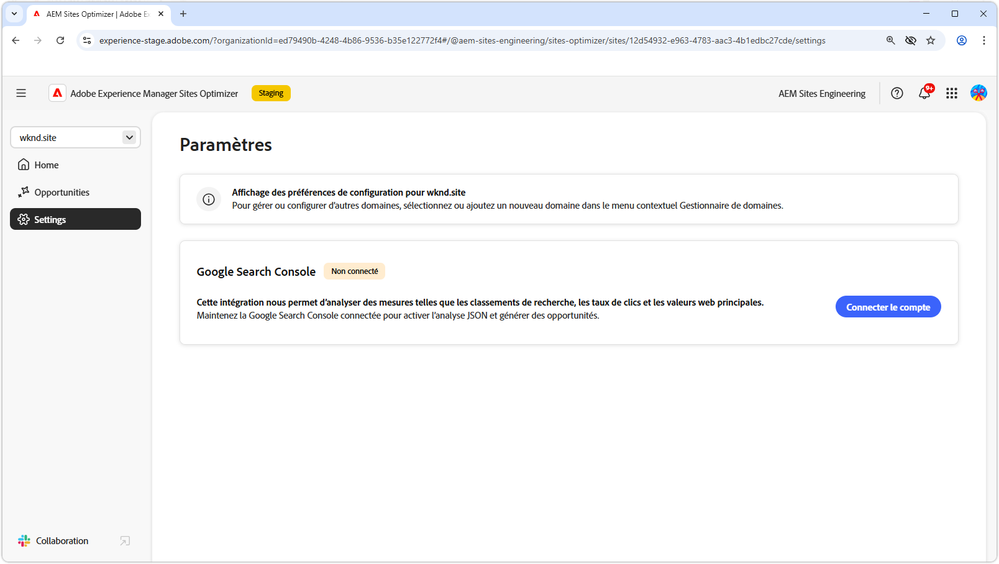

# Paramètres de Sites Optimizer

{align="center"}

Les paramètres de Sites Optimizer constituent le hub central pour configurer votre expérience Sites Optimizer.

## Google Search Console

{align="center"}

Le connecteur de paramètres de Google Search Console dans AEM Sites Optimizer permet d’analyser les mesures d’optimisation du moteur de recherche clés telles que les classements de recherche, les taux de clics et les valeurs web principales. En connectant Google Search Console, vous pouvez tirer parti de l’analyse JSON pour découvrir des opportunités d’optimisation et améliorer les performances du site.

Pour configurer ce connecteur, vous devez disposer d’informations d’identification disposant d’un accès administratif à Google Search Console pour le domaine.
