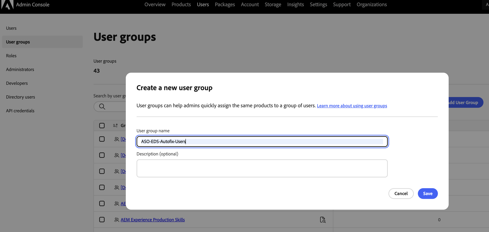

# Essai de Sites Optimizer

Commencez avec Sites Optimizer à l’aide de cette version d’évaluation pour les **clients AEM Sites existants (Edge Delivery Services, Cloud Services et Managed Services)**. Les données de votre domaine sont déjà pré-intégrées, vous pouvez donc commencer l’optimisation immédiatement. La vidéo ci-dessous vous guide tout au long de la période d’essai et vous montre comment commencer.

>[!IMPORTANT]
>
>Avant de commencer, assurez-vous que votre site répond à ces exigences :
>
>* Il repose sur AEM Sites (Edge Delivery Services, Cloud Service ou Managed Services).
>* Il s’agit d’un site de production et non d’un environnement de développement, d’assurance qualité, d’évaluation, de création ou de prévisualisation.
>* Il est accessible au public et ne se trouve pas derrière un identifiant de connexion.
>* Il utilise la diffusion front-end d’AEM Sites. La diffusion découplée n’est actuellement pas prise en charge.

>[!VIDEO](https://video.tv.adobe.com/v/3483253/?learn=on&enablevpops)

>[!TIP]
>
> Contactez [siteoptimizer-now@adobe.com](mailto:siteoptimizer-now@adobe.com) pour toute question ou demande.

## Commencez votre version d’essai dès maintenant !

Pour commencer votre version d’évaluation, procédez comme suit :

1. Connectez-vous avec votre ID d’organisation IMS AEM Sites à [www.sitesoptimizer.live](http://www.sitesoptimizer.live/).
2. Affichez les mesures clés telles que les pages vues, le temps de chargement et le taux d’engagement, ainsi que vos principales opportunités d’optimisation classées par importance.
3. Explorez les trois types d’opportunités disponibles : [backlinks rompus](./opportunities/broken-backlinks.md), [Core Web Vitals](./opportunities/core-web-vitals.md) et [texte secondaire manquant](./opportunities/missing-alt-text.md).
4. Pour chaque opportunité, vérifiez jusqu’à trois problèmes identifiés. Utilisez les suggestions générées par l’IA et déployez des optimisations directement dans votre environnement AEM lorsqu’il est prêt.
5. Débloquez davantage d’opportunités en effectuant une mise à niveau vers la licence complète à tout moment.

## Éléments disponibles dans la version d’essai

Les éléments suivants sont inclus dans la version d’essai :

* Trois types d’opportunités : [backlinks rompus](./opportunities/broken-backlinks.md), [Core Web Vitals](./opportunities/core-web-vitals.md) et [texte secondaire manquant](./opportunities/missing-alt-text.md).
* Jusqu’à trois événements par opportunité chaque mois.
* Workflow complet par problème : identification automatique, suggestion automatique et optimisation automatique.
  * **Identification automatique** : détecte les problèmes sur votre site à l’aide de plusieurs sources de données.
  * **Suggestion automatique** : fournit des recommandations personnalisées générées par l’IA pour chaque problème.
  * **Optimisation automatique** : après approbation, déployez les correctifs directement dans votre environnement de création. Les mises à jour suivent vos workflows existants, ce qui permet à votre équipe de les réviser et de les publier via AEM.

## Activer le correctif automatique pour les sites d’évaluation d’Edge Delivery

Découvrez comment les clients d’évaluation activent l’action **Déployer pour créer** pour obtenir des suggestions de correctifs automatiques sur les sites Edge Delivery Services (EDS) créés dans Google Drive ou SharePoint.

>[!NOTE]
>
>Cette exigence s’applique uniquement aux organisations d’évaluation dont les sites sont créés dans Google Drive ou SharePoint. Les clients payants et les sites créés dans Crosswalk ou Dark Alley ne sont pas affectés.

Les clients en version d’évaluation doivent faire partie du groupe IMS **ASO-EDS-Autofix-Users**. Si le groupe n’existe pas, l’administrateur de votre organisation peut le créer et vous ajouter.

1. Connectez-vous à [](https://adminconsole.adobe.com/).
1. Sélectionnez **Utilisateurs** > **Groupes d’utilisateurs**.
1. Sélectionnez **Ajouter un groupe d’utilisateurs**.
1. Pour **Nom du groupe d’utilisateurs**, saisissez exactement :

   ```
   ASO-EDS-Autofix-Users
   ```

   >[!IMPORTANT]
   >
   > Le nom du groupe doit correspondre exactement, majuscules comprises. Elle est mise en correspondance en respectant la casse. Par conséquent, une orthographe ou une casse différente (par exemple, `ASO-EDS-Autofix-users`) ne fonctionne pas. Ne renommez pas le groupe après l’avoir créé.

1. Sélectionnez **Enregistrer**.

   {align="center"}

1. Ouvrez le nouveau groupe et sélectionnez **Ajouter des utilisateurs**.
1. Saisissez l’adresse e-mail ou le nom d’utilisateur de chaque personne qui doit pouvoir déployer des correctifs automatiques, puis sélectionnez **Enregistrer**.

   {align="center"}

Si vous êtes membre du groupe , le bouton **Déployer vers l’auteur** est activé. Si vous n’êtes pas encore membre, l’option **Déployer vers l’auteur** est désactivée et une info-bulle vous demande de contacter votre administrateur pour vous ajouter au groupe. Une fois que votre administrateur vous a ajouté au groupe, déconnectez-vous et reconnectez-vous à Sites Optimizer afin que votre session prenne en compte la nouvelle appartenance au groupe.

## Questions fréquentes

Lisez ce qui suit pour obtenir des réponses aux questions fréquentes sur la version d’essai d’AEM Sites Optimizer.

+++Qu’est-ce qu’AEM Sites Optimizer ?

[AEM Sites Optimizer](/help/home.md) est une application axée sur l’IA qui identifie les problèmes sur votre site web, fournit des recommandations personnalisées et vous aide à les résoudre pour augmenter l’acquisition, l’engagement et la conversion du trafic.

+++
+++Qui peut profiter de cette version essai ?

Clientes et clients AEM Sites existants (Edge Delivery Services, Cloud Services et Managed Services).

+++
+++Comment accéder à la version d’essai ?

Accédez à [www.sitesoptimizer.live](http://www.sitesoptimizer.live/) et connectez-vous avec votre ID d’organisation IMS AEM Sites.

+++
+++La version d’essai est-elle payante ?

Non. Cette version d’essai est disponible gratuitement pour les clientes et clients AEM Sites existants.

+++
+++Existe-t-il une date d’expiration ?

Non. La version d’essai n’est pas limité dans le temps. Son utilisation est limitée par le nombre de types d’opportunités et de problèmes disponibles.
+++
+++Que se passe-t-il une fois tous les problèmes résolus ?

Sites Optimizer identifie en permanence les problèmes qui affectent vos performances. Dans l’essai gratuit, les problèmes ne sont ajoutés qu’une fois par mois. Mettez à niveau pour un audit et une optimisation continus.

+++
+++Comment accéder à davantage d’opportunités ?

Utilisez les appels à l’action Mettre à niveau ou Contacter l’équipe commerciale dans l’expérience produit ou envoyez un e-mail à l’adresse [siteoptimizer-now@adobe.com](mailto:siteoptimizer-now@adobe.com).

+++
+++Je suis dans le groupe ASO-EDS-Autofix-Users, mais Déployer vers l’auteur est toujours désactivé. Que dois-je vérifier ?

Déconnectez-vous et reconnectez-vous. L’appartenance à un groupe est lue lorsque vous vous connectez. Vérifiez également que le nom du groupe est orthographié et en majuscules de manière `ASO-EDS-Autofix-Users`, et qu’il a été créé dans la même organisation que le site.

+++
+++L’exigence du groupe ASO-EDS-Autofix-Users s’applique-t-elle à tous les sites Edge Delivery Services ?

Non. Elle s’applique uniquement aux sites d’évaluation créés dans **Google Drive** ou **SharePoint**. Les sites créés dans **Crosswalk** ou **Dark Alley**, ainsi que tous les sites **pay** ne sont pas affectés.

+++

<!--
CARDS
* ./opportunities/core-web-vitals.md
  {title=Core web vitals}
  {image=../assets/common/card-performance.png}
* ./opportunities/missing-alt-text.md
  {title=Missing alt text}
  {image=../assets/common/card-arrows.png}
* ./opportunities/broken-backlinks.md
  {title=Broken backlinks}
  {image=../assets/common/card-arrows.png}
-->

<!-- START CARDS HTML - DO NOT MODIFY BY HAND -->
<div class="columns">
    <div class="column is-half-tablet is-half-desktop is-one-third-widescreen" aria-label="Core web vitals">
        <div class="card" style="height: 100%; display: flex; flex-direction: column; height: 100%;">
            <div class="card-image">
                <figure class="image x-is-16by9">
                    <a href="./opportunities/core-web-vitals.md" title="Valeurs web principales" target="_blank" rel="referrer">
                        
                    </a>
                </figure>
            </div>
            <div class="card-content is-padded-small" style="display: flex; flex-direction: column; flex-grow: 1; justify-content: space-between;">
                <div class="top-card-content">
                    <p class="headline is-size-6 has-text-weight-bold">
                        <a href="./opportunities/core-web-vitals.md" target="_blank" rel="referrer" title="Valeurs web principales">Valeurs web principales</a>
                    </p>
                    <p class="is-size-6">Découvrez l’opportunité liée aux Core Web Vitals et comment l’exploiter pour améliorer l’acquisition de trafic.</p>
                </div>
                <a href="./opportunities/core-web-vitals.md" target="_blank" rel="referrer" class="spectrum-Button spectrum-Button--outline spectrum-Button--primary spectrum-Button--sizeM" style="align-self: flex-start; margin-top: 1rem;">
                    <span class="spectrum-Button-label has-no-wrap has-text-weight-bold">En savoir plus</span>
                </a>
            </div>
        </div>
    </div>
    <div class="column is-half-tablet is-half-desktop is-one-third-widescreen" aria-label="Missing alt text">
        <div class="card" style="height: 100%; display: flex; flex-direction: column; height: 100%;">
            <div class="card-image">
                <figure class="image x-is-16by9">
                    <a href="./opportunities/missing-alt-text.md" title="Texte secondaire manquant" target="_blank" rel="referrer">
                        
                    </a>
                </figure>
            </div>
            <div class="card-content is-padded-small" style="display: flex; flex-direction: column; flex-grow: 1; justify-content: space-between;">
                <div class="top-card-content">
                    <p class="headline is-size-6 has-text-weight-bold">
                        <a href="./opportunities/missing-alt-text.md" target="_blank" rel="referrer" title="Texte secondaire manquant">Texte secondaire manquant</a>
                    </p>
                    <p class="is-size-6">Découvrez l’opportunité liée au texte alternatif (alt) manquant et comment l’exploiter pour améliorer l’engagement sur votre site web.</p>
                </div>
                <a href="./opportunities/missing-alt-text.md" target="_blank" rel="referrer" class="spectrum-Button spectrum-Button--outline spectrum-Button--primary spectrum-Button--sizeM" style="align-self: flex-start; margin-top: 1rem;">
                    <span class="spectrum-Button-label has-no-wrap has-text-weight-bold">En savoir plus</span>
                </a>
            </div>
        </div>
    </div>
    <div class="column is-half-tablet is-half-desktop is-one-third-widescreen" aria-label="Broken backlinks">
        <div class="card" style="height: 100%; display: flex; flex-direction: column; height: 100%;">
            <div class="card-image">
                <figure class="image x-is-16by9">
                    <a href="./opportunities/broken-backlinks.md" title="Backlinks rompus" target="_blank" rel="referrer">
                        
                    </a>
                </figure>
            </div>
            <div class="card-content is-padded-small" style="display: flex; flex-direction: column; flex-grow: 1; justify-content: space-between;">
                <div class="top-card-content">
                    <p class="headline is-size-6 has-text-weight-bold">
                        <a href="./opportunities/broken-backlinks.md" target="_blank" rel="referrer" title="Backlinks rompus">Backlinks rompus</a>
                    </p>
                    <p class="is-size-6">Découvrez l’opportunité liée aux backlinks cassés et comment l’exploiter pour améliorer l’acquisition de trafic.</p>
                </div>
                <a href="./opportunities/broken-backlinks.md" target="_blank" rel="referrer" class="spectrum-Button spectrum-Button--outline spectrum-Button--primary spectrum-Button--sizeM" style="align-self: flex-start; margin-top: 1rem;">
                    <span class="spectrum-Button-label has-no-wrap has-text-weight-bold">En savoir plus</span>
                </a>
            </div>
        </div>
    </div>
</div>
<!-- END CARDS HTML - DO NOT MODIFY BY HAND -->
