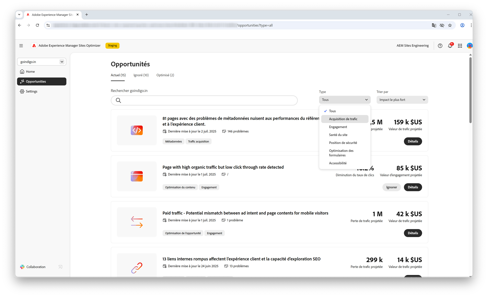
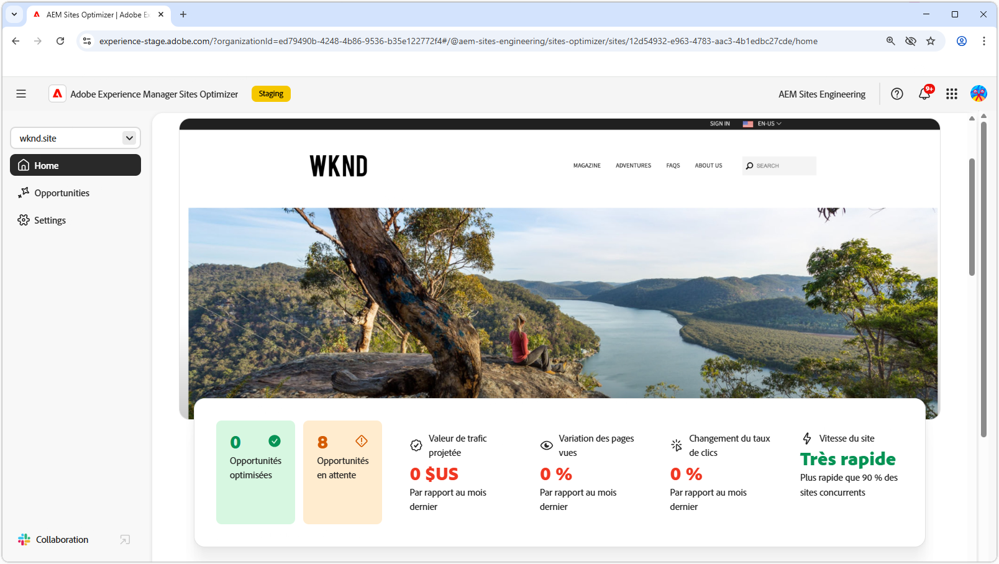
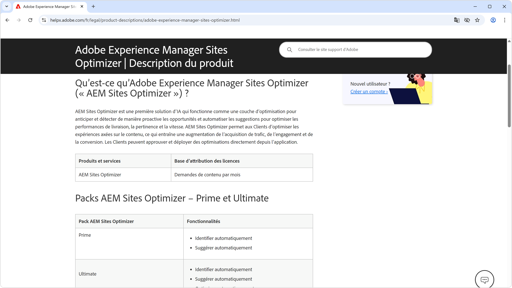
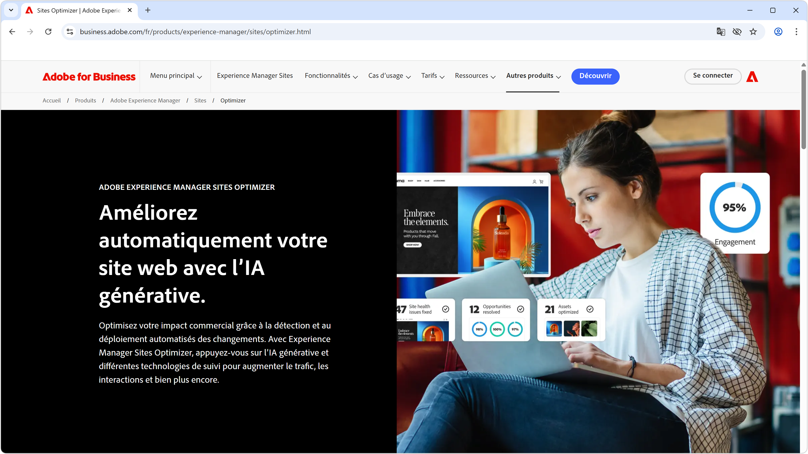

# AEM Sites Optimizer

>[!VIDEO](https://video.tv.adobe.com/v/3455087/?learn=on&enablevpops&captions=fre_fr)

Adobe Experience Manager (AEM) Sites Optimizer est un service basé sur le cloud qui analyse et améliore les performances des sites web créés sur AEM. Sites Optimizer identifie les domaines à améliorer en termes de chargement de page, d’utilisation des composants et de diffusion de contenu. Cette fonctionnalité permet d’améliorer les performances de votre site web tout en réduisant les coûts de maintenance et de mise à jour. En utilisant Sites Optimizer, vous pouvez garantir une expérience en ligne fluide et fiable, ce qui est important pour maintenir l’engagement et les conversions.

## Commencer avec Sites Optimizer

<!-- CARDS 

* ./opportunity-types/overview.md
    * {title=Opportunity types}
    * {description = Learn about the available Site Optimizer opportunities and how to use them to improve your site's performance.}
* ./opportunity-types/preflight.md
  * {title=Preflight opportunities}
  * {description = Learn about the Preflight opportunities in Sites Optimizer and how to optimize your web pages before they're even published.}
* ./documentation/overview.md
  * {title=Documentation}
  * {description=Explore the Sites Optimizer documentation to learn about all its capabilities.}

-->
<!-- START CARDS HTML - DO NOT MODIFY BY HAND -->

    

        

            

                <figure class="image x-is-16by9">
                    
                </figure>
            

            

                

                    

                        <a href="./opportunity-types/overview.md" target="_blank" rel="referrer" title="Types d’opportunités">Types d’opportunités</a>
                    

                    
Découvrez les opportunités de Sites Optimizer disponibles et comment les utiliser pour améliorer les performances de votre site.

                

                <a href="./opportunity-types/overview.md" target="_blank" rel="referrer" class="spectrum-Button spectrum-Button--outline spectrum-Button--primary spectrum-Button--sizeM" style="align-self: flex-start; margin-top: 1rem;">
En savoir plus
</a>
            

        

    

    

        

            

                <figure class="image x-is-16by9">
                    
                </figure>
            

            

                

                    

                        <a href="./documentation/overview.md" target="_blank" rel="referrer" title="Documentation">Documentation</a>
                    

                    
Consultez la documentation de Sites Optimizer pour en savoir plus sur toutes ses fonctionnalités.

                

                <a href="./documentation/overview.md" target="_blank" rel="referrer" class="spectrum-Button spectrum-Button--outline spectrum-Button--primary spectrum-Button--sizeM" style="align-self: flex-start; margin-top: 1rem;">
En savoir plus
</a>
            

        

    

<!-- END CARDS HTML - DO NOT MODIFY BY HAND -->

## En savoir plus sur Sites Optimizer

<!-- CARDS 
* https://helpx.adobe.com/fr/legal/product-descriptions/adobe-experience-manager-sites-optimizer.html
    {title=Packages and licensing}
    {description=Learn about AEM Sites Optimizer packages and licensing.}
    {image=./assets/home/licensing.png}
    {target=_blank}
    {cta=Learn more}
* https://business.adobe.com/products/experience-manager/sites/optimizer.html
    {title=Explore the capabilities of AEM Sites Optimizer}
    {description=Learn what AEM Site Optimizer can do for your company.}
    {image=./assets/home/business-adobe-com.png}
    {target=_blank}
    {cta=Learn more}
-->
<!-- START CARDS HTML - DO NOT MODIFY BY HAND -->

    

        

            

                <figure class="image x-is-16by9">
                    
                </figure>
            

            

                

                    

                        <a href="https://helpx.adobe.com/fr/legal/product-descriptions/adobe-experience-manager-sites-optimizer.html" target="_blank" rel="referrer" title="Packages et licences">Packages et licences</a>
                    

                    
Découvrez les packages et les licences AEM Sites Optimizer.

                

                <a href="https://helpx.adobe.com/fr/legal/product-descriptions/adobe-experience-manager-sites-optimizer.html" target="_blank" rel="referrer" class="spectrum-Button spectrum-Button--outline spectrum-Button--primary spectrum-Button--sizeM" style="align-self: flex-start; margin-top: 1rem;">
En savoir plus
</a>
            

        

    

    

        

            

                <figure class="image x-is-16by9">
                    
                </figure>
            

            

                

                    

                        <a href="https://business.adobe.com/fr/products/experience-manager/sites/optimizer.html" target="_blank" rel="referrer" title="Explorer les fonctionnalités d’AEM Sites Optimizer">Explorer les fonctionnalités d’AEM Sites Optimizer</a>
                    

                    
Découvrez ce qu’AEM Sites Optimizer peut faire pour votre entreprise.

                

                <a href="https://business.adobe.com/fr/products/experience-manager/sites/optimizer.html" target="_blank" rel="referrer" class="spectrum-Button spectrum-Button--outline spectrum-Button--primary spectrum-Button--sizeM" style="align-self: flex-start; margin-top: 1rem;">
En savoir plus
</a>
            

        

    

<!-- END CARDS HTML - DO NOT MODIFY BY HAND -->
