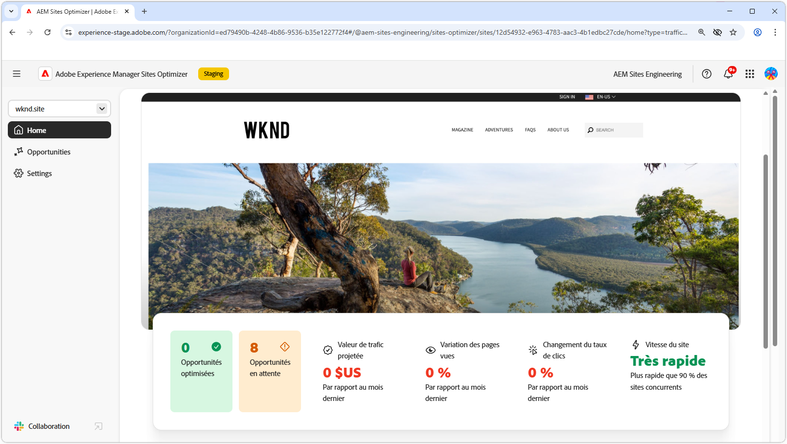

# AEM Sites Optimizer

{align="center"}

Adobe Experience Manager (AEM) Sites Optimizer est un service basé sur le cloud qui analyse et améliore les performances des sites web créés sur AEM. Il identifie les domaines dans lesquels le chargement des pages, l’utilisation des composants et la diffusion de contenu peuvent être améliorés, ce qui vous permet d’améliorer les performances de votre site web et de réduire les coûts de maintenance et de mise à jour. En utilisant Sites Optimizer, vous pouvez garantir une expérience en ligne fluide et fiable, ce qui est important pour maintenir l’engagement et les conversions.

## Prise en main de Sites Optimizer

<!-- CARDS 

* ./opportunity-types/overview.md
   {title=Opportunity types}
   {description = Learn about the available Site Optimizer opportunities and how to use them to improve your site's performance.}
* ./documentation/overview.md
  * {title=Documentation}
  * {description=Explore the Sites Optimizer documentation to learn about all its capabilities.}

-->
<!-- START CARDS HTML - DO NOT MODIFY BY HAND -->

    

        

            

                <figure class="image x-is-16by9">
                    
                </figure>
            

            

                

                    

                        <a href="./opportunity-types/overview.md" target="_blank" rel="referrer" title="Types d’opportunités">Types d’opportunités</a>
                    

                    
Découvrez les opportunités de l’optimisateur de site disponibles et comment les utiliser pour améliorer les performances de votre site.

                

                <a href="./opportunity-types/overview.md" target="_blank" rel="referrer" class="spectrum-Button spectrum-Button--outline spectrum-Button--primary spectrum-Button--sizeM" style="align-self: flex-start; margin-top: 1rem;">
                    En savoir plus
                </a>
            

        

    

    

        

            

                <figure class="image x-is-16by9">
                    
                </figure>
            

            

                

                    

                        <a href="./documentation/overview.md" target="_blank" rel="referrer" title="Documentation">Documentation</a>
                    

                    
Consultez la documentation de Sites Optimizer pour en savoir plus sur toutes ses fonctionnalités.

                

                <a href="./documentation/overview.md" target="_blank" rel="referrer" class="spectrum-Button spectrum-Button--outline spectrum-Button--primary spectrum-Button--sizeM" style="align-self: flex-start; margin-top: 1rem;">
                    En savoir plus
                </a>
            

        

    

<!-- END CARDS HTML - DO NOT MODIFY BY HAND -->
