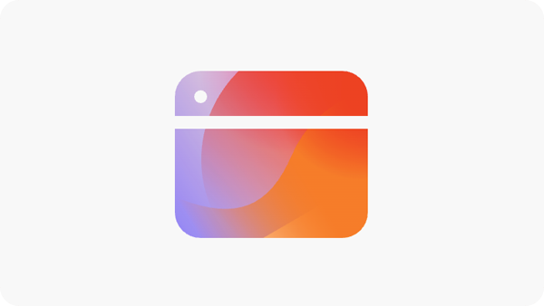

# Opportunités d’engagement

{align="center"}

Les opportunités d’engagement dans AEM Sites Optimizer sont essentielles pour améliorer les expériences numériques en fournissant des informations exploitables sur la manière dont les utilisateurs et utilisatrices interagissent avec les pages web. En identifiant les points à améliorer, tels que les problèmes d’accessibilité, les liens internes rompus, les taux de rebond élevés et le texte secondaire manquant, les spécialistes du marketing et les créateurs et créatrices de contenu peuvent optimiser leurs sites pour de meilleures performances et une meilleure interaction client. Ces opportunités permettent de s’assurer que le contenu est efficace, détectable et attrayant, ce qui entraîne des conversions plus élevées et un parcours client plus transparent. L’utilisation des recommandations d’AEM Sites Optimizer permet aux équipes d’affiner en permanence leur stratégie numérique et de fournir des expériences à fort impact et à grande échelle.

## Opportunités

<!-- CARDS

* ../documentation/opportunities/accessibility-issues.md
  {title=Accessibility issues}
  {image=../assets/common/card-puzzle.png}
* ../documentation/opportunities//broken-internal-links.md
  {title=Broken internal links}
  {image=../assets/common/card-link.png}
* ../documentation/opportunities//high-bounce-rate.md
  {title=High bounce rate}
  {image=../assets/common/card-arrows.png}
* ../documentation/opportunities/high-traffic-page-has-low-ctr.md
  {title=High traffic page has low CTR}
  {image=../assets/common/card-browser.png}
* ../documentation/opportunities/missing-alt-text.md  
  {title=Missing alt text}
  {image=../assets/common/card-arrows.png}

-->
<!-- START CARDS HTML - DO NOT MODIFY BY HAND -->

    

        

            

                <figure class="image x-is-16by9">
                    
                </figure>
            

            

                

                    

                        <a href="../documentation/opportunities/accessibility-issues.md" target="_blank" rel="referrer" title="Problèmes d’accessibilité">Problèmes d’accessibilité</a>
                    

                    
Découvrez l’opportunité des problèmes d’accessibilité et comment l’utiliser pour renforcer la sécurité de votre site web.

                

                <a href="../documentation/opportunities/accessibility-issues.md" target="_blank" rel="referrer" class="spectrum-Button spectrum-Button--outline spectrum-Button--primary spectrum-Button--sizeM" style="align-self: flex-start; margin-top: 1rem;">
En savoir plus
</a>
            

        

    

    

        

            

                <figure class="image x-is-16by9">
                    
                </figure>
            

            

                

                    

                        <a href="../documentation/opportunities//broken-internal-links.md" target="_blank" rel="referrer" title="Liens internes rompus">Liens internes rompus</a>
                    

                    
Découvrez l’opportunité des liens rompus et comment l’utiliser pour améliorer l’engagement sur votre site web.

                

                <a href="../documentation/opportunities//broken-internal-links.md" target="_blank" rel="referrer" class="spectrum-Button spectrum-Button--outline spectrum-Button--primary spectrum-Button--sizeM" style="align-self: flex-start; margin-top: 1rem;">
En savoir plus
</a>
            

        

    

    

        

            

                <figure class="image x-is-16by9">
                    
                </figure>
            

            

                

                    

                        <a href="../documentation/opportunities//high-bounce-rate.md" target="_blank" rel="referrer" title="Taux de rebond élevé">Taux de rebond élevé</a>
                    

                    
Découvrez l’opportunité de faible nombre de vues et comment l’utiliser afin d’améliorer l’engagement pour les formulaires de votre site web.

                

                <a href="../documentation/opportunities//high-bounce-rate.md" target="_blank" rel="referrer" class="spectrum-Button spectrum-Button--outline spectrum-Button--primary spectrum-Button--sizeM" style="align-self: flex-start; margin-top: 1rem;">
En savoir plus
</a>
            

        

    

    

        

            

                <figure class="image x-is-16by9">
                    
                </figure>
            

            

                

                    

                        <a href="../documentation/opportunities/high-traffic-page-has-low-ctr.md" target="_blank" rel="referrer" title="Le taux de clics de la page à trafic élevé est faible">Le taux de clics de la page à trafic élevé est faible</a>
                    

                    
Découvrez que la page à trafic élevé présente une opportunité de faible taux de clics et comment l’utiliser pour augmenter l’engagement sur votre site web.

                

                <a href="../documentation/opportunities/high-traffic-page-has-low-ctr.md" target="_blank" rel="referrer" class="spectrum-Button spectrum-Button--outline spectrum-Button--primary spectrum-Button--sizeM" style="align-self: flex-start; margin-top: 1rem;">
En savoir plus
</a>
            

        

    

    

        

            

                <figure class="image x-is-16by9">
                    
                </figure>
            

            

                

                    

                        <a href="../documentation/opportunities/missing-alt-text.md" target="_blank" rel="referrer" title="Texte secondaire manquant">Texte secondaire manquant</a>
                    

                    
Découvrez l’opportunité de texte secondaire manquant et comment l’utiliser pour améliorer l’engagement sur votre site web.

                

                <a href="../documentation/opportunities/missing-alt-text.md" target="_blank" rel="referrer" class="spectrum-Button spectrum-Button--outline spectrum-Button--primary spectrum-Button--sizeM" style="align-self: flex-start; margin-top: 1rem;">
En savoir plus
</a>
            

        

    

<!-- END CARDS HTML - DO NOT MODIFY BY HAND -->
