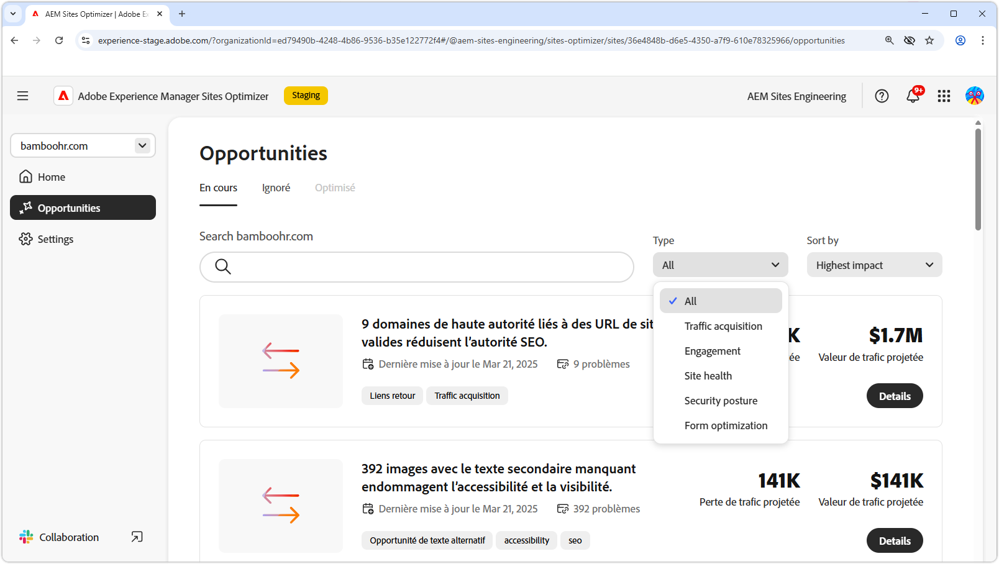
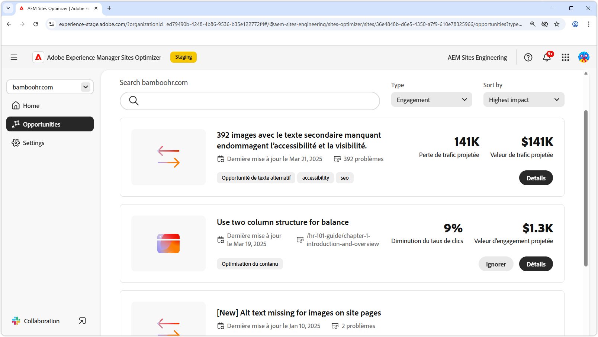
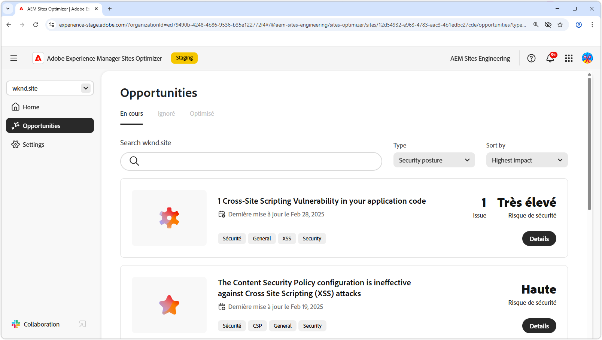
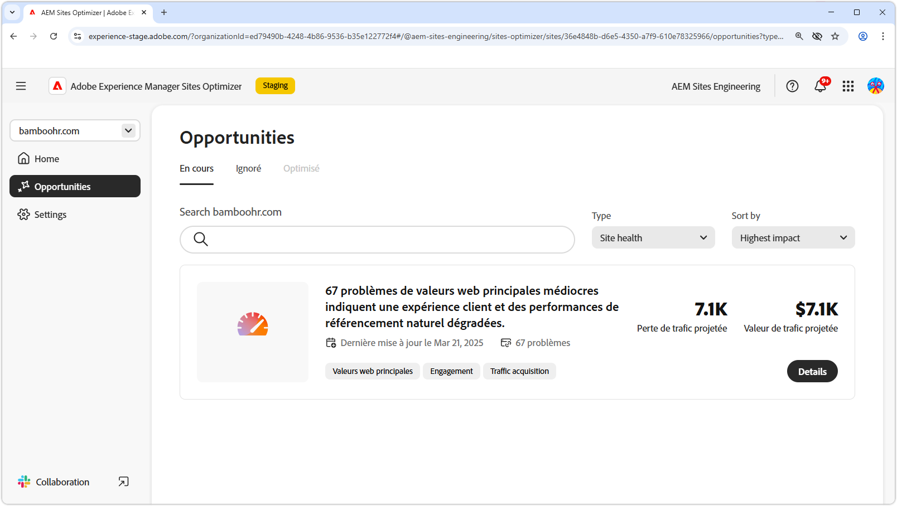
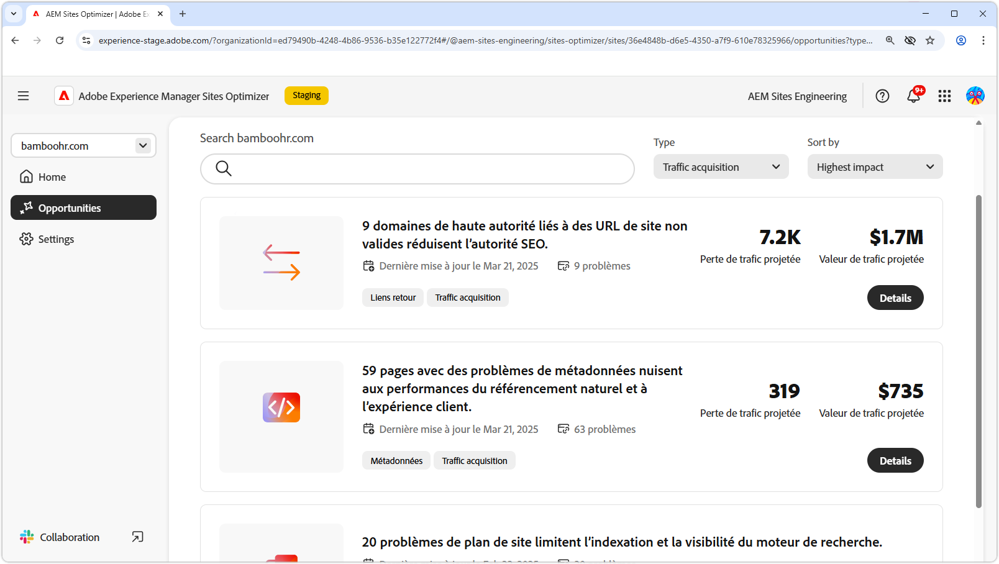
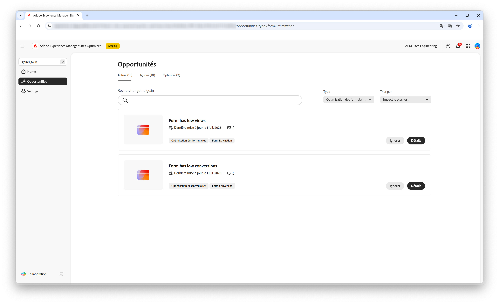

# Types d’opportunités

{align="center"}

AEM Sites Optimizer fournit des informations et des recommandations utiles pour vous aider à améliorer les performances, la convivialité et la sécurité de votre site web. Ces informations sont regroupées dans les domaines clés d’opportunité suivants :

* Engagement
* Acquisition de trafic
* Posture de sécurité
* Intégrité du site
* Preflight

Chaque catégorie met en évidence une manière différente d’améliorer votre site. Une catégorie peut augmenter l’interaction des visiteurs et visiteuses. Une autre peut améliorer la visibilité. D’autres se concentrent sur le renforcement de la sécurité ou le maintien de la stabilité du site. Le contrôle en amont permet d’analyser et d’optimiser les pages avant de les publier.

Faire appel à ces opportunités améliore l’expérience clientèle, attire l’audience appropriée et maintient la sécurité et la fiabilité de votre site. L’amélioration de l’engagement et de l’acquisition du trafic favorise les interactions et la visibilité, tandis qu’une bonne posture de sécurité et un niveau d’intégrité du site contribuent à assurer la confiance et la stabilité. L’analyse en amont garantit que votre contenu est optimisé avant sa mise en ligne. Consultez les liens ci-dessous pour voir les opportunités organisées par catégorie et découvrez comment améliorer votre site.

## Types d’opportunité

<!-- CARDS 

* ./engagement.md
   { title = Engagement }
* ./security-posture.md
   { title = Security posture }
* ./site-health.md
   { title = Site health }
* ./traffic-acquisition.md
   { title = Traffic acquisition }
* ./form-optimization.md
   { title = Forms Optimization }
* ./preflight.md
   { title = Preflight }

-->
<!-- START CARDS HTML - DO NOT MODIFY BY HAND -->

    

        

            

                <figure class="image x-is-16by9">
                    
                </figure>
            

            

                

                    

                        <a href="./engagement.md" target="_blank" rel="referrer" title="Engagement">Engagement</a>
                    

                    
Découvrez comment améliorer l’engagement avec Sites Optimizer.

                

                <a href="./engagement.md" target="_blank" rel="referrer" class="spectrum-Button spectrum-Button--outline spectrum-Button--primary spectrum-Button--sizeM" style="align-self: flex-start; margin-top: 1rem;">
En savoir plus
</a>
            

        

    

    

        

            

                <figure class="image x-is-16by9">
                    
                </figure>
            

            

                

                    

                        <a href="./security-posture.md" target="_blank" rel="referrer" title="Posture de sécurité">Posture de sécurité</a>
                    

                    
Découvrez comment améliorer la sécurité de votre site avec Sites Optimizer.

                

                <a href="./security-posture.md" target="_blank" rel="referrer" class="spectrum-Button spectrum-Button--outline spectrum-Button--primary spectrum-Button--sizeM" style="align-self: flex-start; margin-top: 1rem;">
En savoir plus
</a>
            

        

    

    

        

            

                <figure class="image x-is-16by9">
                    
                </figure>
            

            

                

                    

                        <a href="./site-health.md" target="_blank" rel="referrer" title="Intégrité du site">Intégrité du site</a>
                    

                    
Découvrez comment améliorer l’intégrité de votre site avec Sites Optimizer.

                

                <a href="./site-health.md" target="_blank" rel="referrer" class="spectrum-Button spectrum-Button--outline spectrum-Button--primary spectrum-Button--sizeM" style="align-self: flex-start; margin-top: 1rem;">
En savoir plus
</a>
            

        

    

    

        

            

                <figure class="image x-is-16by9">
                    
                </figure>
            

            

                

                    

                        <a href="./traffic-acquisition.md" target="_blank" rel="referrer" title="Acquisition de trafic">Acquisition de trafic</a>
                    

                    
Découvrez comment augmenter l’acquisition du trafic avec Sites Optimizer.

                

                <a href="./traffic-acquisition.md" target="_blank" rel="referrer" class="spectrum-Button spectrum-Button--outline spectrum-Button--primary spectrum-Button--sizeM" style="align-self: flex-start; margin-top: 1rem;">
En savoir plus
</a>
            

        

    

    

        

            

                <figure class="image x-is-16by9">
                    
                </figure>
            

            

                

                    

                        <a href="./form-optimization.md" target="_blank" rel="referrer" title="Optimisation des formulaires">Optimisation des formulaires</a>
                    

                    
Découvrez comment améliorer la conversion de vos formulaires avec l’optimisation des formulaires.

                

                <a href="./form-optimization.md" target="_blank" rel="referrer" class="spectrum-Button spectrum-Button--outline spectrum-Button--primary spectrum-Button--sizeM" style="align-self: flex-start; margin-top: 1rem;">
En savoir plus
</a>
            

        

    

    

        

            

                <figure class="image x-is-16by9">
                    
                </figure>
            

            

                

                    

                        <a href="./form-optimization.md" target="_blank" rel="referrer" title="Accessibilité des formulaires">Accessibilité des formulaires</a>
                    

                    
Découvrez comment améliorer l’accessibilité de vos formulaires avec l’optimisation des formulaires.

                

                <a href="./form-optimization.md" target="_blank" rel="referrer" class="spectrum-Button spectrum-Button--outline spectrum-Button--primary spectrum-Button--sizeM" style="align-self: flex-start; margin-top: 1rem;">
En savoir plus
</a>
            

        

    

    

        

            

                <figure class="image x-is-16by9">
                    
                </figure>
            

            

                

                    

                        <a href="./preflight.md" target="_blank" rel="referrer" title="Preflight">Contrôle en amont</a>
                    

                    
Découvrez l’analyse en amont et comment configurer les opportunités de contrôle en amont dans Sites Optimizer.

                

                <a href="./preflight.md" target="_blank" rel="referrer" class="spectrum-Button spectrum-Button--outline spectrum-Button--primary spectrum-Button--sizeM" style="align-self: flex-start; margin-top: 1rem;">
En savoir plus
</a>
            

        

    

     

<!-- END CARDS HTML - DO NOT MODIFY BY HAND -->

 Les fonctionnalités d’optimisation des formulaires et d’accessibilité des formulaires sont disponibles dans le cadre du programme d’accès anticipé. Vous pouvez écrire à l’adresse aem-forms-ea@adobe.com à partir de votre identifiant e-mail officiel pour rejoindre le programme d’accès anticipé et demander l’accès à cette fonctionnalité. 
