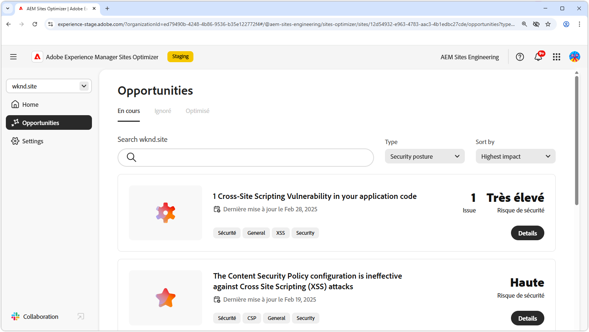

# Opportunités de posture de sécurité

{align="center"}

Le maintien d’une posture de sécurité solide dans AEM Sites Optimizer est essentiel pour protéger les expériences digitales et les données utilisateur. En identifiant les possibilités d&#39;amélioration, telles que la configuration CORS, les scripts entre sites, les autorisations de sites web et les vulnérabilités des sites web, les équipes peuvent anticiper les risques de sécurité potentiels et garantir la conformité aux bonnes pratiques. Le renforcement des mesures de sécurité non seulement protège les informations sensibles, mais améliore également la confiance des utilisateurs et la fiabilité du site. L’utilisation des informations d’AEM Sites Optimizer permet aux entreprises de surveiller et d’améliorer en permanence leur position en matière de sécurité, de réduire les risques et de maintenir un environnement numérique sécurisé.

## Opportunités

<!-- CARDS

* ../documentation/opportunities/cors-configuration.md
  {title=CORS configuration}
  {image=../assets/common/card-code.png}
* ../documentation/opportunities/cross-site-scripting.md
  {title=Cross-site scripting}
  {image=../assets/common/card-gear.png}
* ../documentation/opportunities/website-permissions.md  
  {title=Website permissions}
  {image=../assets/common/card-people.png}
* ../documentation/opportunities//website-vulnerabilities.md
  {title=Website vulnerabilities}
  {image=../assets/common/card-puzzle.png}

-->
<!-- START CARDS HTML - DO NOT MODIFY BY HAND -->

    

        

            

                <figure class="image x-is-16by9">
                    
                </figure>
            

            

                

                    

                        <a href="../documentation/opportunities/cors-configuration.md" target="_blank" rel="referrer" title="Configuration CORS.">Configuration CORS.</a>
                    

                    
Découvrez l’opportunité de configuration CORS et identifiez et corrigez les vulnérabilités de sécurité du site.

                

                <a href="../documentation/opportunities/cors-configuration.md" target="_blank" rel="referrer" class="spectrum-Button spectrum-Button--outline spectrum-Button--primary spectrum-Button--sizeM" style="align-self: flex-start; margin-top: 1rem;">
                    En savoir plus
                </a>
            

        

    

    

        

            

                <figure class="image x-is-16by9">
                    
                </figure>
            

            

                

                    

                        <a href="../documentation/opportunities/cross-site-scripting.md" target="_blank" rel="referrer" title="Cross-site scripting"> Cross-site scripting </a>
                    

                    
Découvrez l’opportunité de cross-site scripting et identifiez et corrigez les vulnérabilités de sécurité du site.

                

                <a href="../documentation/opportunities/cross-site-scripting.md" target="_blank" rel="referrer" class="spectrum-Button spectrum-Button--outline spectrum-Button--primary spectrum-Button--sizeM" style="align-self: flex-start; margin-top: 1rem;">
                    En savoir plus
                </a>
            

        

    

    

        

            

                <figure class="image x-is-16by9">
                    
                </figure>
            

            

                

                    

                        <a href="../documentation/opportunities/website-permissions.md" target="_blank" rel="referrer" title="Autorisations de site web">Autorisations de site web</a>
                    

                    
Découvrez l’opportunité d’autorisations du site web et comment l’utiliser pour renforcer la sécurité de sur votre site web.

                

                <a href="../documentation/opportunities/website-permissions.md" target="_blank" rel="referrer" class="spectrum-Button spectrum-Button--outline spectrum-Button--primary spectrum-Button--sizeM" style="align-self: flex-start; margin-top: 1rem;">
                    En savoir plus
                </a>
            

        

    

    

        

            

                <figure class="image x-is-16by9">
                    
                </figure>
            

            

                

                    

                        <a href="../documentation/opportunities//website-vulnerabilities.md" target="_blank" rel="referrer" title="Vulnérabilités du site web">Vulnérabilités de site web</a>
                    

                    
Découvrez l’opportunité des vulnérabilités du site web et comment l’utiliser pour renforcer la sécurité de sur votre site web.

                

                <a href="../documentation/opportunities//website-vulnerabilities.md" target="_blank" rel="referrer" class="spectrum-Button spectrum-Button--outline spectrum-Button--primary spectrum-Button--sizeM" style="align-self: flex-start; margin-top: 1rem;">
                    En savoir plus
                </a>
            

        

    

<!-- END CARDS HTML - DO NOT MODIFY BY HAND -->

