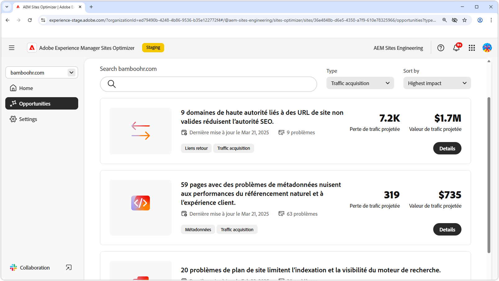

# Opportunités d’acquisition du trafic

{align="center"}

L’acquisition du trafic pousse les clientes et clients potentiels vers votre site web et crée des opportunités de vente ou de prospection. En utilisant des stratégies telles que l’optimisation des moteurs de recherche (SEO), les entreprises peuvent améliorer la visibilité des recherches et faciliter la découverte de leur contenu. Un flux constant de visiteurs et visiteuses augmente la notoriété de la marque et renforce la confiance. Il fournit également des informations précieuses sur le comportement des utilisateurs et utilisatrices. Ces informations aident les équipes à affiner leurs offres et à améliorer l’expérience globale. L’utilisation des informations d’AEM Sites Optimizer permet une optimisation continue, ce qui garantit une croissance soutenue et des taux de conversion améliorés au fil du temps.

## Opportunités

<!--
CARDS

 
* ../documentation/opportunities/broken-backlinks.md
  {title=Broken backlinks}
  {image=../assets/common/card-arrows.png}
* ../documentation/opportunities/invalid-or-missing-metadata.md
  {title=Invalid or missing metadata}
  {image=../assets/common/card-code.png}
* ../documentation/opportunities/missing-invalid-structured-data.md
  {title=Missing or invalid structured data}
  {image=../assets/common/card-bag.png}
* ../documentation/opportunities/sitemap-issues.md
  {title=Sitemap issues}
  {image=../assets/common/card-relationship.png}

-->
<!-- START CARDS HTML - DO NOT MODIFY BY HAND -->

    

        

            

                <figure class="image x-is-16by9">
                    
                </figure>
            

            

                

                    

                        <a href="../documentation/opportunities/broken-backlinks.md" target="_blank" rel="referrer" title="Backlinks rompus">Backlinks rompus</a>
                    

                    
Découvrez l’opportunité des backlinks rompus et comment l’utiliser pour améliorer l’acquisition du trafic.

                

                <a href="../documentation/opportunities/broken-backlinks.md" target="_blank" rel="referrer" class="spectrum-Button spectrum-Button--outline spectrum-Button--primary spectrum-Button--sizeM" style="align-self: flex-start; margin-top: 1rem;">
En savoir plus
</a>
            

        

    

    

        

            

                <figure class="image x-is-16by9">
                    
                </figure>
            

            

                

                    

                        <a href="../documentation/opportunities/invalid-or-missing-metadata.md" target="_blank" rel="referrer" title="Métadonnées non valides ou manquantes">Métadonnées non valides ou manquantes</a>
                    

                    
Découvrez l’opportunité des métadonnées non valides ou manquantes et comment l’utiliser pour améliorer l’acquisition du trafic.

                

                <a href="../documentation/opportunities/invalid-or-missing-metadata.md" target="_blank" rel="referrer" class="spectrum-Button spectrum-Button--outline spectrum-Button--primary spectrum-Button--sizeM" style="align-self: flex-start; margin-top: 1rem;">
En savoir plus
</a>
            

        

    

    

        

            

                <figure class="image x-is-16by9">
                    
                </figure>
            

            

                

                    

                        <a href="../documentation/opportunities/missing-invalid-structured-data.md" target="_blank" rel="referrer" title="Données structurées manquantes ou non valides">Données structurées manquantes ou non valides</a>
                    

                    
Découvrez l’opportunité des données structurées manquantes ou non valides et comment l’utiliser pour améliorer l’acquisition du trafic.

                

                <a href="../documentation/opportunities/missing-invalid-structured-data.md" target="_blank" rel="referrer" class="spectrum-Button spectrum-Button--outline spectrum-Button--primary spectrum-Button--sizeM" style="align-self: flex-start; margin-top: 1rem;">
En savoir plus
</a>
            

        

    

    

        

            

                <figure class="image x-is-16by9">
                    
                </figure>
            

            

                

                    

                        <a href="../documentation/opportunities/sitemap-issues.md" target="_blank" rel="referrer" title="Problèmes de plan de site">Problèmes de plan de site</a>
                    

                    
Découvrez l’opportunité des problèmes de plan de site et comment l’utiliser pour améliorer l’acquisition du trafic.

                

                <a href="../documentation/opportunities/sitemap-issues.md" target="_blank" rel="referrer" class="spectrum-Button spectrum-Button--outline spectrum-Button--primary spectrum-Button--sizeM" style="align-self: flex-start; margin-top: 1rem;">
En savoir plus
</a>
            

        

    

<!-- END CARDS HTML - DO NOT MODIFY BY HAND -->
